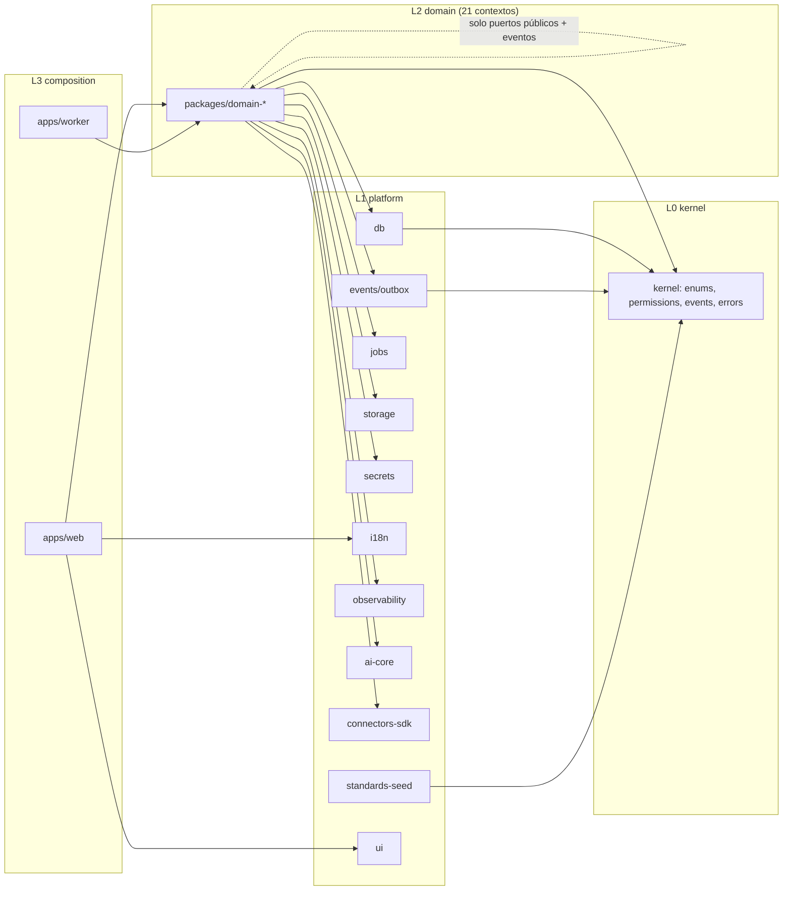
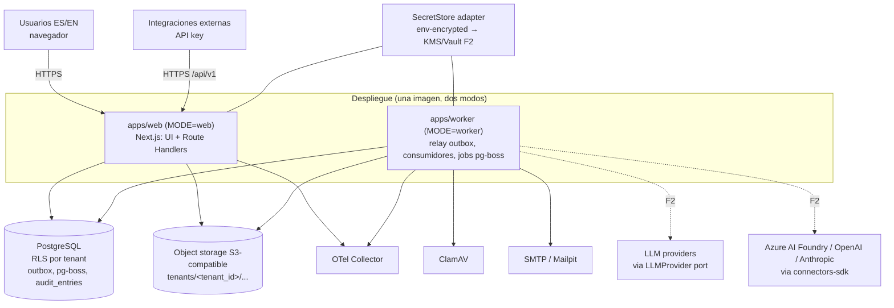
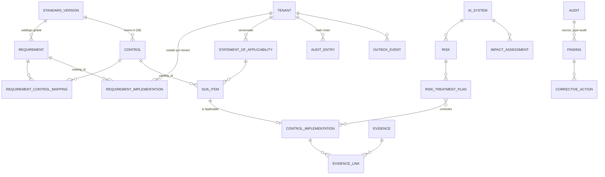

# Architecture Spine — Plataforma SaaS de gobernanza de IA ISO/IEC 42001

Modo de producción: headless, Fast path. Toda inferencia no fijada por los insumos lleva `[ASSUMPTION]`; toda decisión que toca interpretación normativa o seguridad queda **pendiente de aprobación humana** (CLAUDE.md). Los identificadores, entidades, enumeraciones, rutas y código están en inglés; el documento en español.

## Design Paradigm

**Monolito modular con hexagonal ligera por bounded context.** Un único despliegue (imagen `web` y `worker`), 21 módulos de dominio aislados que solo se hablan por puertos públicos y eventos de dominio persistidos en outbox.

| Capa | Paquete(s) | Contiene | Puede depender de |
| --- | --- | --- | --- |
| L0 kernel | `packages/kernel` | tipos compartidos (`TenantContext`, `Result`, `DomainEvent`, `Permission`), catálogo de permisos, enumeraciones canónicas, errores canónicos | nada |
| L1 platform | `packages/db`, `packages/events`, `packages/jobs`, `packages/storage`, `packages/secrets`, `packages/i18n`, `packages/observability`, `packages/ai-core`, `packages/connectors-sdk`, `packages/ui`, `packages/standards-seed` | adaptadores técnicos y puertos (Prisma, outbox, pg-boss, S3, SecretStore, OTel, LLMProvider, SDK de conectores, design system, dataset semilla) | L0 |
| L2 domain | `packages/domain-<context>` (21) | entidades, invariantes, servicios de aplicación (commands/queries), repositorios propios, manejadores de eventos, puertos públicos en `src/index.ts` | L0, L1, puertos públicos de otros L2 |
| L3 composition | `apps/web` (Next.js: UI + route handlers), `apps/worker` (consumidores de outbox y jobs) | composición, entrega HTTP/UI, arranque de consumidores; **sin lógica de dominio** | L0-L2 |

Regla de altitud: este documento fija lo que dos cambios OpenSpec construidos por separado podrían decidir de forma incompatible. Lo estructural (árbol, versiones) es semilla y pasa a ser propiedad del código desde `foundation-project-bootstrap`.

## Invariants & Rules



Las flechas indican la única dirección de dependencia permitida. Un arco ausente está prohibido y lo comprueba la prueba de arquitectura de CI (AD-3).

### AD-1 — Monolito modular hexagonal, un despliegue, 21 módulos `[ADOPTED]`

- **Binds:** all
- **Prevents:** lógica de dominio repartida entre componentes React, route handlers y jobs; microservicios prematuros.
- **Rule:** toda regla de negocio vive en `packages/domain-<context>`; `apps/web` y `apps/worker` solo componen, autentican, traducen HTTP/UI y despachan a servicios de aplicación. Un módulo de dominio compila y se prueba sin Next.js.

### AD-2 — Aislamiento de tenant por RLS y prefijo de almacenamiento `[ADOPTED]`

- **Binds:** all (toda tabla de negocio, todo objeto almacenado)
- **Prevents:** una consulta sin filtro de tenant que devuelva datos ajenos; un tenant que lea objetos de otro.
- **Rule:** toda tabla de negocio tiene `tenant_id uuid NOT NULL` con `ENABLE ROW LEVEL SECURITY` + `FORCE ROW LEVEL SECURITY` y política `tenant_id = current_setting('app.tenant_id')::uuid`; el rol de conexión de la aplicación no tiene `BYPASSRLS`; cada transacción empieza con `SET LOCAL app.tenant_id`; las tablas del catálogo global (Standards & Compliance) no llevan `tenant_id` y son de solo lectura para el rol de aplicación. Las claves de almacenamiento empiezan por `tenants/<tenant_id>/`. Prohibido esquema-por-tenant y base-por-tenant en el MVP.

### AD-3 — Dirección de dependencias y aislamiento de tablas entre contextos

- **Binds:** all
- **Prevents:** dos contextos que escriben la misma tabla; import de internals de otro paquete; ciclos.
- **Rule:** dependencias solo L3→L2→L1→L0 (diagrama). Entre contextos L2 solo se importa el `index.ts` público del otro (puertos de lectura y tipos) y se reacciona a sus eventos; **cada tabla tiene un único contexto propietario** (DOMAIN_MAP §4) y solo su repositorio la escribe. Reporting, Administration y AI Assistance leen otros contextos exclusivamente por puertos de lectura (`*ReadPort`) o vistas SQL de solo lectura declaradas por el propietario. `dependency-cruiser` en CI falla el build ante un arco no permitido `[ASSUMPTION herramienta]`.

### AD-4 — Mutación solo por servicios de aplicación con outbox en la misma transacción `[ADOPTED]`

- **Binds:** all
- **Prevents:** mutaciones sin autorización, sin validación o sin rastro; eventos perdidos por escribirse fuera de la transacción.
- **Rule:** cada mutación es un *command* de un servicio de aplicación con la secuencia fija `authorize(permission, object) → validate(Zod) → transaction { mutate; append outbox }`. Toda mutación escribe al menos un evento: uno del catálogo (`EVENT_ARCHITECTURE.md`) o el genérico `ENTITY_MUTATED` con `entity_type, entity_id, before, after`. Ningún route handler, componente ni job llama a Prisma directamente.

### AD-5 — Outbox → pg-boss, consumidores idempotentes, correlación `[ADOPTED]`

- **Binds:** all (contextos publicadores y consumidores, jobs)
- **Prevents:** entrega duplicada que crea dos tareas; consumidores que rompen al reordenarse; trazas sin correlación.
- **Rule:** el envelope de evento es `{ id (uuid v7), type (UPPER_SNAKE), version (int), tenant_id, aggregate_type, aggregate_id, occurred_at, actor_id, correlation_id, causation_id, payload }`. Un relay mueve `outbox_events` a colas pg-boss (`events.<TYPE>`); cada consumidor registra `(consumer_name, event_id)` en `processed_events` dentro de su transacción y es idempotente. Reintentos exponenciales (máximo 5) y cola `dead_letter`. pg-boss se usa solo a través del puerto `JobScheduler`.

### AD-6 — Registro de auditoría append-only con cadena de hashes; Administration único escritor `[ADOPTED]`

- **Binds:** Administration; todos los publicadores de eventos
- **Prevents:** dos escritores que rompen la cadena; entradas modificadas; decisiones de cumplimiento sin rastro.
- **Rule:** `audit_entries` acepta solo `INSERT` (triggers que rechazan `UPDATE`/`DELETE`; el rol de aplicación no tiene esos privilegios). Solo el consumidor `audit-trail-writer` de Administration escribe, procesando el outbox completo **serializado por tenant** (clave singleton pg-boss por tenant). `hash = SHA-256(previous_hash || canonical_json(entry))` (JSON canónico RFC 8785) con `sequence` por tenant; el primer eslabón usa `previous_hash = SHA-256(tenant_id)`. Campos: actor, timestamp, action, object type/id, previous state, new state, reason, correlation_id, session metadata. Verificación y exportación por API/UI. Ancla externa diaria: F2.

### AD-7 — Catálogo normativo global separado del estado del tenant `[ADOPTED, pendiente ratificación humana D-3]`

- **Binds:** Standards & Compliance, AIMS, Controls & SoA, Audit, Risk, Reporting
- **Prevents:** duplicar la norma por tenant; una nueva versión de norma que sobreescribe estado; identificadores inventados.
- **Rule:** `Standard, StandardVersion, Clause, Requirement, Annex, ControlDomain, Control, ControlGuidance, RequirementControlMapping, StandardRelationship, AuditQuestion, SeedRecordSource` son globales, inmutables tras publicar y se cargan solo desde `packages/standards-seed` (semver). El estado del tenant (`RequirementImplementation`, `SoAItem`, `ControlImplementation`, `RiskSource` del tenant…) referencia el catálogo por `catalog_id` + `standard_version_id`. Publicar una `StandardVersion` nunca altera filas de tenant; migrar un tenant de versión es un command explícito. Ningún registro del catálogo lleva texto literal de la norma; cada uno cita `resumenes/NN §sección`; falta de detalle = `SOURCE_DETAIL_REQUIRED`.

### AD-8 — Autorización por permiso declarado y verificado en el servicio

- **Binds:** all
- **Prevents:** permisos verificados solo en la UI; cadenas de permiso distintas por módulo; acceso a objetos ajenos (BOLA).
- **Rule:** el catálogo de permisos `<resource>.<action>` (P2 §4 más los añadidos del addendum §B) vive únicamente en `packages/kernel/permissions.ts`. Cada command/query declara su permiso y el `Authorizer` lo evalúa contra roles del tenant con alcance `tenant | business_unit | owned_object`. Los objetos se cargan siempre por repositorios con tenant fijado; la propiedad `(p)` se comprueba en el servicio. La matriz por defecto es addendum §B (D-6, requiere aprobación humana); los roles son personalizables por tenant.

### AD-9 — La SoA gobierna los flujos por evento; nadie infiere aplicabilidad por su cuenta

- **Binds:** Controls & SoA, Evidence, Workflow, AIMS, Objectives & KPIs, Audit, Lifecycle, Reporting
- **Prevents:** un contexto que crea tareas para un control `Not Applicable`; métricas que cuentan controles excluidos; lecturas directas de `SoAItem`.
- **Rule:** solo Controls & SoA emite `CONTROL_ACTIVATED`, `CONTROL_DEACTIVATED`, `CONTROL_APPLICABILITY_CHANGED`, `SOA_APPROVED`. Los demás reaccionan a esos eventos o consultan `SoAReadPort.isControlActive(tenantId, controlId)`; ninguno lee `soa_items`. `Not Applicable` exige `justification` no vacía (transición rechazada si falta), no genera tareas, solicitudes de evidencia ni métricas activas, y permanece visible y auditable. Aprobar la SoA exige completitud (PR-DR-004). El Anexo B nunca aparece como control ni se justifica en la SoA (PR-DR-018).

### AD-10 — Toda decisión de cumplimiento pasa por `Approval` con separación de funciones

- **Binds:** AIMS, Documents & Policies, Risk, Impact, Controls & SoA, Evidence, CAPA, Management Review, Workflow
- **Prevents:** aprobaciones ad hoc por contexto con formas distintas; un usuario que aprueba lo que él mismo creó.
- **Rule:** la entidad `Approval` (Workflow) es la única forma de aprobar: `{ subject_type, subject_id, requested_by, decided_by, decision, reason, previous_state, new_state, decided_at }`. El contexto propietario ejecuta la transición al recibir `APPROVAL_GRANTED` (o sincrónicamente vía `ApprovalPort` en el mismo command). `decided_by ≠ requested_by` y `decided_by ≠ created_by` del objeto (PR-DR-011); si el tenant no tiene otro usuario con el permiso, se permite con `SegregationOfDutiesException` registrada y evento propio (addendum D.4, **pendiente de aprobación humana**). El paquete `domain-workflow` existe desde el cambio 5 con `Approval` mínimo; el motor completo llega en el cambio 14 `[ASSUMPTION]`.

### AD-11 — Versionado, concurrencia y borrado gobernado

- **Binds:** all
- **Prevents:** historiales incompatibles (unos con snapshots, otros sin ellos); borrado físico silencioso; sobrescrituras ciegas.
- **Rule:** toda entidad importante lleva `id, tenant_id, created_at, created_by, updated_at, updated_by, status, version, deleted_at`. `version` es concurrencia optimista (la API exige `If-Match`). Documentos aprobados (`AIMSScope`, `Policy`, `Document`, `StatementOfApplicability`, `ImpactAssessment`, `RiskMethodology`, `Audit report`) tienen tabla `*_versions` inmutable creada en cada aprobación; el resto de entidades usan `object_versions` (snapshot JSON por mutación) para FR-009. Borrar = `deleted_at` + evento; purga física solo por job de retención (Administration) sin `LegalHold` y con aprobación (F2). La evidencia nunca se purga en el MVP.

### AD-12 — Enumeraciones canónicas únicas e i18n por clave

- **Binds:** all
- **Prevents:** un módulo con `'not_applicable'` y otro con `'Not Applicable'`; textos hardcodeados; términos prohibidos.
- **Rule:** las enumeraciones del addendum §C se definen una sola vez en `packages/kernel/enums/*.ts` (valores en inglés tal cual) y se reflejan en Prisma `enum`; la UI traduce por `enum.<Entity>.<Value>`. Mensajes en `packages/i18n/messages/{es,en}/<namespace>.json`; una prueba falla ante clave sin traducción y ante las cadenas `certified`, `certificado`, `compliance score` en recursos o API (PR-DR-009).

### AD-13 — Almacenamiento de objetos, hash e higiene de archivos

- **Binds:** Evidence, Documents & Policies, Reporting, Audit, Administration
- **Prevents:** archivos en la BD; URLs públicas; hashes calculados en cliente; evidencia sin escanear.
- **Rule:** binarios solo por el puerto `ObjectStorage` (S3-compatible; SeaweedFS en local `[ASSUMPTION]`, MinIO CE descartado por estar archivado) con clave `tenants/<tenant_id>/<domain>/<object_id>/<version>`; `sha256` calculado en servidor al ingerir y guardado en la entidad; descarga por URL firmada de vida corta (≤ 15 min `[ASSUMPTION]`) y con permiso verificado; escaneo antivirus asíncrono (ClamAV `[ASSUMPTION]`) antes de que la evidencia pase a `Collected`; tipos MIME permitidos por lista.

### AD-14 — Secretos solo por `SecretStore`

- **Binds:** Integrations, AI Assistance, Identity & Organization, Notifications
- **Prevents:** claves de API en columnas normales, en logs o en el cliente.
- **Rule:** la BD almacena `secret_ref` únicamente; el valor vive en el adaptador (`env` cifrado con clave maestra en dev/CI, KMS/Vault en producción, F2). Toda lectura emite `CREDENTIAL_ACCESSED`; toda escritura `CREDENTIAL_CREATED|UPDATED|ROTATED|REVOKED`. Los DTOs de API y los `server components` nunca contienen el valor; una prueba de exposición de secretos lo comprueba.

### AD-15 — Contrato de API uniforme

- **Binds:** all (todo route handler)
- **Prevents:** envelopes, errores y paginación distintos por dominio.
- **Rule:** Route Handlers en `apps/web/app/api/v1/<domain>/…` `[ASSUMPTION: prefijo v1]` con esquemas Zod de entrada y salida; OpenAPI generado desde Zod; errores `application/problem+json` (RFC 9457) con `code` canónico del `kernel`; paginación por cursor `{ items, next_cursor, total? }`; filtros `?filter[field]=`, orden `?sort=-created_at`; `Idempotency-Key` obligatorio en POST que crean; `If-Match` en PATCH/PUT; permiso declarado por endpoint; toda mutación emite evento (AD-4). Autenticación: sesión (cookie) para UI y `Authorization: Bearer <api_key>` para integraciones, ambas resueltas a `TenantContext`.

### AD-16 — Puntuaciones transparentes e informes declarativos sin SQL libre

- **Binds:** Objectives & KPIs, Reporting, Dashboard (apps/web)
- **Prevents:** porcentajes sin desglose; informes con SQL incrustado; un informe que salta las reglas de RLS/permisos.
- **Rule:** toda puntuación es un `ScoreSnapshot { score_type, formula, numerator, denominator, exclusions[], source_record_refs[], computed_at }`; la UI no renderiza un valor sin su desglose. Un informe es una `ReportDefinition` (JSON/TS declarativo) sobre `QueryModel`: datasets nombrados expuestos por puertos de lectura de cada contexto, filtros tipados, sin SQL libre. `ReportRun` asíncrono (job) con parámetros, autor, `sha256` del resultado, versión de SoA y de norma. Render HTML → PDF con Chromium headless en `apps/worker` `[ASSUMPTION]`; CSV/JSON desde el dataset. Añadir un informe = añadir una definición (prueba de arquitectura).

### AD-17 — IA asistida: proveedor abstraído, todo registrado, sin escritura sobre cumplimiento

- **Binds:** AI Assistance, AI Portfolio, Documents & Policies, Risk, Evidence
- **Prevents:** SDKs de proveedor en el dominio; contenido generado sin marca; una sugerencia que cambia un estado.
- **Rule:** el dominio usa solo el puerto `LLMProvider` (`packages/ai-core`); los adaptadores (`anthropic`, `openai`, `azure-openai`) viven fuera del dominio. Cada invocación es explícita (nunca por evento), crea `AIAssistanceTask` y `LLMUsageRecord` (modelo, tokens, coste, prompt/task id, fuentes) y produce `AIGeneratedArtifact { generated_by_ai: true, model, generated_at, task_id, source_refs[], review_status, reviewer_id }`. El principal `ai-assistant` solo tiene permisos `*.suggest`; una prueba verifica que no puede escribir estados de requisito, control, riesgo, evidencia ni CAPA. Toda referencia normativa en un artefacto se valida contra el catálogo. La plataforma se registra como `AISystem` del tenant plataforma (A9). Modelo por defecto configurable por tenant; ninguno cableado.

### AD-18 — SDK de conectores fuera del dominio, estados honestos

- **Binds:** Integrations, AI Portfolio, Evidence, Incidents
- **Prevents:** un conector que escribe entidades de dominio; "validado" sin credenciales reales; datos ausentes mostrados como vacíos.
- **Rule:** pipeline fijo `ConnectorInterface → ProviderAdapter → CredentialRef (SecretStore) → ConnectionTest → SyncJob → Normalization → Mapping → Evidence | CandidateAISystem | IntegrationFinding`. Los adaptadores viven en `packages/connectors-<provider>` e implementan `connectors-sdk`; el dominio solo conoce `IntegrationSync` y los registros normalizados. Estados de conector `mock | configured | validated` (validado solo tras `ConnectionTest` real); disponibilidad por dato `Available | Not Available | Permission Required | Not Supported by Provider API | Not Configured`; errores de la taxonomía P2 §62 con guía de remediación. El adaptador `mock` se etiqueta en UI y datos (PR-DR-020).

### AD-19 — Observabilidad y correlación de extremo a extremo

- **Binds:** all
- **Prevents:** un job sin traza; logs sin tenant ni correlación.
- **Rule:** OpenTelemetry para trazas, métricas y logs estructurados; `correlation_id` se genera en el borde (request o job programado) y viaja por `TenantContext`, outbox, jobs y `audit_entries`. Logs con `tenant_id, actor_id, correlation_id, event_type` y nunca con secretos ni contenido de evidencia. `/api/v1/health` y `/health` del worker; métricas de pg-boss expuestas.

### AD-20 — Envolvente operativa: una imagen, dos modos, cuatro entornos

- **Binds:** foundation-project-bootstrap, mvp-hardening, todos los despliegues
- **Prevents:** divergencia web/worker; migraciones aplicadas a mano; configuración por entorno incrustada.
- **Rule:** una imagen Docker con `MODE=web|worker`; `docker-compose` local con `postgres`, `seaweedfs` (S3), `clamav`, `otel-collector`, `mailpit` `[ASSUMPTION]`; entornos `local | ci | staging | production` configurados solo por variables de entorno validadas con Zod al arrancar; `prisma migrate deploy` como paso previo obligatorio del despliegue; proveedor de nube neutral (PostgreSQL gestionado + S3-compatible); región = `data_region` del tenant (NFR-015). La elección de proveedor y región queda **pendiente de decisión humana** (PRD Q6).

### AD-21 — Retención, archivo y legal hold pertenecen a Administration

- **Binds:** Administration, Evidence, Documents & Policies, Audit, CAPA
- **Prevents:** políticas de retención distintas por contexto; purga con legal hold activo.
- **Rule:** `RetentionPolicy` (por clase de objeto y tenant) y `LegalHold` viven en Administration; los contextos exponen `retentionClass` por entidad y no ejecutan purgas. El job `retention-sweeper` marca `RETENTION_EXPIRED`; la purga física exige ausencia de `LegalHold`, aprobación (`Approval`) y evento; en el MVP solo archiva (`status = Archived`).

### AD-22 — Identidad, tiempo y formato

- **Binds:** all
- **Prevents:** ids mezclados, fechas locales, hashes no reproducibles.
- **Rule:** `id uuid` v7 generado en servidor; `timestamptz` en UTC; fechas de negocio `date`; JSON canónico RFC 8785 para todo hash; tablas `snake_case` plural, columnas `snake_case`, entidades `PascalCase`, eventos `UPPER_SNAKE`, permisos `resource.action`, rutas kebab-case en plural.

### AD-23 — Pruebas que acompañan cada cambio y prueban las invariantes por ID

- **Binds:** all (Definition of Done, PRD §16.3)
- **Prevents:** invariantes sin prueba; conectores "funcionales" sin contrato; regresiones de seguridad.
- **Rule:** por cambio OpenSpec: unitarias (Vitest) con un caso nombrado por cada `PR-DR-nnn` que toque; integración contra PostgreSQL real en contenedor (RLS, API); E2E Playwright de los pasos de §16.1 que habilite; suite `tests/security` (cross-tenant, escalada, BOLA, exposición de secretos); pruebas de dominio de la semilla (38 controles con distribución, 26 términos, 11 objetivos, 7 fuentes, cero texto literal); pruebas de arquitectura (dependencias, "nuevo informe sin código", "nuevo conector sin tocar dominio"). Un `[x]` en `tasks.md` exige todo en verde.

## Consistency Conventions

| Concern | Convention |
| --- | --- |
| Naming (entidades, archivos, interfaces, eventos) | Entidades `PascalCase` (`RequirementImplementation`); tablas `snake_case` plural (`requirement_implementations`); archivos `kebab-case.ts`; servicios `<verb>-<noun>.ts` exportando `<verbNoun>`; puertos `XxxPort`; eventos `UPPER_SNAKE`; permisos `resource.action`; paquetes `domain-<context-kebab>` (`domain-controls-soa`, `domain-identity-organization`). |
| Ids, fechas, dinero, texto | UUID v7; `timestamptz` UTC; `date` para plazos; sin tipos monetarios en MVP; textos largos `text`; JSON estructurado `jsonb` solo para `payload`, `before/after`, `formula`, `metadata`. |
| Errores | `application/problem+json` con `type, title, status, detail, code, correlation_id, errors[]`; códigos canónicos en `kernel/errors.ts` (`TENANT_MISMATCH`, `PERMISSION_DENIED`, `INVARIANT_VIOLATION`, `CONFLICT_VERSION`, `SOURCE_DETAIL_REQUIRED`…). |
| Envelope de evento | ver AD-5; `version` por tipo; cambios incompatibles = nuevo `version`, consumidor tolera n-1. |
| Estado y transiciones | máquinas de estado explícitas por entidad en `packages/domain-<ctx>/src/state/`; transición = command; transición inválida = `INVARIANT_VIOLATION` con `PR-DR-nnn` en `detail`. |
| Autenticación | sesión de cookie `httpOnly, Secure, SameSite=Lax`; API keys `hash` en BD con prefijo visible; OIDC y TOTP MFA (`[ASSUMPTION librería]`, ADR-011). |
| Config | variables de entorno validadas con Zod en `packages/kernel/config.ts`; ninguna lectura de `process.env` fuera. |
| Logging | OTel logs estructurados; nivel `info` en mutaciones con `event_type`; nunca cuerpos de evidencia ni secretos. |
| i18n | `next-intl` `[ASSUMPTION]`; claves `namespace.key`; enumeraciones `enum.<Entity>.<Value>`; glosario `resumenes/13` como terminología oficial. |
| Commits y ramas | Conventional Commits; `feature/<capacidad>`; migraciones `prisma/migrations/<timestamp>_<change-name>`. |

## Stack

Semilla verificada en la web el 2026-09-17 (ver ADR-001 y memlog); el código es propietario desde `foundation-project-bootstrap`. Se pinnea la versión mayor verificada; el `lockfile` fija la exacta.

| Name | Version |
| --- | --- |
| Node.js (Active LTS) | 24.21 (migrar a 26 LTS en oct-2026) |
| TypeScript (strict) | 7.0 (compilador nativo; 6.0 como puente si una herramienta no lo soporta) |
| Next.js (App Router) | 16.3 |
| React | 19.3 |
| Tailwind CSS | 4.3 |
| shadcn/ui (CLI `shadcn`) | 4.21 (Base UI por defecto) |
| PostgreSQL | 18.6 |
| Prisma ORM (`prisma`, `@prisma/client`) | 7.10 (Prisma 8 en RC: planificar migración) |
| Zod | 4.6 |
| pg-boss | 12.33 |
| OpenTelemetry JS (`@opentelemetry/api` / `sdk-trace-node` / `sdk-node`) | 1.9 / 2.11 / 0.222 (fijar exactas; sdk-node es 0.x) |
| Vitest | 5.0 |
| Playwright (`@playwright/test`) | 1.63 |
| better-auth `[ASSUMPTION]` | 1.7 (Auth.js en mantenimiento; ADR-011) |
| next-intl `[ASSUMPTION]` | 4.14 |
| zod-openapi `[ASSUMPTION]` | 6.0 |
| pnpm / Turborepo `[ASSUMPTION]` | 12.4 (o 10.x si hay fricción en CI) / 2.10 |
| Object storage S3-compatible local `[ASSUMPTION]` | SeaweedFS 4.47 (Apache-2.0; MinIO CE archivado 2026-04) |
| ClamAV | 1.4 LTS |
| Docker Engine / GitHub Actions | 29.8 / `actions/checkout` v7 |
| Anthropic TypeScript SDK (adaptador F2) | 0.126 (0.x, fijar exacta) |

## Structural Seed



```text
/                                   # monorepo pnpm + Turborepo [ASSUMPTION]
  apps/
    web/                            # Next.js App Router: UI bilingüe + app/api/v1/<domain>
    worker/                         # relay outbox, consumidores, jobs pg-boss (misma imagen, MODE=worker)
  packages/
    kernel/                         # enums, permissions, event envelope, errors, config schema, TenantContext
    db/                             # Prisma schema multi-archivo por contexto, migraciones, RLS, cliente tenant-scoped
    events/                         # outbox, relay, processed_events, registro de consumidores
    jobs/                           # puerto JobScheduler + adaptador pg-boss
    storage/                        # puerto ObjectStorage + adaptador S3 (SeaweedFS local, S3 gestionado en prod)
    secrets/                        # puerto SecretStore + adaptadores
    i18n/                           # mensajes es/en, utilidades, prueba de claves
    observability/                  # OTel setup, logger, correlación
    ai-core/                        # puerto LLMProvider, presupuesto, caché, registro de uso (F2 adaptadores)
    connectors-sdk/                 # interfaces del SDK, pipeline, mock adapter etiquetado
    standards-seed/                 # dataset JSON semver (42001, 19011, 23894 parcial), loader, pruebas de dominio
    ui/                             # design system accesible (shadcn/ui + Tailwind), tokens
    domain-identity-organization/   # 21 paquetes de dominio, uno por bounded context (DOMAIN_MAP §3)
    domain-administration/
    domain-workflow/
    domain-notifications/
    domain-reporting/
    domain-ai-assistance/
    domain-standards-compliance/
    domain-aims/
    domain-ai-portfolio/
    domain-risk/
    domain-impact/
    domain-lifecycle/
    domain-controls-soa/
    domain-evidence/
    domain-documents-policies/
    domain-objectives-kpis/
    domain-incidents/
    domain-audit/
    domain-capa/
    domain-management-review/
    domain-integrations/
  tests/
    e2e/                            # Playwright (15 pasos §16.1)
    security/                       # cross-tenant, escalada, BOLA, secretos
    architecture/                   # dependency-cruiser, "nuevo informe sin código", "nuevo conector sin dominio"
  docs/                             # arquitectura, decisiones, cumplimiento (este nivel 3)
  openspec/                         # cambios y specs
  resumenes/                        # nivel 0/1, nunca importado en runtime
```



## Capability → Architecture Map

| Capability / Area | Lives in | Governed by |
| --- | --- | --- |
| 1 `foundation-project-bootstrap` | `apps/*`, `packages/kernel, db, i18n, ui, observability` | AD-1, AD-3, AD-12, AD-19, AD-20, AD-22, AD-23 |
| 2 `organization-tenancy` | `domain-identity-organization`, `db` (RLS) | AD-2, AD-4, AD-11 |
| 3 `identity-and-rbac` | `domain-identity-organization`, `apps/web` (auth) | AD-8, AD-14, AD-15 |
| 4 `immutable-audit-trail` | `domain-administration` | AD-6, AD-4 |
| 5 `domain-events-outbox-jobs` | `packages/events, jobs`, `domain-workflow` (Approval mínimo) | AD-5, AD-10, AD-19 |
| 6 `standards-and-requirements-engine` | `domain-standards-compliance`, `standards-seed`, `domain-aims` (RequirementImplementation) | AD-7, AD-12, AD-23 |
| 7-8 AIMS contexto/alcance/política/objetivos | `domain-aims`, `domain-documents-policies`, `domain-objectives-kpis` | AD-10, AD-11 |
| 9 `ai-inventory-core` | `domain-ai-portfolio` | AD-4, AD-5 (MODEL_VERSION_CHANGED) |
| 10-11 riesgo e impacto | `domain-risk`, `domain-impact` | AD-10, AD-16 (residual), PR-DR-005..007, 028 |
| 12 `soa-control-activation` | `domain-controls-soa` | AD-9, AD-10, AD-11 |
| 13 `evidence-library` | `domain-evidence`, `packages/storage` | AD-13, AD-10 (PR-DR-011), AD-21 |
| 14 `tasks-approvals-notifications` | `domain-workflow`, `domain-notifications` | AD-10, AD-5 |
| 15-17 auditoría, CAPA, revisión por la dirección | `domain-audit`, `domain-capa`, `domain-management-review` | AD-10, AD-7 (criterios), PR-DR-022..024 |
| 18-19 puntuaciones e informes | `domain-objectives-kpis`, `domain-reporting`, `apps/worker` (render) | AD-16, AD-3 (read ports) |
| 20 `certification-readiness-workspace` | `domain-reporting` + `domain-aims` (checklist) | AD-16, PR-DR-009, 027 |
| 21 `connector-sdk-mock` | `packages/connectors-sdk`, `domain-integrations` | AD-18, AD-14 |
| 22 `search-traceability-navigation` | `apps/web`, proyección de búsqueda en `domain-reporting` `[ASSUMPTION]` | AD-3, AD-15 |
| 23 `demo-tenant-seed` | `standards-seed` (fixtures) + script de tenant | AD-2, PR-DR-020 |
| 24 `mvp-hardening` | `tests/*`, `apps/*` | AD-19, AD-20, AD-23 |
| F2 conectores reales, IA asistida, lifecycle, incidentes | `packages/connectors-*`, `ai-core` adaptadores, `domain-lifecycle`, `domain-incidents` | AD-17, AD-18 |

## Deferred

| Decisión diferida | Por qué puede esperar | Condición de revisión |
| --- | --- | --- |
| Proveedor de nube y región concreta (Q6) | El MVP corre en Docker con servicios S3/PostgreSQL neutrales | Antes de `staging` (checkpoint 3) |
| Algoritmo exacto de riesgo residual (addendum D.1) | Es fórmula dentro de `ScoreSnapshot`; el contrato (AD-16) ya fija cómo se expone | `risk-engine-core`, con revisión del Risk Manager piloto |
| Criterios de `Ready for internal review` / `Audit-ready` (D.2) | Son datos de `ReportDefinition`/checklist, no estructura | `certification-readiness-workspace` |
| Búsqueda semántica (FR-124) y proyección de búsqueda | MVP usa búsqueda léxica sobre proyección; `pgvector` u otro motor no altera contratos | F2 |
| Contexto "People & Competence" separado | Competency/Training viven en AIMS con tabla propia; separar es mover un paquete | F2 |
| `Exception` en Controls & SoA vs Workflow | Se coloca en Controls & SoA (DOMAIN_MAP propuesta) con `Approval` de Workflow; F2 | `lifecycle` F2 |
| KMS/Vault concreto para `SecretStore` | Puerto fijado (AD-14); adaptador `env` cifrado en MVP | Antes de credenciales de producción de conectores (F2) |
| Ancla externa de la cadena de hashes | Verificación interna cubre MVP; ancla diaria exportable F2 | F2 |
| Multi-región y residencia efectiva | `data_region` se registra desde el cambio 2; enrutar por región es despliegue, no dominio | Cuando exista segundo despliegue regional |
| SAML | Arquitectura OIDC-ready; SAML por adaptador | Cuando lo exija un piloto |
| Panel multi-cliente para consultoras | Riesgo cross-tenant en agregación; fuera del MVP | F2/F3 tras validar Q2 |
| Purga física gobernada | MVP solo archiva | F2 con aprobación humana |
