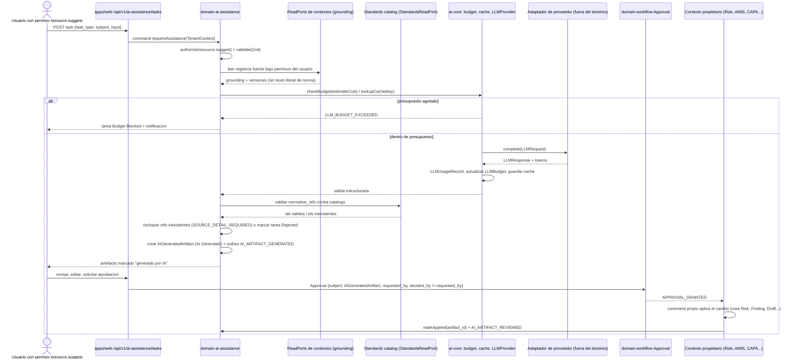

# Arquitectura de asistencia por IA y autogobernanza de la plataforma

Documento de nivel 3 que desarrolla la decisión AD-17 del *Architecture Spine* (IA asistida: proveedor abstraído, todo registrado, sin escritura sobre cumplimiento) junto con AD-3 (lectura por puertos), AD-8 (autorización en el servicio), AD-10 (toda decisión pasa por `Approval`), AD-14 (secretos solo por `SecretStore`) y AD-7 (catálogo normativo global). No añade decisiones nuevas: cada valor concreto que el spine deja abierto va marcado `[ASSUMPTION]` y figura en la tabla final como pendiente de aprobación humana. Documento en español; identificadores, entidades, eventos y código en inglés.

## 1. Objetivo y principio rector

**Desarrolla AD-17.** La plataforma ofrece asistencia por IA para diez familias de tareas (FR-127) con una regla única heredada de CLAUDE.md: *la IA sugiere; una persona autorizada aprueba*. En arquitectura esa frase se traduce en cuatro propiedades verificables:

1. El dominio no conoce ningún SDK de proveedor: solo el puerto `LLMProvider` de `packages/ai-core`.
2. Ninguna invocación se dispara por evento; siempre la solicita un usuario con permiso `*.suggest` y crea `AIAssistanceTask` y `LLMUsageRecord`.
3. Todo resultado es un `AIGeneratedArtifact` marcado `generated_by_ai: true`, en estado `AI Generated`, que un humano revisa y que solo el contexto propietario aplica tras una `Approval` (AD-10).
4. El principal `ai-assistant` no tiene ningún permiso de escritura sobre estados de requisito, control, riesgo, evidencia ni CAPA (PR-DR-008); una prueba de permisos lo garantiza.

Además, por A9 y FR-130 (PR-DR-026), la propia función asistida es un sistema de IA y se registra como `AISystem` en el inventario del tenant plataforma, sujeto a los mismos flujos que cualquier sistema de un cliente.

## 2. Posición en el monorepo

**Desarrolla AD-1, AD-3 y AD-17.**

| Paquete | Capa | Contenido | Fase |
| --- | --- | --- | --- |
| `packages/ai-core` | L1 platform | puerto `LLMProvider`, `LLMBudget` (servicio de presupuesto), `ResponseCache` (puerto y adaptador PostgreSQL), `UsageRecorder`, tipos `LLMRequest`/`LLMResponse`, proveedor falso determinista para pruebas | MVP (puerto, registro, caché, presupuesto sin adaptador real) |
| `packages/domain-ai-assistance` | L2 domain | `AIAssistanceTask`, `AIGeneratedArtifact`, `LLMProviderConfig`, `LLMUsageRecord`, `LLMBudget` (entidad), catálogo de tareas, servicio de *grounding*, validador de referencias normativas, máquina de estados de revisión | MVP: entidad `LLMProviderConfig` y registro; F2: tareas (F2-2) |
| `packages/llm-anthropic`, `packages/llm-openai`, `packages/llm-azure-openai` `[ASSUMPTION nombres]` | L1 platform (adaptadores) | implementaciones de `LLMProvider` con el SDK oficial de cada proveedor; ningún otro paquete importa esos SDKs | F2 (F2-1) |
| `apps/web` | L3 | UI de invocación, revisión y marcado; route handlers `/api/v1/ai-assistance/*` | F2 |
| `apps/worker` | L3 | job `ai-assistance-run` (ejecución asíncrona de tareas largas) | F2 |

La prueba de dependencias de AD-3 (`dependency-cruiser`) prohíbe que `packages/domain-*` y `apps/*` importen `@anthropic-ai/sdk`, `openai` o cualquier paquete `packages/llm-*`; solo la composición de arranque de `apps/web` y `apps/worker` registra el adaptador elegido detrás del puerto. El adaptador Anthropic usa el SDK TypeScript verificado en el spine (0.126, fijar exacta); los adaptadores OpenAI y Azure OpenAI usan sus SDKs oficiales con versión a verificar en F2-1 `[ASSUMPTION]`.

## 3. Puerto `LLMProvider` y entidades de `ai-core`

**Desarrolla AD-17, AD-14 y FR-129.**

```ts
// packages/ai-core/src/llm-provider.ts
export interface LLMProvider {
  readonly provider_id: 'anthropic' | 'openai' | 'azure-openai' | 'fake';
  listModels(): Promise<ModelDescriptor[]>;          // { model_id, context_window, max_output_tokens, input_cost_per_1m, output_cost_per_1m, supports_streaming }
  complete(req: LLMRequest): Promise<LLMResponse>;
  stream(req: LLMRequest): AsyncIterable<LLMStreamEvent>;
  estimateCost(req: LLMRequest, model_id: string): Promise<CostEstimate>;   // tokens de entrada contados o estimados × tarifa configurada
  limits(model_id: string): ModelLimits;              // max_input_tokens, max_output_tokens, requests_per_minute (si el proveedor lo publica)
}

export interface LLMRequest {
  model_id: string;
  system: string;                       // instrucciones de la tarea (plantilla versionada por task_type)
  messages: Array<{ role: 'user' | 'assistant'; content: string }>;
  max_output_tokens: number;
  output_schema?: JsonSchema;           // salida estructurada cuando el proveedor lo soporta; si no, el adaptador valida con Zod
  metadata: { tenant_id: string; task_id: string; task_type: AITaskType; correlation_id: string };
}
```

`complete` y `stream` reciben la solicitud ya construida por el dominio; el adaptador solo traduce al SDK, aplica las opciones específicas del proveedor (p. ej. modo de razonamiento del modelo) y devuelve `LLMResponse { text, structured?, input_tokens, output_tokens, cached_input_tokens?, model_id, latency_ms, stop_reason, provider_request_id }`. El `stop_reason` incluye el valor `refusal` para proveedores que lo devuelven; el dominio lo trata como resultado no utilizable y cierra la tarea en `Rejected` con explicación al usuario, nunca con un artefacto vacío.

### 3.1 `LLMProviderConfig` (por tenant)

```ts
export interface LLMProviderConfig {
  id: string; tenant_id: string;
  provider_id: 'anthropic' | 'openai' | 'azure-openai';
  default_model_id: string;                          // dato de configuración, nunca constante del dominio
  model_overrides: Partial<Record<AITaskType, string>>;
  region_or_endpoint: string | null;                 // Azure: endpoint del recurso; Anthropic/OpenAI: región de inferencia si el proveedor la ofrece
  secret_ref: string;                                // AD-14: la clave vive en SecretStore
  data_classification_allowed: DataClassification[]; // qué clases de datos del tenant pueden salir hacia el proveedor (§10)
  redaction_profile: 'none' | 'pii_basic' | 'strict' | null;   // [ASSUMPTION] §10
  enabled: boolean;
  created_at: Date; created_by: string; updated_at: Date; updated_by: string; status: string; version: number; deleted_at: Date | null;
}
```

Cambiar la configuración es un command con permiso `ai_assistance.configure` `[ASSUMPTION nombre]`, emite `ENTITY_MUTATED` y, al escribir `secret_ref`, los eventos `CREDENTIAL_CREATED|UPDATED|ROTATED` de AD-14. Ningún DTO devuelve el valor del secreto; la prueba de exposición de secretos de `tests/security` cubre estos endpoints.

### 3.2 `LLMBudget`

`LLMBudget { tenant_id, period: 'monthly' | 'quarterly', limit_input_tokens, limit_output_tokens, limit_estimated_cost, soft_block: true, consumed_*, period_start, period_end }`. El presupuesto se comprueba **antes** de invocar al proveedor con `estimateCost` y **después** con el consumo real. Al superarlo se aplica bloqueo suave (FR-129): la tarea se rechaza con código `LLM_BUDGET_EXCEEDED`, se emite el evento `LLM_BUDGET_EXCEEDED` (Notifications avisa al `AI Governance Manager`) y un usuario con `ai_assistance.configure` puede ampliar el presupuesto o autorizar una excepción puntual registrada; nunca se corta a mitad de una tarea ya iniciada. Los importes son estimaciones calculadas con las tarifas registradas en `ModelDescriptor` (dato del adaptador, actualizable sin tocar el dominio) y se etiquetan como estimadas.

### 3.3 Caché de respuestas

`ResponseCache` guarda `{ cache_key, tenant_id, task_type, model_id, response, created_at, expires_at }` en la tabla `llm_response_cache` con RLS (AD-2). `cache_key = SHA-256(canonical_json({ tenant_id, task_type, model_id, prompt_template_version, grounding_digest, user_input }))`, con JSON canónico RFC 8785 (AD-22). El `grounding_digest` es el hash de los registros fuente inyectados con sus versiones, de modo que un cambio en la SoA o en un riesgo invalida la caché sin lógica adicional. TTL por tipo de tarea (por defecto 24 h `[ASSUMPTION]`); la caché es siempre por tenant, nunca compartida entre tenants. Un acierto de caché crea igualmente `AIAssistanceTask` y `LLMUsageRecord` con `cache_hit: true` y coste cero, para que el uso quede registrado.

### 3.4 `LLMUsageRecord` (por llamada)

`{ id, tenant_id, task_id, task_type, provider_id, model_id, input_tokens, output_tokens, cached_input_tokens, estimated_cost, latency_ms, cache_hit, prompt_template_version, provider_request_id, source_refs[], invoked_by, occurred_at }`. Es de solo inserción, alimenta `LLMBudget`, el informe de uso del `AISystem` de la plataforma (§9) y los KPI de coste. Nunca almacena el texto del prompt ni de la respuesta: eso vive, cuando procede, en el `AIGeneratedArtifact`.

## 4. Catálogo de tareas de asistencia (FR-127)

**Desarrolla AD-17 y AD-3.** Cada tarea declara entrada, *grounding* (qué datos del tenant se inyectan), salida, artefacto resultante y quién lo revisa. Reglas comunes a todas: el *grounding* se obtiene **exclusivamente** por puertos de lectura de los contextos propietarios bajo el `TenantContext` y los permisos del usuario invocador (si el usuario no puede leer un riesgo, la tarea no lo ve); nunca se inyectan datos de otro tenant; nunca se inyecta texto literal de la norma, solo la paráfrasis y las citas `resumenes/NN §sección` del catálogo `standards-seed` (AD-7); la salida estructurada lleva `normative_refs[]` que el validador de §5 contrasta con el catálogo.

| Tarea (`AITaskType`) | Entrada | Grounding inyectado | Salida | Artefacto y estado inicial | Revisor |
| --- | --- | --- | --- | --- | --- |
| `requirement_interpretation` | `requirement_id` | paráfrasis del requisito, `record_type`, controles mapeados, contexto y roles de IA del tenant (`AIMSContext`) | explicación en lenguaje llano y preguntas de implementación | `AIGeneratedArtifact.kind = 'interpretation_note'` → `AI Generated`; solo se adjunta como nota, nunca cambia `RequirementImplementation.status` | propietario del requisito |
| `gap_analysis` | alcance o cláusula | `requirements.implementations`, `soa.items`, `evidence.coverage` del alcance | lista de brechas con referencia a requisito/control existentes | `gap_analysis` → `AI Generated`; al aprobarse, AIMS crea `Finding.source_type = ai_gap_analysis` y tareas | Compliance Manager |
| `risk_suggestion` | `ai_system_id` | ficha del `AISystem`, fuentes de riesgo Anexo C del catálogo, riesgos ya registrados, `RiskMethodology` | riesgos candidatos con fuente, escenario y controles sugeridos | `risk_suggestion` → `AI Generated`; al aprobarse Risk crea `Risk` en estado inicial, sin inherente ni residual | Risk Manager |
| `impact_assessment_assist` | `impact_assessment_id` | plantilla y dimensiones de impacto, ficha del sistema, evaluaciones previas | borrador de respuestas por dimensión y posibles impactos | `impact_draft` → `AI Generated`; al aprobarse Impact rellena el borrador como `Draft` | evaluador de impacto |
| `control_mapping` | `risk_id` o `requirement_id` | 38 controles del catálogo con paráfrasis, `RequirementControlMapping`, `soa.items` | controles propuestos con justificación | `control_mapping` → `AI Generated`; al aprobarse Controls & SoA/Risk aplican el mapeo | propietario del riesgo o requisito |
| `policy_generation` (FR-081) | plantilla de política (15) | contexto, alcance, objetivos, controles activos, postura de riesgo, principios | borrador de documento | `Document` en estado `AI Generated` (enumeración §C) con metadatos FR-128 | Compliance Manager; publicación solo tras `Approval` |
| `evidence_analysis` (F2-19) | `evidence_id` | metadatos y, si la clasificación lo permite (§10), contenido textual de la evidencia; expectativas de evidencia del control | sugerencia de idoneidad, campos faltantes, controles que podría cubrir | `evidence_assessment` → `AI Generated`; **nunca** cambia el estado de la evidencia (PR-DR-011) | revisor de evidencia |
| `audit_preparation` | `audit_id` | criterios de auditoría, SoA aprobada, evidencia por criterio, `AuditQuestion` del catálogo | lista de preguntas probables y evidencia a preparar | `audit_prep_note` → `AI Generated` | auditor líder interno |
| `corrective_action_suggestion` | `finding_id` | hallazgo, causa raíz declarada, controles afectados, CAPA anteriores similares del tenant | acciones correctivas candidatas con criterio de eficacia | `capa_suggestion` → `AI Generated`; al aprobarse CAPA crea `CorrectiveAction` en `Draft` | propietario de la CAPA |
| `executive_summary` (FR-110) | `report_run_id` | datasets y `ScoreSnapshot` del run, con desgloses completos | resumen narrativo que cita las puntuaciones con su fórmula | sección `narrative` del informe marcada como generada | autor del informe antes de exportar |

Ninguna tarea recibe permisos distintos de lectura; ninguna produce un artefacto en estado distinto de `AI Generated`.

## 5. Entidades del dominio y flujo completo

**Desarrolla AD-17, AD-10, AD-4 y AD-7.**

```ts
export interface AIAssistanceTask {
  id: string; tenant_id: string;
  task_type: AITaskType;
  invoked_by: string;                         // usuario humano; nunca un principal de sistema
  subject: { entity: string; id: string; version: number };
  input: Record<string, unknown>;             // validado con el esquema Zod de la tarea
  grounding_refs: RecordRef[];                // registros fuente leídos, con versión
  provider_id: string; model_id: string; prompt_template_version: string;
  status: 'Requested' | 'Running' | 'Completed' | 'Rejected' | 'Failed' | 'Budget Blocked';
  usage_record_id: string | null;
  correlation_id: string;
  created_at: Date; created_by: string; updated_at: Date; updated_by: string; version: number; deleted_at: Date | null;
}

export interface AIGeneratedArtifact {
  id: string; tenant_id: string;
  task_id: string; kind: AIArtifactKind;
  generated_by_ai: true;                      // literal, no booleano libre
  model: string; provider_id: string; generated_at: Date;
  content: Record<string, unknown>;           // salida estructurada validada
  normative_refs: Array<{ catalog_id: string; standard_version_id: string; validated: true }>;
  source_refs: RecordRef[];
  review_status: 'AI Generated' | 'Under Review' | 'Approved' | 'Rejected' | 'Superseded';
  reviewer_id: string | null; reviewed_at: Date | null; review_notes: string | null;
  approval_id: string | null;                 // Approval de Workflow (AD-10)
  applied_by_context: string | null; applied_at: Date | null;
  created_at: Date; created_by: string; updated_at: Date; updated_by: string; status: string; version: number; deleted_at: Date | null;
}
```



Puntos que el diagrama fija:

- **Invocación explícita**: el único punto de entrada es un command solicitado por un usuario; `domain-ai-assistance` no registra consumidores de eventos que invoquen al proveedor. Los consumidores que sí registra (`AI_ARTIFACT_REVIEWED`, `TENANT_CREATED` para crear el `LLMBudget` por defecto) no llaman al LLM.
- **Validación de referencias normativas** (PR-DR-019, FR-128): toda `catalog_id` devuelta por el modelo se comprueba con `StandardsReadPort.exists(catalog_id, standard_version_id)`. Una referencia inexistente se elimina del artefacto y se registra en `review_notes`; si la tarea depende de esa referencia (p. ej. `control_mapping` con todos los controles inventados) la tarea termina `Rejected` con `SOURCE_DETAIL_REQUIRED`. Ningún identificador no validado llega a la UI, a la API ni a un informe.
- **Aplicación por el propietario**: `domain-ai-assistance` nunca crea un `Risk`, un `Finding` ni un `Document`; emite el artefacto y es el contexto propietario quien, al recibir `APPROVAL_GRANTED` con `subject_type = AIGeneratedArtifact`, ejecuta su propio command con su propia autorización (el aprobador debe tener el permiso de escritura correspondiente, además de `decided_by ≠ requested_by`, PR-DR-011).

## 6. Regla dura: el principal `ai-assistant` nunca escribe cumplimiento

**Desarrolla AD-17 y AD-8.** El rol técnico `ai-assistant` existe en el catálogo de roles con exactamente los permisos `requirements.suggest, risks.suggest, impacts.suggest, controls.suggest, policies.suggest, evidence.suggest, audits.suggest, capa.suggest, reports.suggest` `[ASSUMPTION nombres, sujetos al catálogo P2 §4 y addendum §B]` y ninguno más. `tests/security/ai-assistant-cannot-write.test.ts` construye un `TenantContext` con ese rol y verifica, para cada command de transición de estado de `RequirementImplementation`, `SoAItem`, `ControlImplementation`, `Risk`, `Evidence` y `CorrectiveAction`, que el `Authorizer` responde `PERMISSION_DENIED`; además comprueba estáticamente que ningún módulo de `domain-ai-assistance` importa commands de escritura de otros contextos (solo `*ReadPort` y tipos). La prueba se nombra por `PR-DR-008` según AD-23.

## 7. Marcado visible "generado por IA"

**Desarrolla FR-128.** El marcado es una propiedad del dato (`generated_by_ai: true` literal, `model`, `generated_at`, `task_id`) y se propaga a tres superficies:

- **UI**: componente `AIGeneratedBadge` de `packages/ui` obligatorio junto a cualquier contenido cuyo origen sea un `AIGeneratedArtifact`, con el estado de revisión y el revisor; los componentes que renderizan `Document`, `Risk`, `Finding` o `narrative` reciben el metadato y no pueden omitir el badge (prueba de tipos: la prop es requerida cuando `generated_by_ai` está presente).
- **Exportaciones** (`REPORTING_ARCHITECTURE.md` §5): las plantillas HTML/PDF anteponen a cada bloque generado la leyenda bilingüe "Contenido generado por IA, revisado por … el …" o "pendiente de revisión humana"; CSV/JSON incluyen las columnas `generated_by_ai`, `model`, `review_status`.
- **Informes y documentos publicados**: un `Document` que nació `AI Generated` conserva el metadato en todas sus `*_versions` aunque pase a `Approved` o `Published`.

## 8. Control de coste

**Desarrolla FR-129 y A9.** Cuatro palancas, todas datos de configuración:

1. `LLMBudget` con bloqueo suave por tenant y periodo (§3.2).
2. Caché por hash de prompt, *grounding* y modelo (§3.3).
3. Límites por tarea en el catálogo: `max_grounding_tokens`, `max_output_tokens` y `max_invocations_per_user_per_day` por `AITaskType` `[ASSUMPTION valores en F2-2]`; el *grounding* que excede el límite se recorta por relevancia declarada (registros más recientes o del alcance solicitado) y la tarea informa qué se omitió, nunca se trunca en silencio.
4. Modelo por tipo de tarea: las tareas simples usan modelos más baratos, las complejas modelos más capaces, siempre como dato de `LLMProviderConfig.model_overrides`.

### 8.1 Modelos por defecto recomendados

Los identificadores siguientes son los verificados en el spine/ADR-001 para el adaptador Anthropic y se proponen **solo como valores iniciales de configuración**; no existen como constantes en `packages/domain-ai-assistance` y cualquier tenant puede sustituirlos por modelos de OpenAI o Azure OpenAI en `LLMProviderConfig` sin cambiar código.

| Grupo de tareas | Modelo recomendado (Anthropic) | Motivo |
| --- | --- | --- |
| `requirement_interpretation`, `gap_analysis`, `policy_generation`, `impact_assessment_assist` | `claude-opus-5` | razonamiento largo sobre mucho *grounding*; calidad prima sobre coste |
| `risk_suggestion`, `control_mapping`, `corrective_action_suggestion`, `audit_preparation` | `claude-sonnet-5` | tareas estructuradas de tamaño medio con salida en esquema |
| `executive_summary`, `evidence_analysis` (clasificación y campos faltantes) | `claude-haiku-4-5` | tareas cortas y frecuentes; coste bajo |
| Opción de máxima capacidad, desactivada por defecto | `claude-fable-5-1` | reservado para tenants que lo activen expresamente tras revisar coste y condiciones de retención de datos del proveedor (§10) |

El ADR-001/memlog cita el identificador con sufijo de fecha `claude-haiku-4-5-20251001`; este documento usa el alias sin fecha `claude-haiku-4-5` porque es el identificador canónico documentado por el proveedor `[ASSUMPTION, confirmar en F2-1]`. Los equivalentes para OpenAI y Azure OpenAI se fijan en F2-1 con verificación contra la documentación de cada proveedor; este documento no los inventa.

## 9. La plataforma como sistema de IA (A9, FR-130, PR-DR-026)

**Desarrolla AD-17 y AD-9.** En el tenant plataforma (el tenant interno con el que la organización que opera el producto gestiona su propio SGIA) existe un `AISystem` con `name = "Platform AI Assistant"` en `domain-ai-portfolio`, creado por el cambio F2-3 `platform-self-governance` y mantenido por los mismos commands que cualquier sistema de un cliente. La ficha se rellena con los campos que el inventario ya exige (FR-034) y sin inventar detalle normativo:

| Campo del `AISystem` | Contenido |
| --- | --- |
| propósito y uso previsto | asistir a usuarios autorizados en las diez tareas de §4; producir borradores y sugerencias que requieren revisión humana |
| mal uso previsible | tratar una sugerencia como decisión de cumplimiento; usar el asistente para redactar declaraciones hacia terceros sin revisión; introducir datos personales de evidencia no clasificados |
| modelo y proveedor | los de `LLMProviderConfig` del tenant plataforma; `MODEL_VERSION_CHANGED` se emite cuando cambia `default_model_id`, lo que dispara la reevaluación de riesgo e impacto (PR-DR-007) |
| supervisión humana | flujo de §5: revisión obligatoria, `Approval` con separación de funciones, principal sin escritura |
| evaluación de impacto | `ImpactAssessment` del sistema con las dimensiones del §C, en particular `transparency`, `human_oversight`, `automated_decisions`, `foreseeable_misuse` |
| información a usuarios | el marcado de §7 y la página de ayuda bilingüe que explica qué hace el asistente, con qué datos y cómo se revisa |
| uso responsable | política interna del tenant plataforma como `Document` aprobado |
| controles del Anexo A vinculados | los controles de los dominios A.6 (ciclo de vida del sistema de IA), A.8 (información a partes interesadas) y A.9 (uso responsable) que la SoA del tenant plataforma marque `Applicable`; la selección concreta es una `organizational_decision` del tenant plataforma, no de este documento |

`AI_ARTIFACT_GENERATED` es consumido por AI Portfolio (consumidor `platform-ai-usage-recorder`) para alimentar el registro de uso de ese `AISystem`: conteo por tarea, modelos, tokens y tasa de artefactos aprobados/rechazados, que a su vez son evidencia de tipo `monitoring_metric` para los controles activos. La matriz de trazabilidad del propio desarrollo se expone como evidencia según FR-130 y `TRACEABILITY_MODEL.md` §7.

## 10. Privacidad y residencia

**Desarrolla AD-14, AD-20 y NFR-015.**

- **Clasificación antes de envío**: solo se inyecta contenido de evidencia (no metadatos) si la `Evidence.classification` está en `LLMProviderConfig.data_classification_allowed`; por defecto la lista está vacía y el asistente trabaja solo con metadatos y descripciones. La evidencia con datos personales sin clasificación permitida nunca sale del tenant.
- **Redacción/anonimización configurable** `[ASSUMPTION]`: `redaction_profile` aplica un paso determinista en `domain-ai-assistance` antes de construir el prompt (patrones de identificadores personales, correos, teléfonos; F2 con biblioteca a decidir). El registro `AIAssistanceTask.grounding_refs` conserva las referencias, no el texto redactado.
- **Residencia**: `region_or_endpoint` de `LLMProviderConfig` debe ser compatible con `data_region` del tenant; el command de configuración rechaza combinaciones no permitidas por la política del tenant plataforma `[ASSUMPTION regla]`. Las condiciones de retención de datos de cada modelo (p. ej. modelos que el proveedor no ofrece bajo retención cero) se registran en `ModelDescriptor.data_retention_note` y se muestran al configurar; el dominio no las hardcodea.
- **Logs**: `LLMUsageRecord` y los logs OTel (AD-19) nunca incluyen prompt, respuesta ni contenido de evidencia; solo identificadores, tokens y tiempos.

## 11. Evaluación y pruebas

**Desarrolla AD-23.**

| Prueba | Qué garantiza | Fase |
| --- | --- | --- |
| Pruebas de contrato del puerto (`packages/ai-core/test/llm-provider.contract.ts`) ejecutadas contra cada adaptador con grabaciones y, con credenciales de prueba y aprobación humana previa, contra el proveedor real | `complete`, `stream`, `estimateCost`, manejo de `refusal`, límites, errores tipados | MVP (proveedor falso), F2-1 (adaptadores) |
| Proveedor falso determinista (`FakeLLMProvider`) que devuelve salidas fijadas por `task_type` y semilla | pruebas unitarias e integración reproducibles sin red ni coste; incluye casos con referencias normativas inventadas y con `refusal` | MVP |
| Prueba "ninguna referencia inventada llega a la UI" (`tests/e2e/ai-no-invented-refs.spec.ts`) | con el proveedor falso configurado para devolver `A.99.1`, la UI muestra la tarea rechazada o el artefacto sin esa referencia y con nota | F2-2 |
| Prueba de permisos `PR-DR-008` (§6) y prueba de dependencias (§2) | el principal no escribe cumplimiento; ningún SDK en el dominio | MVP (estructura), F2 (roles) |
| Prueba de presupuesto (`LLM_BUDGET_EXCEEDED`) y de caché por tenant | bloqueo suave; ningún acierto de caché entre tenants | F2-1 |
| Prueba de exposición de secretos sobre `/api/v1/ai-assistance/config` | `secret_ref` nunca se resuelve en DTOs | MVP |
| Evals de calidad por tarea (conjunto de casos derivados de `resumenes/` con salidas esperadas revisadas por humanos, ejecutados periódicamente contra el proveedor real) | regresión de calidad al cambiar modelo o plantilla; métricas de referencias válidas, aceptación por revisores | F2, tras F2-2 |

## 12. Fases

- **MVP** `[ASSUMPTION]`: `packages/ai-core` con el puerto, `FakeLLMProvider`, `UsageRecorder`, `ResponseCache` y servicio de `LLMBudget`; `packages/domain-ai-assistance` con las entidades `LLMProviderConfig`, `LLMUsageRecord`, `LLMBudget` y el registro `AIAssistanceTask`/`AIGeneratedArtifact` en esquema; la entidad `AISystem` "Platform AI Assistant" creada en el tenant plataforma como registro de inventario con estado que indica que la función aún no está operativa. Ninguna UI de invocación (no hay botones falsos, CLAUDE.md).
- **F2**: F2-1 adaptadores y presupuesto probado con dos proveedores intercambiables; F2-2 catálogo de tareas, *grounding*, validación de referencias, revisión y `Approval`; F2-3 autogobernanza completa (evaluación de impacto e información a usuarios); F2-4 generación de políticas; F2-19 análisis de evidencia; FR-110 resúmenes en informes.
- **F3**: evals continuas, modelos adicionales y, si se aprueba, redacción avanzada.

## 13. Decisiones pendientes de aprobación humana y supuestos

| Ítem | Tipo | Dónde se resuelve |
| --- | --- | --- |
| Nombres de paquetes de adaptadores `packages/llm-anthropic`, `llm-openai`, `llm-azure-openai` | `[ASSUMPTION nombres]` | F2-1 |
| Nombres de permisos `*.suggest` y `ai_assistance.configure` | `[ASSUMPTION]` sobre el catálogo P2 §4 y addendum §B; pendiente de aprobación humana (D-6) | cambio 3 y F2-2 |
| Modelos por defecto por tipo de tarea (§8.1) y uso del alias `claude-haiku-4-5` en lugar del identificador con fecha | `[ASSUMPTION]` de configuración; pendiente de aprobación humana por coste | F2-1 |
| Activación opcional de `claude-fable-5-1` y sus condiciones de retención | `[ASSUMPTION]`; pendiente de aprobación humana (privacidad) | F2-1 |
| TTL de caché 24 h y límites por tarea (`max_grounding_tokens`, invocaciones por usuario y día) | `[ASSUMPTION valores]` | F2-2 |
| Perfiles de redacción/anonimización y biblioteca | `[ASSUMPTION]`; pendiente de aprobación humana (privacidad) | F2-2 |
| Regla de compatibilidad `region_or_endpoint` con `data_region` | `[ASSUMPTION regla]`; pendiente de decisión humana junto a PRD Q6 | F2-27 |
| Alcance del MVP: solo puerto, registro, presupuesto y entidad `AISystem` de la plataforma | `[ASSUMPTION]` de fase | épicas del MVP |
| Selección de controles A.6/A.8/A.9 aplicables al "Platform AI Assistant" | `organizational_decision` del tenant plataforma; pendiente de aprobación humana | F2-3 |
| Equivalentes de modelo para OpenAI y Azure OpenAI | verificar en documentación del proveedor; no se fijan aquí | F2-1 |
