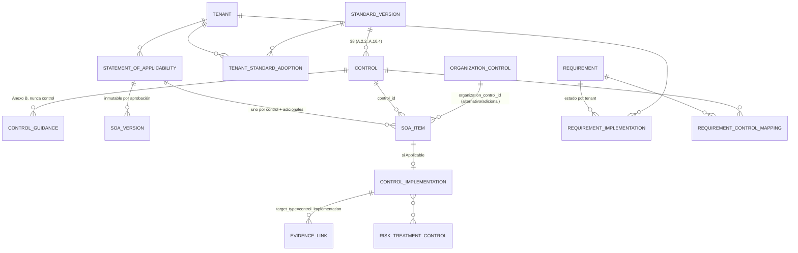
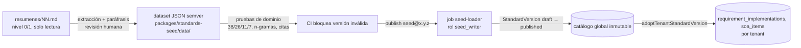

# Arquitectura de datos

Desarrolla `AD-2`, `AD-6`, `AD-7`, `AD-11`, `AD-13`, `AD-21` y `AD-22`. El principio rector es la **separación estricta entre el catálogo normativo global (inmutable, versionado, sembrado) y el estado de cumplimiento de cada tenant (mutable, aislado por RLS, versionado y auditado)**. El detalle de columnas lo fija cada cambio OpenSpec en su `design.md` y migración; aquí se fijan las formas que dos cambios podrían decidir de manera incompatible.

## 1. Principios

1. Una base de datos PostgreSQL 18 compartida; `tenant_id` en toda tabla de negocio; RLS forzada (`AD-2`, ADR-002).
2. El catálogo normativo es global, sin `tenant_id`, inmutable tras publicar y cargado solo desde `packages/standards-seed` (`AD-7`, ADR-006). Nunca contiene texto literal de ISO/IEC/UNE (A6, NFR-020).
3. Cada tabla pertenece a un único bounded context (DOMAIN_MAP §4) y solo su repositorio la escribe (`AD-3`).
4. Toda entidad importante lleva los campos comunes de `CLAUDE.md`; el borrado es lógico; el historial es obligatorio (`AD-11`).
5. Cambios de esquema únicamente por migración Prisma, reversibles cuando sea práctico, con índices por `tenant_id`, `status`, `owner_id`, claves foráneas y `due_date` (NFR-019).
6. Los binarios nunca están en la base de datos; viven en el almacenamiento de objetos con clave prefijada por tenant y `sha256` calculado en servidor (`AD-13`).
7. Identificadores UUID v7, `timestamptz` en UTC, JSON canónico RFC 8785 para hashes (`AD-22`).

## 2. Catálogo normativo global

### 2.1 Entidades

| Entidad | Tabla | Claves y notas |
| --- | --- | --- |
| `Standard` | `standards` | `code` (`ISO/IEC 42001`, `ISO 19011`, `ISO/IEC 23894`, `ISO/IEC 42006`), `title_i18n_key`, `publisher` |
| `StandardVersion` | `standard_versions` | `standard_id`, `edition` (`2023`, `2026`…), `amendments` (`Amd 1:2024`), `language`, `adoption_body` (`ISO`, `UNE`), `status` (`draft|published|deprecated`), `seed_version` (semver), `published_at`; única por (`standard_id`, `edition`, `amendments`, `adoption_body`) |
| `StandardRelationship` | `standard_relationships` | `from_version_id`, `to_version_id`, `type` (`identical_adoption`, `supersedes`, `references`, `pending_dependency`); UNE-ISO/IEC 42001:2025 → 42001:2023+Amd1 = `identical_adoption`; 19011:2026 → 19011:2018 = `supersedes`; 42006 = `pending_dependency` sin contenido (A7) |
| `Clause` / `SubClause` | `clauses` | `standard_version_id`, `identifier` (`4`, `4.1`, `6.1.3`), `parent_id`, `title_paraphrase`, `order` |
| `Requirement` | `requirements` | `standard_version_id`, `clause_id`, `identifier` (`6.1.3 f)`), `record_type`, `requirement_summary` (paráfrasis propia), `expected_evidence[]`, `documented_information_required` (bool, para los 21 elementos), `source_detail_required` (bool), `order` |
| `Annex` | `annexes` | `standard_version_id`, `identifier` (`A`, `B`, `C`, `D`), `normative` (bool: A normativo; B, C, D informativos) |
| `ControlDomain` | `control_domains` | `annex_id`, `identifier` (`A.2`…`A.10`, y `A.6.1`, `A.6.2` como subdominios), `title_paraphrase`, `objective_paraphrase` |
| `Control` | `controls` | `standard_version_id`, `control_domain_id`, `identifier` (`A.2.2`…`A.10.4`; 38 en total), `title_paraphrase`, `purpose_summary`, `expected_evidence[]`, `related_clauses[]` |
| `ControlGuidance` | `control_guidances` | `control_id`, `record_type = implementation_guidance`, `guidance_summary`; **procede del Anexo B y nunca es un control** (PR-DR-018) |
| `RequirementControlMapping` | `requirement_control_mappings` | `requirement_id`, `control_id`, `relationship` (`supports`, `implements`, `evidences`), `source` (`seed`, `tenant` F2) |
| `AuditQuestion` | `audit_questions` | `target_type` (`requirement|control`), `target_id`, `question_i18n`, `expected_evidence[]`, `record_type` |
| `RiskSourceCatalog`, `AIObjectiveCatalog` | `risk_source_catalog`, `ai_objective_catalog` | Anexo C: 7 fuentes de riesgo y 11 objetivos; `identifier`, `summary` |
| `ImpactDimensionCatalog` | `impact_dimension_catalog` | 15 dimensiones (addendum §C) con `safety` ≠ `security` |
| `MandatoryDocumentedInformationCatalog` | `mandatory_documented_information_catalog` | 21 elementos con `requirement_id` de origen |
| `SeedRecordSource` | `seed_record_sources` | `record_type_table`, `record_id`, `source_doc` (`resumenes/02 §4.7 A.6.2.2`), `seed_version`, `reviewed_by`, `reviewed_at` (A10) |
| `RegulatoryRequirement` (F2) | `regulatory_requirements` | `tenant_id` nulo = global; única tabla del contexto con `tenant_id` opcional |

Hechos verificados que la semilla y sus pruebas imponen (CLAUDE.md, resumenes/02 §4.12): 38 controles con distribución A.2:3, A.3:2, A.4:5, A.5:4, A.6:9, A.7:5, A.8:4, A.9:3, A.10:3; 26 términos de la cláusula 3; Anexo C con 11 objetivos y 7 fuentes. Ningún identificador fuera de esas listas puede existir en `controls` para 42001:2023.

### 2.2 Reglas

- El rol de conexión de la aplicación tiene `SELECT` sobre el catálogo y **no** `INSERT/UPDATE/DELETE`; solo el job `seed-loader` (rol `seed_writer`) escribe, y únicamente en versiones `draft`. Publicar una versión la vuelve inmutable por trigger.
- Los identificadores públicos de la norma (`4.1`, `A.6.2.2`) son el único texto "de la norma" que se muestra; títulos y descripciones son paráfrasis con `SeedRecordSource`.
- `record_type` ∈ {`normative_requirement`, `implementation_guidance`, `recommended_practice`, `evidence_example`} es obligatorio en `requirements`, `control_guidances`, `audit_questions` (PR-DR-018).
- Versión de norma por tenant: `tenant_standard_adoptions (tenant_id, standard_version_id, adopted_at, status)`; el estado del tenant referencia siempre la versión adoptada; cambiar de versión es un command explícito que crea nuevas filas de estado por mapeo (`supersedes`) y nunca actualiza en sitio (`AD-7`).

## 3. Estado por tenant (núcleo del MVP)

### 3.1 Campos comunes

Toda tabla de negocio (`CLAUDE.md`, `AD-11`):

```sql
id            uuid PRIMARY KEY,            -- UUID v7 generado en servidor
tenant_id     uuid NOT NULL REFERENCES tenants(id),
status        text NOT NULL,               -- enum canónico del kernel (Prisma enum)
version       integer NOT NULL DEFAULT 1,  -- concurrencia optimista (If-Match)
created_at    timestamptz NOT NULL DEFAULT now(),
created_by    uuid NOT NULL,               -- users.id o principal técnico (system, ai-assistant, connector:<id>)
updated_at    timestamptz NOT NULL DEFAULT now(),
updated_by    uuid NOT NULL,
deleted_at    timestamptz NULL             -- soft delete; nunca DELETE físico salvo purga gobernada
```

Extensiones habituales: `owner_id uuid` (indexado), `due_date date` (indexado), `business_unit_id uuid`, `classification` (`public|internal|confidential|restricted` `[ASSUMPTION]`), `retention_class` (clave de `RetentionPolicy`), `metadata jsonb`.

### 3.2 Entidades núcleo del MVP por contexto

| Contexto | Tablas (MVP) | Notas de forma |
| --- | --- | --- |
| Identity & Organization | `tenants`, `organizations`, `business_units`, `departments`, `locations`, `teams`, `memberships`, `users`, `roles`, `role_permissions`, `user_roles`, `api_keys`, `invitations`, `tenant_settings` | `tenants.data_region`, `tenants.is_demo`; `users` con `tenant_id` (un usuario pertenece a un tenant; identidad federada por `external_subject`); `role_permissions.scope` (`tenant|business_unit|owned_object`) |
| Administration | `audit_entries`, `retention_policies`, `legal_holds`, `data_quality_checks`, `data_quality_issues`, `import_jobs`, `support_access_grants`, `segregation_of_duties_exceptions` | ver §6 |
| Workflow | `tasks`, `workflows`, `workflow_steps`, `approvals`, `comments` | `approvals.subject_type/subject_id`, `previous_state`, `new_state`, `reason` (PR-DR-017) |
| Notifications | `notifications`, `notification_rules`, `notification_templates` | plantillas bilingües por `locale` |
| AIMS | `organization_contexts`, `context_issues`, `ai_role_declarations`, `interested_parties`, `aims_scopes`, `aims_scope_versions`, `scope_exclusions`, `governance_roles`, `governance_committees`, `competencies`, `training_requirements`, `training_records`, `change_requests`, `requirement_implementations`, `requirement_status_suggestions` | `requirement_implementations (tenant_id, requirement_id, standard_version_id, status, owner_id, target_date, justification, last_recalculated_at)` única por (`tenant_id`, `requirement_id`) |
| AI Portfolio | `ai_assets`, `ai_systems`, `ai_models`, `ai_model_versions`, `ai_providers`, `ai_deployments`, `ai_use_cases`, `ai_projects`, `ai_datasets`, `ai_data_sources`, `ai_integrations`, `suppliers`, `customers`, `contracts`, `asset_relationships` | `ai_systems.personal_data`, `sensitive_data`, `in_scope`, `is_platform_self` (A9); `asset_relationships (from_type, from_id, to_type, to_id, relationship)` para el grafo |
| Risk | `risk_methodologies`, `risk_methodology_versions`, `risk_scales`, `risks`, `risk_sources` (ref. catálogo Anexo C), `threats`, `vulnerabilities`, `risk_assessments`, `risk_treatments`, `risk_treatment_plans`, `risk_treatment_controls`, `risk_acceptances`, `residual_risks` | `risk_acceptances.expires_at NOT NULL` (PR-DR-006); `risks.reassessment_required` (PR-DR-007) |
| Impact | `assessment_templates`, `assessment_questions`, `impact_assessments`, `impact_assessment_versions`, `assessment_answers`, `impact_findings` (especialización), `mitigations` | `impact_assessments.lifecycle_stage`, `ai_system_id`, `risk_ids[]` |
| Controls & SoA | `statements_of_applicability`, `soa_versions`, `soa_items`, `control_implementations`, `organization_controls`, `exceptions` (F2 uso), `control_tests` (F2) | ver §3.3 |
| Evidence | `evidence`, `evidence_versions`, `evidence_requests`, `evidence_links`, `evidence_reviews`, `evidence_provenance` | `evidence.sha256`, `storage_key`, `mime_type`, `size_bytes`, `classification`, `valid_until`, `uploaded_by`; `evidence_links (evidence_id, target_type, target_id)`; `evidence_reviews.reviewer_id ≠ evidence.uploaded_by` (PR-DR-011, constraint + servicio) |
| Documents & Policies | `documents`, `document_versions`, `policies` (vista/subtipo de `documents` con `document_type = policy` `[ASSUMPTION]`), `procedures`, `document_templates`, `mandatory_documented_information` | ciclo de 8 estados |
| Objectives & KPIs | `ai_objectives`, `ai_objective_metrics`, `kpis`, `kpi_definitions`, `metrics`, `metric_samples`, `score_definitions`, `score_snapshots` | `score_snapshots (score_type, scope_type, scope_id, formula, numerator, denominator, exclusions jsonb, source_record_refs jsonb, computed_at)` |
| Audit | `audit_programmes`, `audits`, `audit_plans`, `audit_criteria`, `audit_evidence`, `audit_findings` (especialización), `audit_conclusions`, `audit_reports`, `external_auditor_accesses`, `finding_classification_schemes` | `audit_criteria.target_type/target_id` referencia catálogo o `soa_items` |
| CAPA | `findings`, `nonconformities`, `root_cause_analyses`, `corrective_actions`, `effectiveness_verifications`, `improvement_opportunities` | `findings.source_type` enum (addendum §C) |
| Management Review | `management_reviews`, `management_review_inputs`, `management_review_decisions`, `management_review_minutes` | 14 entradas / 8 salidas como filas tipadas |
| Reporting | `report_definitions` (semilla + tenant), `report_runs`, `report_schedules` (F2), `dashboards`, `search_documents` | `report_runs.result_sha256`, `soa_version_id`, `standard_version_id`, `cutoff_date`, `storage_key` |
| Integrations | `integrations`, `integration_credentials` (`secret_ref` únicamente), `integration_syncs`, `integration_findings`, `data_availability` | `integrations.status` ∈ {`mock`, `configured`, `validated`} |
| AI Assistance (F2; MVP solo tablas) | `llm_provider_configs`, `llm_budgets`, `llm_usage_records`, `ai_assistance_tasks`, `ai_generated_artifacts` | |
| Plataforma | `outbox_events`, `processed_events`, `object_versions`, `idempotency_keys`, `pgboss.*` (esquema propio de pg-boss) | `outbox_events` con `tenant_id` para RLS; `pgboss` sin RLS (solo worker) |

### 3.3 Especialización de `Finding` y de las especializaciones (D-4)

Patrón fijo para toda especialización: **tabla base + tabla de extensión 1:1** (`findings` ← `audit_findings`, `impact_findings`), nunca herencia por columna nula ni tablas independientes. `findings.source_type` indica la extensión; CAPA es dueño de `findings`; Audit e Impact son dueños de su extensión y crean la fila base a través de `FindingPort.register` (command de CAPA) en la misma transacción `[ASSUMPTION mecanismo]`. Lo mismo para `documents` ← `policies`.

## 4. Separación catálogo ↔ estado: la SoA



- `soa_items`: `(soa_id, control_id | organization_control_id, applicability, justification, owner_id, evidence_expectations jsonb, mapped_risk_ids[], mapped_requirement_ids[], decided_by, decided_at)`; `CHECK (applicability <> 'Not Applicable' OR justification IS NOT NULL AND length(justification) > 0)` refuerza PR-DR-003 en BD además del servicio.
- `control_implementations`: `(soa_item_id, control_id, status, owner_id, operating_since, effectiveness_declared, last_test_id, next_review_date)`; existe solo para ítems `Applicable` o `Applicable with Alternative Control`; se desactiva (no se borra) con `CONTROL_DEACTIVATED`.
- `requirement_implementations`: una fila por (`tenant_id`, `requirement_id`) creada al adoptar la versión de norma con `status = Not Started`; `status` de la enumeración de 10 valores; D-2 restringe `Not Applicable` (interpretación normativa pendiente de aprobación).

## 5. Aislamiento por tenant (RLS)

Implementación de `AD-2` (ADR-002):

```sql
ALTER TABLE soa_items ENABLE ROW LEVEL SECURITY;
ALTER TABLE soa_items FORCE ROW LEVEL SECURITY;
CREATE POLICY tenant_isolation ON soa_items
  USING (tenant_id = current_setting('app.tenant_id', true)::uuid)
  WITH CHECK (tenant_id = current_setting('app.tenant_id', true)::uuid);
```

- Un generador en `packages/db` aplica la política a **toda** tabla con columna `tenant_id`; una prueba de integración enumera las tablas y falla si alguna carece de política o de `FORCE`.
- Roles de BD: `app_rw` (aplicación; sin `BYPASSRLS`, sin `DELETE` en tablas de cumplimiento, sin `UPDATE/DELETE` en `audit_entries`), `worker_rw` (igual más `pgboss`), `seed_writer` (catálogo `draft`), `report_ro` (`SELECT` en vistas de lectura declaradas), `migrator` (solo migraciones). `postgres`/superusuario nunca en la aplicación.
- `withTenantTransaction(ctx, fn)` ejecuta `SET LOCAL app.tenant_id = $1` y `SET LOCAL app.actor_id = $2` al inicio; una consulta fuera de transacción con tenant falla porque `current_setting` devuelve nulo y la política no coincide (fail-closed).
- Operaciones de plataforma (Platform Administrator, jobs globales como `seed-loader`, `retention-sweeper` iterando tenants) recorren tenants explícitamente, fijando `app.tenant_id` por iteración; no existe un "modo sin tenant" para tablas de negocio.
- Almacenamiento: claves `tenants/<tenant_id>/<domain>/<object_id>/<version>`; el adaptador rechaza cualquier clave que no empiece por el prefijo del `TenantContext`.
- Pruebas obligatorias (`AD-23`): un usuario del tenant A con todos los permisos no puede leer, listar, actualizar ni descargar objetos del tenant B por API ni por URL firmada.

## 6. Registro de auditoría (`audit_entries`)

Implementación de `AD-6` (ADR-005, addendum D.6):

```sql
CREATE TABLE audit_entries (
  id              uuid PRIMARY KEY,
  tenant_id       uuid NOT NULL,
  sequence        bigint NOT NULL,               -- por tenant, sin huecos
  event_id        uuid NOT NULL UNIQUE,          -- outbox_events.id (idempotencia)
  event_type      text NOT NULL,
  actor_id        uuid,
  actor_type      text NOT NULL,                 -- user | system | ai-assistant | connector | api_key
  occurred_at     timestamptz NOT NULL,
  recorded_at     timestamptz NOT NULL DEFAULT now(),
  object_type     text NOT NULL,
  object_id       uuid,
  action          text NOT NULL,
  previous_state  jsonb,
  new_state       jsonb,
  reason          text,
  correlation_id  uuid NOT NULL,
  session_meta    jsonb,                         -- ip, user_agent, api_key_id (sin secretos)
  previous_hash   bytea NOT NULL,
  hash            bytea NOT NULL,
  UNIQUE (tenant_id, sequence)
);
-- Triggers BEFORE UPDATE OR DELETE → RAISE EXCEPTION 'audit_entries is append-only'
-- REVOKE UPDATE, DELETE ON audit_entries FROM app_rw, worker_rw
```

- `hash = SHA-256(previous_hash || canonical_json(entry sin hash))`; el primer eslabón usa `previous_hash = SHA-256(tenant_id)`.
- Único escritor: consumidor `audit-trail-writer` (Administration) con clave singleton por tenant en pg-boss; toma el último `hash` con `SELECT … FOR UPDATE` sobre `audit_chain_heads (tenant_id, last_sequence, last_hash)`.
- Verificación: `verifyChain(tenantId, from, to)` recalcula y devuelve el primer eslabón roto; exportación en JSON Lines con hashes para custodia externa; ancla externa diaria en F2.
- `previous_state`/`new_state` contienen el diff de la entidad, nunca binarios ni secretos (el `SecretStore` redacta `secret_ref`).

## 7. Historial y versionado

Tres mecanismos complementarios (`AD-11`, ADR-015), elegidos por tipo de entidad para que dos contextos no inventen formas distintas:

| Mecanismo | Se aplica a | Forma |
| --- | --- | --- |
| `version` optimista | todas | `UPDATE … WHERE id = $1 AND version = $2`; conflicto → `CONFLICT_VERSION` |
| Tablas `*_versions` inmutables | documentos y declaraciones **aprobados**: `aims_scope_versions`, `soa_versions`, `document_versions` (incluye políticas), `impact_assessment_versions`, `risk_methodology_versions`, `evidence_versions`, `audit_reports` | fila creada en la aprobación con snapshot completo (`content jsonb` o `storage_key`), `version_number`, `approved_by`, `approval_id`, `effective_from`; nunca se actualiza |
| `object_versions` genérico | el resto de entidades importantes (FR-009) | `(tenant_id, object_type, object_id, version, snapshot jsonb, changed_by, changed_at, event_id)` escrita por el mismo command en la transacción; consulta "ver historial" uniforme |

## 8. Soft delete, retención y legal hold

- `deleted_at` marca el borrado lógico; los repositorios filtran `deleted_at IS NULL` por defecto y exponen `includeDeleted` solo a Administration y Reporting de auditoría.
- `retention_policies (tenant_id, object_class, retention_period, action_on_expiry ∈ {archive, review, purge(F2)}, legal_basis)`; por defecto 7 años para evidencia, auditoría y registros de decisión `[ASSUMPTION D-7]`.
- `legal_holds (tenant_id, scope_type ∈ {tenant, ai_system, audit, evidence}, scope_id, reason, applied_by, released_at)`; el job `retention-sweeper` omite todo objeto bajo `LegalHold` y emite `RETENTION_EXPIRED` solo para revisión.
- En el MVP no existe purga física de registros de cumplimiento; `evidence.delete` del addendum §B es archivo (`status = Archived`). La purga (F2) exigirá `Approval`, ausencia de `LegalHold` y dejará `AuditEntry` con el `sha256` del objeto purgado.

## 9. Índices y rendimiento

Reglas mínimas por tabla de negocio (NFR-006, NFR-007, `CLAUDE.md`):

- `(tenant_id, status)`, `(tenant_id, owner_id)`, `(tenant_id, due_date)` cuando existan; índice en cada FK; `(tenant_id, deleted_at)` parcial `WHERE deleted_at IS NULL`.
- Unicidades de negocio siempre compuestas con `tenant_id`: `(tenant_id, requirement_id)` en `requirement_implementations`; `(soa_id, control_id)` en `soa_items`; `(tenant_id, identifier)` en `ai_systems` `[ASSUMPTION]`.
- `outbox_events (status, created_at)` y `(tenant_id, created_at)`; `processed_events (consumer_name, event_id)` PK.
- `audit_entries (tenant_id, sequence)` único, `(tenant_id, object_type, object_id)`, `(tenant_id, occurred_at)`, `(correlation_id)`.
- Búsqueda léxica MVP: `search_documents` con columna `tsvector` generada y `GIN` `[ASSUMPTION]`; semántica (`pgvector`) diferida a F2.
- Paginación por cursor `(created_at, id)`; nunca `OFFSET` en listados de usuario.

## 10. Migraciones Prisma

- Esquema Prisma multi-archivo: `packages/db/prisma/schema/*.prisma` compuesto por los fragmentos `packages/domain-<ctx>/prisma/<ctx>.prisma` (enlazados o copiados por script de build) `[ASSUMPTION mecanismo]`; el generador de RLS y de triggers append-only se ejecuta tras `prisma migrate dev` y añade SQL a la migración.
- Una migración por cambio OpenSpec como mínimo, nombrada `<timestamp>_<change-name>`; SQL manual permitido dentro de la migración para RLS, `CHECK`, triggers y vistas.
- CI: `prisma migrate diff` entre esquema y migraciones debe ser vacío; `prisma migrate deploy` en una BD limpia y luego la semilla y las pruebas de dominio.
- Reversibilidad: cada migración documenta su `down` en el `design.md`; las irreversibles (borrado de columna con datos, cambio de tipo con pérdida) requieren aprobación humana (`CLAUDE.md`).
- Prisma 7.10 verificado; Prisma 8 en RC: la migración 7→8 se planifica como cambio propio de hardening; ningún paquete importa `@prisma/client` salvo `packages/db` y los adaptadores `adapters/prisma` de cada contexto.

## 11. Semilla normativa (`packages/standards-seed`)



- Formato de registro (A6, PRD §8.2): `{ identifier, title, requirement_summary, record_type, expected_evidence[], references: [{ source_doc: "resumenes/02 §4.7 A.6.2.2", section }], standard_version, source_detail_required }`. Sin texto literal; la prueba de n-gramas ≥ 12 palabras (addendum D.5) compara con `resumenes/` y con una lista de frases marcadas como literales.
- Versionado semver del dataset: `patch` = corrección de paráfrasis sin cambio de identificadores (aun así requiere aprobación humana por ser interpretación normativa), `minor` = nuevos registros o normas, `major` = cambio de identificadores o estructura.
- Carga idempotente por (`standard_version`, `identifier`): reejecutar no duplica; cambiar un registro publicado no está permitido, se publica una nueva `StandardVersion` o un `seed_version` superior con `supersedes`.
- Contenido inicial: ISO/IEC 42001:2023 + Amd 1:2024 (cláusulas 4-10, 38 controles del Anexo A con orientación B como `ControlGuidance`, Anexo C con 11 objetivos y 7 fuentes, Anexo D como `recommended_practice`), UNE-ISO/IEC 42001:2025 como `identical_adoption`, ISO 19011:2026 (criterios y fases de auditoría, preguntas), ISO/IEC 23894:2023 parcial (cláusulas 1-4, 5.1-5.3; el resto `SOURCE_DETAIL_REQUIRED`), ISO/IEC 42006 registrada como `pending_dependency` sin contenido (A7).
- `SeedRecordSource` guarda, por registro, el `source_doc` y el revisor humano; la matriz de trazabilidad (`TRACEABILITY_MODEL.md`) usa el mismo formato `resumenes/NN §sección`.
- El tenant demo (`demo-tenant-seed`) se construye con fixtures derivados de la misma semilla y `tenants.is_demo = true` (PR-DR-020).

## 12. Clasificación y datos personales

- `evidence.classification` y `documents.classification` obligatorios; `ai_systems.personal_data` y `sensitive_data` booleanos declarativos (PRD §8.8).
- Las exportaciones filtran por clasificación y permiso; los logs y el `audit_entries.new_state` no incluyen contenido de evidencia, solo metadatos.
- Cifrado de columnas sensibles (p. ej. `session_meta.ip`, datos de contacto de partes interesadas) con clave por tenant mediante el `SecretStore` `[ASSUMPTION]`, detallado en `SECURITY_ARCHITECTURE.md`.

## 13. Decisiones pendientes de aprobación humana

| Decisión | Motivo |
| --- | --- |
| Separación catálogo/estado (`AD-7`, D-3) | afecta a casi todos los contextos; debe fijarse antes de `standards-and-requirements-engine` |
| Restricción de `Not Applicable` en `requirement_implementations` (D-2) | interpretación normativa |
| Retención por defecto 7 años y `archive` como acción por defecto | umbrales operativos (D-7) |
| Integridad referencial cruzada por puerto en lugar de FK entre contextos | trade-off consistencia/desacoplamiento `[ASSUMPTION]` |
| Cifrado de columnas con clave por tenant | arquitectura de seguridad |
| Cualquier cambio de paráfrasis o identificador de la semilla | interpretación normativa (`CLAUDE.md`) |
