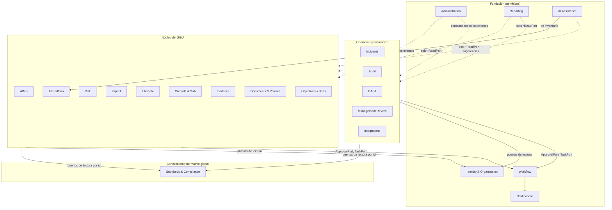

# Arquitectura de dominio

Desarrolla `AD-1`, `AD-3`, `AD-4`, `AD-7`, `AD-9`, `AD-10` y `AD-17` de la espina. Los 21 bounded contexts son los de `DOMAIN_MAP.md` §3; la propiedad de entidades es la de su §4 y no se rediscute aquí. Lo que este documento añade es la **forma de módulo** común, las **interfaces públicas** de cada contexto, las **reglas de dependencia** y **dónde vive cada invariante** del PRD §9.

## 1. Forma común de un módulo de dominio

Cada contexto es un paquete `packages/domain-<context>` con la misma anatomía (`AD-1`, `AD-3`):

| Carpeta | Contenido | Regla |
| --- | --- | --- |
| `src/index.ts` | único punto público: puertos de lectura (`*ReadPort`), tipos de DTO, constantes de eventos publicados, `register(container)` | nada fuera de `index.ts` se importa desde otro paquete |
| `src/entities/` | entidades y objetos de valor con campos comunes (`AD-11`) | sin dependencias de Prisma |
| `src/state/` | máquinas de estado explícitas (`transition(from, to, ctx)`) | una transición inválida lanza `INVARIANT_VIOLATION` con `PR-DR-nnn` |
| `src/commands/` | servicios de aplicación mutantes: `authorize → validate → transaction { mutate; outbox }` (`AD-4`) | un archivo por command; exporta `execute(ctx, input)` |
| `src/queries/` | lecturas para UI/API bajo `TenantContext` y permiso | sin efectos |
| `src/events/` | publicadores (constantes + esquemas Zod de payload) y manejadores `on-<event>.ts` | manejadores idempotentes (`AD-5`) |
| `src/ports/` | interfaces requeridas (repositorio, `ApprovalPort`, `SoAReadPort`…) y ofrecidas | los puertos ofrecidos se reexportan en `index.ts` |
| `src/adapters/prisma/` | repositorios sobre las tablas propias | nunca tablas de otro contexto |
| `prisma/<context>.prisma` | fragmento de esquema (Prisma multi-archivo) compilado por `packages/db` | solo modelos propios |
| `test/` | unitarias (`PR-DR-nnn` por nombre), integración | `AD-23` |

Los commands reciben `TenantContext { tenantId, actorId, roles, permissions, locale, correlationId }` del borde (Route Handler, consumidor o job) y nunca lo construyen. La transacción la abre `packages/db` (`withTenantTransaction(ctx, fn)`), que ejecuta `SET LOCAL app.tenant_id` (`AD-2`) y expone `appendOutbox(event)`.

## 2. Reglas de dependencia entre contextos

Reglas (`AD-3`):

1. **Hacia abajo, nunca hacia arriba.** El núcleo y la operación pueden importar puertos de la fundación y del catálogo; la fundación no importa el núcleo (Reporting, Administration y AI Assistance solo usan puertos `*ReadPort` que el núcleo registra en un contenedor, sin import estático).
2. **Entre pares, solo eventos.** Dos contextos del mismo grupo (por ejemplo Risk e Impact, SoA y Evidence) no se invocan síncronamente para mutar; publican y consumen eventos. La lectura sincrónica por id (`RiskReadPort.getRiskSummary`) se permite para componer pantallas y validar referencias.
3. **Referencias por identificador.** Una entidad referencia a otra ajena solo por `id` (y `type` cuando es polimórfica, p. ej. `EvidenceLink.target_type/target_id`); nunca hay `JOIN` cruzado en repositorios. La integridad referencial cruzada se comprueba en el command mediante el `*ReadPort` del propietario (`exists(id)`), no con claves foráneas de BD `[ASSUMPTION]`, para permitir mover un contexto a otro despliegue sin migración masiva. Excepción: claves foráneas hacia `tenants`, `users` y el catálogo global, que son estables.
4. **Un único escritor por tabla.** DOMAIN_MAP §4 define el propietario; `packages/db` genera una prueba que asocia cada modelo Prisma con su paquete y falla si otro paquete lo referencia en un `adapters/prisma`.
5. **Sin ciclos.** `dependency-cruiser` valida el grafo de paquetes en CI; las dependencias legítimas se declaran en `packages/*/package.json`.

## 3. Interfaces públicas por contexto

Se listan los puertos que cada contexto **ofrece** (exportados en `index.ts`), los principales **commands** (servicios de aplicación mutantes) y los **eventos publicados**. Los nombres son vinculantes como convención; la firma exacta la fija cada cambio OpenSpec. Fase: MVP salvo indicación.

### 3.1 Identity & Organization (`domain-identity-organization`)

- Entidades: `Tenant, Organization, BusinessUnit, Department, Location, Team, Membership, User, Role, Permission (asignación), ApiKey, Invitation, Session (referencia al proveedor de auth)`.
- Puertos ofrecidos: `TenantReadPort { getTenant, getSettings, getDataRegion }`, `UserReadPort { getUser, listUsersWithPermission(tenantId, permission) }`, `AuthorizationPort { can(ctx, permission, object?) }`, `OrgStructureReadPort { getBusinessUnit, listDescendants }`.
- Commands: `createTenant`, `updateTenantSettings`, `inviteUser`, `activateUser`, `deactivateUser`, `assignRole`, `createCustomRole`, `createApiKey`, `revokeApiKey`.
- Eventos: `TENANT_CREATED`, `USER_INVITED`, `USER_ACTIVATED`, `USER_DEACTIVATED`, `USER_PERMISSION_CHANGED`, `API_KEY_CREATED`, `API_KEY_REVOKED` `[A]`.
- Invariantes: el catálogo de permisos es el de `packages/kernel/permissions.ts` (`AD-8`); `Platform Administrator` no accede a datos de negocio sin `SupportAccessGrant` registrado `[ASSUMPTION, addendum §B regla 1]`.

### 3.2 Administration (`domain-administration`)

- Entidades: `AuditEntry, RetentionPolicy, LegalHold, DataQualityCheck, DataQualityIssue, ImportJob, ExportJob, SupportAccessGrant, SegregationOfDutiesException` `[ASSUMPTION ubicación de las dos últimas]`.
- Puertos ofrecidos: `AuditTrailReadPort { query, verifyChain(tenantId, range), export }`, `RetentionReadPort { getPolicy(objectClass), hasLegalHold(objectType, objectId) }`.
- Commands: `applyLegalHold`, `releaseLegalHold`, `setRetentionPolicy`, `runDataQualityCheck`, `startImport`, `grantSupportAccess`.
- Consumidores: `audit-trail-writer` consume **todos** los eventos del outbox (`AD-6`); `retention-sweeper` job.
- Eventos: `RETENTION_EXPIRED`, `LEGAL_HOLD_APPLIED`, `LEGAL_HOLD_RELEASED` `[A]`, `DATA_QUALITY_ISSUE_DETECTED`, `IMPORT_COMPLETED`, `AUDIT_CHAIN_VERIFIED` `[A]`.
- Invariantes: PR-DR-015 (ningún registro de cumplimiento se borra en silencio), PR-DR-017 (toda decisión genera registro inmutable).

### 3.3 Workflow (`domain-workflow`)

- Entidades: `Task, Workflow, WorkflowStep, Approval, Comment`.
- Puertos ofrecidos: `ApprovalPort { request(subject, approverPermission), decide(approvalId, decision, reason) }`, `TaskPort { create, cancelBySource(sourceType, sourceId), complete }`, `CommentPort`.
- Commands: `createTask`, `completeTask`, `requestApproval`, `grantApproval`, `rejectApproval`, `addComment`.
- Eventos: `TASK_CREATED` `[A]`, `TASK_OVERDUE`, `TASK_COMPLETED` `[A]`, `APPROVAL_REQUESTED`, `APPROVAL_GRANTED`, `APPROVAL_REJECTED`, `COMMENT_ADDED` `[A]`.
- Invariantes: `decided_by ≠ requested_by` y `≠ created_by` del sujeto; excepción de separación de funciones solo si `UserReadPort.listUsersWithPermission` devuelve un único usuario y con motivo registrado (`AD-10`, addendum D.4, **pendiente de aprobación humana**). El paquete existe con `Approval` y `Task` mínimos desde `domain-events-outbox-jobs` y el motor completo llega en `tasks-approvals-notifications` `[ASSUMPTION]`.

### 3.4 Notifications (`domain-notifications`)

- Entidades: `Notification, NotificationRule, NotificationTemplate (bilingüe)`.
- Puertos ofrecidos: `NotificationPort { notify(recipients, templateKey, params) }`.
- Consumidores: `TASK_OVERDUE`, `APPROVAL_REQUESTED`, `RISK_ACCEPTANCE_EXPIRING`, `EVIDENCE_EXPIRING`, `CAPA_OVERDUE`, `KPI_THRESHOLD_BREACHED`, `LLM_BUDGET_EXCEEDED`, etc.
- Eventos: `NOTIFICATION_SENT`, `NOTIFICATION_FAILED` `[A]`.

### 3.5 Reporting (`domain-reporting`)

- Entidades: `ReportDefinition, ReportRun, ReportSchedule (F2), Dashboard, SearchDocument (proyección léxica)` `[ASSUMPTION ubicación de la búsqueda]`.
- Puertos ofrecidos: `ReportPort { run(definitionId, params) }`, `SearchPort { search(query, filters) }`; **requiere** `ReportDataSourcePort` de cada contexto (datasets nombrados, `AD-16`).
- Eventos: `REPORT_RUN_COMPLETED`, `REPORT_RUN_FAILED` `[A]`.
- Invariantes: PR-DR-009 (nunca "certificado"), PR-DR-010 (explicación de puntuaciones al renderizar).

### 3.6 AI Assistance (`domain-ai-assistance`, F2 salvo el registro)

- Entidades: `AIAssistanceTask, AIGeneratedArtifact, LLMProviderConfig, LLMBudget, LLMUsageRecord`.
- Puertos ofrecidos: `AssistancePort { suggest(taskType, context) }` (solo lectura del dominio; devuelve artefactos, nunca aplica cambios).
- Eventos: `AI_ARTIFACT_GENERATED`, `AI_ARTIFACT_REVIEWED`, `LLM_BUDGET_EXCEEDED`.
- Invariantes: PR-DR-008 (marcado, aprobación humana, nunca cambia estado), PR-DR-019 (referencias validadas contra `StandardsReadPort`), PR-DR-026 (se inventaría en AI Portfolio) — `AD-17`.

### 3.7 Standards & Compliance (`domain-standards-compliance`)

- Entidades (globales, sin `tenant_id`): `Standard, StandardVersion, Clause, SubClause, Requirement, Annex, ControlDomain, Control, ControlGuidance, RequirementControlMapping, StandardRelationship, AuditQuestion, SeedRecordSource`; `RegulatoryRequirement` (F2, `tenant_id` nulo = global).
- Puertos ofrecidos: `StandardsReadPort { getStandardVersion, listRequirements(versionId), listControls(versionId), getControl(id), getRequirement(id), resolveIdentifier(standard, identifier), listMappings, getSourceCitation(recordId), exists(id) }`.
- Commands (solo `standards.manage`, Platform Administrator): `publishStandardVersion(seedVersion)`, `deprecateStandardVersion`.
- Eventos: `STANDARD_VERSION_PUBLISHED` `[A]`, `REGULATORY_REQUIREMENT_CHANGED` (F2).
- Invariantes: `AD-7` (catálogo inmutable tras publicar, cargado solo desde `standards-seed`), PR-DR-018 (`record_type` obligatorio; Anexo B nunca es control), PR-DR-019 (`SOURCE_DETAIL_REQUIRED`).

### 3.8 AIMS (`domain-aims`)

- Entidades: `OrganizationContext, ContextIssue, AIRoleDeclaration, InterestedParty, AIMSScope, AIMSScopeVersion, ScopeExclusion, GovernanceRole (RACI), GovernanceCommittee, Competency, TrainingRequirement, TrainingRecord, ChangeRequest, RequirementImplementation, RequirementStatusSuggestion` `[ASSUMPTION nombres de las entidades de contexto 4.1]`.
- Puertos ofrecidos: `ScopeReadPort { getApprovedScope, isInScope(aiSystemId, businessUnitId) }`, `RequirementImplementationReadPort { getStatus(requirementId), listByStatus }`, `AIRolesReadPort`.
- Commands: `recordContext`, `declareAIRoles`, `registerInterestedParty`, `draftScope`, `approveScope` (vía `ApprovalPort`), `setRequirementStatus`, `acceptStatusSuggestion`, `raiseChangeRequest`.
- Consumidores: `CONTROL_ACTIVATED/DEACTIVATED`, `EVIDENCE_COLLECTED/APPROVED/EXPIRED`, `AUDIT_FINDING_CREATED`, `CAPA_CLOSED`, `POLICY_APPROVED`, `MANAGEMENT_REVIEW_APPROVED`, `AI_SYSTEM_CHANGED`, `MODEL_VERSION_CHANGED` → generan `RequirementStatusSuggestion` + `Task` (addendum D.3: sugerencia, nunca cambio automático).
- Eventos: `SCOPE_CHANGED`, `REQUIREMENT_STATUS_CHANGED`, `CONTEXT_REVIEWED` `[A]`, `CHANGE_REQUEST_RAISED` `[A]`.
- Invariantes: PR-DR-029 (roles respecto a la IA condicionan aplicabilidad sugerida, expuesta vía `AIRolesReadPort` a Controls & SoA), PRD D-2 (`Not Applicable` de requisito restringido a `implementation_guidance` y normas de apoyo; para `normative_requirement` de 42001 exige justificación y advertencia — **interpretación normativa pendiente de aprobación humana**).

### 3.9 AI Portfolio (`domain-ai-portfolio`)

- Entidades: `AIAsset, AISystem, AIModel, AIModelVersion, AIProvider, AIDeployment, AIUseCase, AIProject, AIDataset, AIDataSource, AIIntegration, Supplier, Customer, Contract, CandidateAISystem (F2), Agent (F2)`.
- Puertos ofrecidos: `AISystemReadPort { getSystem, listInScope, getRelationshipGraph, exists }`, `SupplierReadPort`.
- Commands: `registerAISystem`, `updateAISystem`, `addModelVersion`, `linkDataset`, `registerSupplier`, `promoteCandidate` (F2).
- Eventos: `AI_SYSTEM_CREATED`, `AI_SYSTEM_CHANGED`, `MODEL_VERSION_CHANGED`, `DATASET_CHANGED`, `CANDIDATE_AI_SYSTEM_DISCOVERED` (F2).
- Invariantes: PRD D-4 (`AIProvider` ≠ `Supplier` ≠ `Integration`), PR-DR-012 (candidatos nunca marcan cumplimiento), PR-DR-026 (las funciones LLM de la plataforma son `AISystem` del tenant plataforma).

### 3.10 Risk (`domain-risk`)

- Entidades: `RiskMethodology, RiskMethodologyVersion, RiskScale, Risk, RiskSource (referencia a semilla Anexo C), Threat, Vulnerability, RiskAssessment, RiskTreatment, RiskTreatmentPlan, RiskAcceptance, ResidualRisk`.
- Puertos ofrecidos: `RiskReadPort { getRisk, listByAISystem, listMappedToControl, getExposureDataset }`.
- Commands: `approveMethodology`, `configureScale`, `registerRisk`, `assessRisk`, `proposeTreatmentPlan`, `approveTreatmentPlan`, `acceptResidualRisk`, `flagReassessmentRequired`.
- Consumidores: `AI_SYSTEM_CHANGED`, `MODEL_VERSION_CHANGED`, `DATASET_CHANGED`, `IMPACT_ASSESSMENT_COMPLETED`, `INCIDENT_CREATED`, `CONTROL_DEACTIVATED`, `CONTROL_TEST_FAILED`, `EVIDENCE_EXPIRED` (recalcula residual).
- Eventos: `RISK_CREATED`, `RISK_SCORED`, `RISK_ESCALATED`, `RISK_TREATMENT_APPROVED`, `RISK_ACCEPTED`, `RISK_ACCEPTANCE_EXPIRING`, `RISK_REASSESSMENT_REQUIRED` `[A]`.
- Invariantes: PR-DR-005 (tratado ≠ plan existente: requiere plan aprobado, controles `Implemented|Operating` vía `SoAReadPort`/`ControlImplementationReadPort`, residual evaluado y aceptado o dentro de criterios), PR-DR-006 (aceptación con rol, justificación, residual y expiración; job `risk-acceptance-expiry`), PR-DR-007, PR-DR-028 (no completar evaluación con impacto posterior sin revisar).

### 3.11 Impact (`domain-impact`)

- Entidades: `AssessmentTemplate, AssessmentQuestion, ImpactAssessment, ImpactAssessmentVersion, AssessmentAnswer, ImpactAssessmentFinding (especialización de Finding), Mitigation`.
- Puertos ofrecidos: `ImpactReadPort { getLatestApproved(aiSystemId), hasPendingReview(aiSystemId) }`.
- Commands: `startAssessment`, `answer`, `recordFinding`, `completeAssessment`, `approveAssessment`.
- Eventos: `IMPACT_ASSESSMENT_COMPLETED`, `IMPACT_ASSESSMENT_APPROVED`, `IMPACT_REVIEW_REQUIRED` `[A]`.
- Invariantes: dimensiones semilla con `safety` ≠ `security` (UNE: protección ≠ seguridad), PR-DR-028 con Risk.

### 3.12 Lifecycle (`domain-lifecycle`, F2)

- Entidades: `LifecycleStage, LifecycleGate, GateRequirement, LifecycleReview, StageTransition`.
- Puertos: `LifecycleReadPort { getStage(aiSystemId), listOpenGates }`.
- Eventos: `LIFECYCLE_GATE_PASSED`, `LIFECYCLE_GATE_FAILED`, `LIFECYCLE_STAGE_CHANGED`.
- Invariantes: PR-DR-013 (no avanzar con puertas incompletas salvo `Exception` autorizada de Controls & SoA), PRD D-5 (`Operation & Monitoring`).

### 3.13 Controls & SoA (`domain-controls-soa`)

- Entidades: `StatementOfApplicability (versionada), SoAItem, ControlImplementation, OrganizationControl (control adicional/alternativo), ControlTest (F2), Exception`.
- Puertos ofrecidos: `SoAReadPort { getApprovedSoA, isControlActive(controlRef), listActiveControls, getCompleteness }`, `ControlImplementationReadPort { getStatus, listByOwner, getEffectiveness }`, `ExceptionReadPort`.
- Commands: `createSoA`, `decideApplicability` (PR-DR-003), `assignControlOwner`, `approveSoA` (PR-DR-004, vía `ApprovalPort`), `activateControl`, `deactivateControl`, `transitionControlStatus`, `registerOrganizationControl`, `recordControlTest` (F2), `requestException` (PR-DR-014: `expires_at` obligatorio).
- Consumidores: `RISK_TREATMENT_APPROVED` (mapea controles), `EVIDENCE_EXPIRED` (→ `Needs Improvement`), `AUDIT_FINDING_CREATED`, `MODEL_VERSION_CHANGED` (revisión de controles), `INCIDENT_CREATED`, `AIRoles` vía puerto para sugerir aplicabilidad (PR-DR-029).
- Eventos: `CONTROL_APPLICABILITY_CHANGED`, `SOA_APPROVED`, `CONTROL_ACTIVATED`, `CONTROL_DEACTIVATED`, `CONTROL_STATUS_CHANGED` `[A]`, `CONTROL_TEST_COMPLETED/FAILED`, `EXCEPTION_APPROVED/EXPIRING`.
- Invariantes: **PR-DR-001 a PR-DR-004** (`AD-9`), PR-DR-014, PR-DR-018 (Anexo B nunca en la SoA).

### 3.14 Evidence (`domain-evidence`)

- Entidades: `Evidence, EvidenceVersion, EvidenceRequest, EvidenceLink (target polimórfico), EvidenceReview, EvidenceProvenance (F2 conectores; modelo desde el MVP)`.
- Puertos ofrecidos: `EvidenceReadPort { getCoverage(controlRef|requirementRef), listAcceptedFor(target), getFreshness }`.
- Commands: `requestEvidence`, `uploadEvidence` (hash en servidor, estado `Collected` solo tras escaneo), `submitForReview`, `acceptEvidence`, `rejectEvidence`, `supersedeEvidence`, `linkEvidence`, `archiveEvidence`.
- Consumidores: `CONTROL_ACTIVATED` (crea `EvidenceRequest` según expectativas del control), `CONTROL_DEACTIVATED` (cancela solicitudes abiertas sin borrar), `LIFECYCLE_GATE_*`, `CONNECTOR_SYNC_COMPLETED`; job `evidence-expiry-sweeper`.
- Eventos: `EVIDENCE_REQUESTED`, `EVIDENCE_COLLECTED`, `EVIDENCE_APPROVED`, `EVIDENCE_REJECTED`, `EVIDENCE_EXPIRING`, `EVIDENCE_EXPIRED`, `EVIDENCE_SUPERSEDED` `[A]`.
- Invariantes: **PR-DR-011** (`acceptEvidence` exige `reviewer_id ≠ uploaded_by` y permiso `evidence.approve`; `AD-10`), PR-DR-015 (archivo, nunca borrado), `AD-13`.

### 3.15 Documents & Policies (`domain-documents-policies`)

- Entidades: `Policy, PolicyVersion, Procedure, Document, DocumentVersion, DocumentTemplate, MandatoryDocumentedInformation (los 21 elementos, PR-DR-027)`.
- Puertos ofrecidos: `DocumentReadPort { getApprovedPolicy, listMandatoryElementsStatus }`.
- Commands: `createDraft`, `submitForReview`, `approveDocument` (vía `ApprovalPort`, `policies.approve` = Executive), `publish`, `supersede`, `archive`, `generateDraftFromTemplate` (F2 con IA, marcado `AI Generated`).
- Eventos: `POLICY_APPROVED`, `DOCUMENT_PUBLISHED` `[A]`, `DOCUMENT_SUPERSEDED` `[A]`.
- Invariantes: ciclo canónico de 8 estados (addendum §C), PR-DR-008, PR-DR-027.

### 3.16 Objectives & KPIs (`domain-objectives-kpis`)

- Entidades: `AIObjective, AIObjectiveMetric, KPI, KPIDefinition, Metric, MetricSample, ScoreDefinition, ScoreSnapshot`.
- Puertos ofrecidos: `ScoreReadPort { latest(scoreType, scope), history }`, `KPIReadPort`; **requiere** `*ReadPort` de SoA, Evidence, Risk, AIMS, Audit para calcular.
- Commands: `defineObjective`, `recordMetricSample`, `recalculateScores` (job `kpi-recalculation`).
- Eventos: `SCORE_RECALCULATED`, `KPI_THRESHOLD_BREACHED`, `OBJECTIVE_DEFINED` `[A]`.
- Invariantes: PR-DR-009, **PR-DR-010** (`ScoreSnapshot` completo), PR-DR-030 (objetivo coherente con la política aprobada, medible, con responsable, recursos, plazo y evaluación), PR-DR-001 (excluye `Not Applicable` de denominadores).

### 3.17 Incidents (`domain-incidents`, F2)

- Entidades: `Incident, IncidentEvent, IncidentCategory`.
- Eventos: `INCIDENT_CREATED`, `INCIDENT_STATUS_CHANGED` `[A]`.
- Consumidores: `KPI_THRESHOLD_BREACHED` (incidente sugerido), `CONNECTOR_SYNC_COMPLETED` (hallazgos externos).

### 3.18 Audit (`domain-audit`)

- Entidades: `AuditProgramme, Audit, AuditPlan, AuditCriterion (referencia a Requirement/Control del catálogo y a la SoA aprobada), AuditEvidence, AuditFinding (especialización de Finding), AuditConclusion, AuditReport, ExternalAuditorAccess`.
- Puertos ofrecidos: `AuditReadPort { getReadinessDataset, listOpenFindings, getProgramme }`.
- Commands: `planProgramme`, `scheduleAudit`, `defineCriteria` (desde `StandardsReadPort` y `SoAReadPort.getApprovedSoA`), `attachEvidence`, `recordFinding`, `deriveConclusion`, `issueReport`, `grantExternalAuditorAccess` (Read Only con caducidad).
- Eventos: `AUDIT_STARTED`, `AUDIT_FINDING_CREATED`, `AUDIT_CONCLUDED`, `AUDIT_REPORT_ISSUED` `[A]`.
- Invariantes: PR-DR-022 (clasificación configurable por tenant), **PR-DR-023** (conclusión derivada; sin hallazgo o conformidad por criterio no se emite), independencia del `Auditor` (addendum §B regla 2).

### 3.19 CAPA (`domain-capa`)

- Entidades: `Finding (genérico, source_type), Nonconformity, RootCauseAnalysis, CorrectiveAction, EffectivenessVerification, ImprovementOpportunity`.
- Puertos ofrecidos: `FindingReadPort { listBySource, listOpen, getCapaDataset }`.
- Commands: `registerFinding`, `raiseNonconformity`, `analyzeRootCause`, `planCorrectiveAction`, `verifyEffectiveness`, `closeCapa`, `registerImprovementOpportunity`.
- Consumidores: `AUDIT_FINDING_CREATED`, `IMPACT_ASSESSMENT_COMPLETED` (hallazgos), `INCIDENT_CREATED`, `CONTROL_TEST_FAILED`, `DATA_QUALITY_ISSUE_DETECTED`.
- Eventos: `FINDING_CREATED`, `CAPA_CREATED`, `CAPA_OVERDUE`, `CAPA_CLOSED`, `EFFECTIVENESS_VERIFIED` `[A]`.
- Invariantes: PRD D-4 (`Finding` genérico), **PR-DR-024** (`closeCapa` rechaza sin `EffectivenessVerification` positiva por usuario distinto del ejecutor `[ASSUMPTION]`).

### 3.20 Management Review (`domain-management-review`)

- Entidades: `ManagementReview, ManagementReviewInput (14 entradas agregadas), ManagementReviewDecision (8 salidas), ManagementReviewMinutes`.
- Puertos ofrecidos: `ManagementReviewReadPort`.
- Commands: `scheduleReview`, `aggregateInputs` (lee `RiskReadPort`, `AuditReadPort`, `FindingReadPort`, `KPIReadPort`, `ScoreReadPort`, `ImpactReadPort`…), `recordDecision`, `approveReview` (`management_review.approve` = Executive), `exportMinutes`.
- Eventos: `MANAGEMENT_REVIEW_SCHEDULED` `[A]`, `MANAGEMENT_REVIEW_APPROVED` (→ Workflow crea tareas; Documents recibe decisiones).

### 3.21 Integrations (`domain-integrations`)

- Entidades: `Integration, IntegrationCredential (secret_ref), IntegrationSync, IntegrationFinding, DataAvailability`.
- Puertos ofrecidos: `IntegrationReadPort { getStatus, listSyncs, getDataAvailability }`; **requiere** `connectors-sdk` y `SecretStore`.
- Commands: `registerIntegration`, `configureCredential`, `testConnection`, `runSync`, `revokeCredential`.
- Eventos: `CONNECTOR_SYNC_COMPLETED`, `CONNECTOR_SYNC_FAILED` `[A]`, `CREDENTIAL_CREATED|UPDATED|ROTATED|ACCESSED|REVOKED`.
- Invariantes: PR-DR-020, **PR-DR-021** (`validated` solo tras `ConnectionTest` real), `AD-14`, `AD-18`.

## 4. Dónde viven las invariantes del PRD §9

| Invariante | Contexto que la impone | Mecanismo | Prueba nombrada |
| --- | --- | --- | --- |
| PR-DR-001 SoA gobierna flujos | Controls & SoA (emisor), Evidence, Workflow, Objectives (consumidores) | solo SoA emite `CONTROL_*`; consumidores verifican `isControlActive`; denominadores excluyen `Not Applicable` | `soa/test/activation.spec.ts::"PR-DR-001 inactive control creates no tasks, requests or metrics"` |
| PR-DR-002 activación por evento | Controls & SoA → Evidence, Workflow, Objectives, Audit, Lifecycle | `CONTROL_ACTIVATED` dispara solicitudes, tareas y métricas | `…::"PR-DR-002 applicable control activates flows via event"` |
| PR-DR-003 justificación para excluir | Controls & SoA | `decideApplicability` rechaza `Not Applicable` sin `justification` | `…::"PR-DR-003"` |
| PR-DR-004 completitud antes de aprobar | Controls & SoA | `approveSoA` valida propietario, estado, expectativas de evidencia, riesgos y requisitos mapeados por ítem `Applicable` | `…::"PR-DR-004"` |
| PR-DR-005 tratado ≠ plan | Risk (+ `SoAReadPort`, `ControlImplementationReadPort`) | estado `Treated` solo con plan aprobado, controles implementados y residual aceptado/en criterios | `risk/test/treatment.spec.ts::"PR-DR-005"` |
| PR-DR-006 aceptación con expiración | Risk + job | `acceptResidualRisk` exige `risks.accept`, motivo, residual, `expires_at`; job devuelve a revisión | `…::"PR-DR-006"` |
| PR-DR-007 cambio significativo | AI Portfolio (emisor) → Risk, Impact, Controls & SoA | `MODEL_VERSION_CHANGED`, `AI_SYSTEM_CHANGED`, `DATASET_CHANGED` marcan `reassessment_required` | `…::"PR-DR-007"` |
| PR-DR-008 IA marcada y aprobada (F2) | AI Assistance, Documents, Workflow | `AIGeneratedArtifact`, `Approval`, principal sin permisos de escritura | `ai-assistance/test/permissions.spec.ts::"PR-DR-008"` |
| PR-DR-009 nunca "certificado" | i18n, Reporting, Objectives | prueba de cadenas prohibidas en recursos y API | `i18n/test/forbidden-terms.spec.ts::"PR-DR-009"` |
| PR-DR-010 puntuaciones transparentes | Objectives & KPIs, Reporting, UI | `ScoreSnapshot` obligatorio; componente `ScoreWithExplanation` único en `packages/ui` | `objectives/test/score-snapshot.spec.ts::"PR-DR-010"` |
| PR-DR-011 subida ≠ aceptada | Evidence + Workflow | `acceptEvidence` exige revisor ≠ `uploaded_by`; excepción registrada (pendiente aprobación) | `evidence/test/review.spec.ts::"PR-DR-011"` |
| PR-DR-012 descubrimiento no marca cumplimiento (F2) | AI Portfolio, Integrations | `CandidateAISystem` separado de `AISystem` | `ai-portfolio/test/candidates.spec.ts::"PR-DR-012"` |
| PR-DR-013 puertas (F2) | Lifecycle + `ExceptionReadPort` | transición bloqueada sin puertas o excepción | `lifecycle/test/gates.spec.ts::"PR-DR-013"` |
| PR-DR-014 excepción no permanente (F2) | Controls & SoA | `expires_at NOT NULL`; job `EXCEPTION_EXPIRING` | `soa/test/exceptions.spec.ts::"PR-DR-014"` |
| PR-DR-015 sin borrado silencioso | Administration, todos | soft delete + evento; purga solo por Administration con aprobación | `administration/test/retention.spec.ts::"PR-DR-015"` |
| PR-DR-016 importaciones (F2) | Administration | `ImportJob` con previsualización y confirmación | `…::"PR-DR-016"` |
| PR-DR-017 decisión → registro inmutable | Administration (`audit-trail-writer`) + Workflow (`Approval`) | todo evento del outbox → `AuditEntry`; `Approval` guarda actor, momento, motivo, antes/después | `administration/test/audit-trail.spec.ts::"PR-DR-017"` |
| PR-DR-018 normativo vs orientativo | Standards & Compliance, Controls & SoA, UI | `record_type` obligatorio; la SoA solo admite `Control` del Anexo A | `standards/test/record-types.spec.ts::"PR-DR-018"` |
| PR-DR-019 nunca inventar | Standards & Compliance, AI Assistance | catálogo inmutable desde semilla; validación de referencias; `SOURCE_DETAIL_REQUIRED` | `standards-seed/test/domain.spec.ts::"PR-DR-019"` |
| PR-DR-020 demo y mock etiquetados | Identity (tenant `is_demo`), Integrations (`mock`) | banner y campo persistente | `…::"PR-DR-020"` |
| PR-DR-021 conector no validado sin API real | Integrations | `validated` solo tras `ConnectionTest` con credencial real | `integrations/test/status.spec.ts::"PR-DR-021"` |
| PR-DR-022 clasificación configurable | Audit + Tenant settings | `FindingClassificationScheme` por tenant | `audit/test/classification.spec.ts::"PR-DR-022"` |
| PR-DR-023 conclusión derivada | Audit | `deriveConclusion` exige hallazgo o conformidad por criterio | `audit/test/conclusion.spec.ts::"PR-DR-023"` |
| PR-DR-024 CAPA cierra tras verificar | CAPA | `closeCapa` exige `EffectivenessVerification` | `capa/test/closure.spec.ts::"PR-DR-024"` |
| PR-DR-025 paquetes sectoriales (F3) | Standards & Compliance | `record_type = recommended_practice`, nunca `normative_requirement` | `…::"PR-DR-025"` |
| PR-DR-026 funciones LLM inventariadas (F2) | AI Assistance → AI Portfolio | `AISystem` del tenant plataforma creado por la semilla | `…::"PR-DR-026"` |
| PR-DR-027 21 elementos documentales | Documents & Policies, Reporting | `MandatoryDocumentedInformation` semilla con registro identificable | `documents/test/mandatory.spec.ts::"PR-DR-027"` |
| PR-DR-028 impacto en riesgo | Risk + `ImpactReadPort` | `assessRisk` no completa si `hasPendingReview` | `risk/test/impact-link.spec.ts::"PR-DR-028"` |
| PR-DR-029 roles de IA condicionan aplicabilidad sugerida | AIMS → Controls & SoA | `AIRolesReadPort` alimenta sugerencia `Pending Assessment` → propuesta | `soa/test/suggested-applicability.spec.ts::"PR-DR-029"` |
| PR-DR-030 objetivos coherentes | Objectives & KPIs + `DocumentReadPort` | `defineObjective` exige política aprobada y campos obligatorios | `objectives/test/objectives.spec.ts::"PR-DR-030"` |

## 5. Decisiones abiertas del mapa de dominio resueltas aquí

| Pregunta (DOMAIN_MAP §7, PRD §18) | Decisión | Estado |
| --- | --- | --- |
| §7.1 separación catálogo/estado | Confirmada (`AD-7`, ADR-006) | pendiente de ratificación humana (D-3) |
| §7.2 `Competency`/`Training*` | Permanecen en AIMS con tablas propias; separar a "People & Competence" en F2 si crece | diferida |
| §7.3 `Exception` | Vive en Controls & SoA; su aprobación usa `Approval` de Workflow; Lifecycle la consulta por `ExceptionReadPort` | `[ASSUMPTION]`, F2 |
| §7.4 AI Assistance como contexto separado | Confirmado; su inventario vive en AI Portfolio (`AISystem` del tenant plataforma) | confirmado (A9) |
| §7.5 Administration único escritor del audit log | Confirmado (`AD-6`) | confirmado (ADR-005) |
| §18.3 recalculo de estado de requisito | Sugerencia + tarea + confirmación humana (addendum D.3) | confirmado |
| §18.8 separación de funciones en tenants pequeños | Excepción registrada (`SegregationOfDutiesException`) | **pendiente de aprobación humana** |
