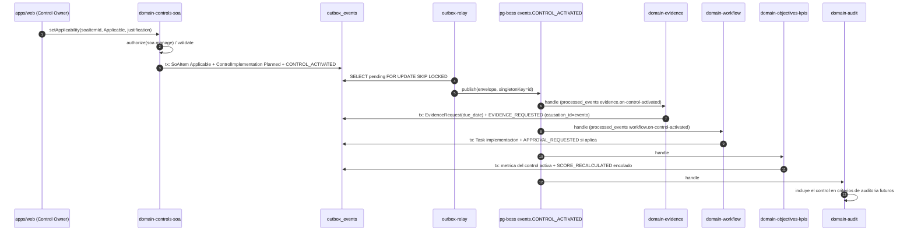
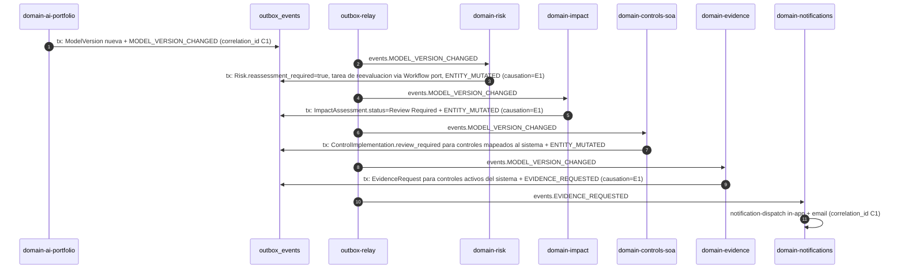
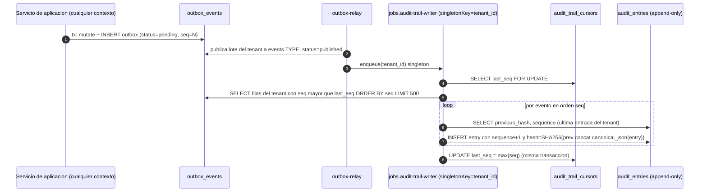

# Arquitectura de eventos, outbox y trabajos en segundo plano

Este documento es el compañero de nivel 3 del *Architecture Spine* para todo lo asíncrono: eventos de dominio, tabla `outbox_events`, relay, colas pg-boss, consumidores idempotentes, registro de auditoría por eventos y catálogo de jobs. Desarrolla las decisiones AD-4, AD-5, AD-6, AD-9, AD-10 y AD-19 del spine y no introduce decisiones nuevas: toda inferencia lleva `[ASSUMPTION]` y queda **pendiente de aprobación humana** (tabla final). El documento está en español; identificadores, entidades, eventos, colas y código en inglés (AD-22).

## 1. Propósito y relación con el spine

| Decisión del spine | Qué fija | Qué desarrolla este documento |
| --- | --- | --- |
| AD-4 | Command `authorize → validate → transaction { mutate; append outbox }`; toda mutación escribe un evento del catálogo o `ENTITY_MUTATED`. | Fila de outbox (§4), evento genérico (§3.1), prueba de misma transacción (§13). |
| AD-5 | Envelope, relay a `events.<TYPE>`, `processed_events`, reintentos (máximo 5), `dead_letter`, puerto `JobScheduler`. | Relay (§5), colas (§6), consumidores y reintentos (§7), correlación y versionado (§9). |
| AD-6 | `audit_entries` append-only con hash chain; único escritor `audit-trail-writer`, serializado por tenant. | Flujo (c) y cursor por tenant (§8). |
| AD-9 | Solo Controls & SoA emite `CONTROL_*` y `SOA_APPROVED`; `Not Applicable` no genera nada. | Flujo (a) y prueba 5 (§13). |
| AD-10 | `Approval` única forma de aprobar; el propietario transiciona con `APPROVAL_GRANTED` o `ApprovalPort`. | `APPROVAL_*` en el catálogo (§3). |
| AD-19 | OTel; `correlation_id` viaja por `TenantContext`, outbox, jobs y `audit_entries`. | Propagación a OTel (§9), métricas, salud y panel (§12). |

Ubicación en el monorepo (spine): `packages/kernel` (envelope, catálogo de tipos y versiones), `packages/events` (outbox, relay, `processed_events`, registro de consumidores), `packages/jobs` (`JobScheduler` y adaptador pg-boss), `apps/worker` (arranque; sin lógica de dominio). Lo materializa el cambio 5 `domain-events-outbox-jobs` (ROADMAP §3).

## 2. Envelope del evento (AD-5)

Los campos son exactamente los del spine; no se añaden campos al envelope. El contexto de traza de OTel se guarda en una columna de la fila de outbox, fuera del envelope (§4).

| Campo | Tipo | Regla |
| --- | --- | --- |
| `id` | `uuid` v7 | Generado en servidor en la misma transacción que la mutación; identidad para idempotencia. |
| `type` | `UPPER_SNAKE` | Un valor del catálogo (§3) o `ENTITY_MUTATED`. |
| `version` | `int` | Versión del esquema del `payload` para ese `type` (§9). |
| `tenant_id` | `uuid` | Tenant propietario; fijado por `TenantContext`, nunca por el payload. |
| `aggregate_type` | `PascalCase` | Entidad raíz (`SoAItem`, `Risk`, `Evidence`…). |
| `aggregate_id` | `uuid` | Identificador de la entidad raíz. |
| `occurred_at` | `timestamptz` UTC | Instante de la mutación (no del relay). |
| `actor_id` | `uuid` o `null` | Usuario, API key o principal de sistema (`system:<job-name>`). |
| `correlation_id` | `uuid` | Generado en el borde (request o job programado) y propagado sin cambios. |
| `causation_id` | `uuid` o `null` | `id` del evento que provocó el command; `null` en el borde. |
| `payload` | `jsonb` | Datos del evento validados con el esquema Zod de `type@version`. |

```json
{
  "id": "0192f3a8-7c1e-7b2a-9d40-3f1e5b6c7d8e",
  "type": "CONTROL_ACTIVATED",
  "version": 1,
  "tenant_id": "0192f000-0000-7000-8000-000000000001",
  "aggregate_type": "SoAItem",
  "aggregate_id": "0192f3a8-6a00-7c11-8a55-1b2c3d4e5f60",
  "occurred_at": "2026-09-17T10:15:42.118Z",
  "actor_id": "0192f000-1111-7000-8000-0000000000aa",
  "correlation_id": "0192f3a8-7bff-7000-8000-0c0ffee00001",
  "causation_id": "0192f3a8-7b00-7000-8000-00000a99e001",
  "payload": {
    "soa_item_id": "0192f3a8-6a00-7c11-8a55-1b2c3d4e5f60",
    "statement_of_applicability_id": "0192f3a8-5000-7000-8000-00000000s0a1",
    "control_catalog_id": "0192e000-0000-7000-8000-00000000a621",
    "standard_version_id": "0192e000-0000-7000-8000-000000042001",
    "control_implementation_id": "0192f3a8-6b00-7000-8000-000000000c11",
    "previous_applicability": "Not Applicable",
    "new_applicability": "Applicable",
    "justification": "Control requerido por el alcance aprobado v2"
  }
}
```

El `payload` nunca contiene texto literal de la norma (AD-7): referencia el catálogo por `control_catalog_id` + `standard_version_id`. Tampoco contiene secretos ni contenido de evidencia (AD-19).

## 3. Catálogo de eventos de dominio

El catálogo es la matriz de `DOMAIN_MAP.md` §5, íntegra. La fase indica el cambio OpenSpec de `ROADMAP.md` que introduce al publicador. Administration consume todos los eventos (audit-trail-writer) y no se repite en la columna de consumidores. Los marcados `[A]` son añadidos del mapa de dominio o técnicos del spine; los añadidos por este documento se marcan `[A]` y `[ASSUMPTION]`.

| Evento | Publica | Consumidores | Fase | Origen |
| --- | --- | --- | --- | --- |
| `AI_SYSTEM_CREATED` | AI Portfolio | Impact, Objectives & KPIs, Management Review, Workflow | MVP (9) | P2 §65 |
| `AI_SYSTEM_CHANGED` | AI Portfolio | Risk, Impact, AIMS, Controls & SoA | MVP (9) | P2 §65, §41 |
| `MODEL_VERSION_CHANGED` | AI Portfolio | Risk, Impact, Controls & SoA, Evidence, Lifecycle, AIMS | MVP (9) | P2 §65, §41 |
| `DATASET_CHANGED` | AI Portfolio | Risk, Impact | MVP (9) | P2 §65 |
| `CANDIDATE_AI_SYSTEM_DISCOVERED` | AI Portfolio | Workflow | MVP (21, mock); F2-8 real | [A] |
| `CONTROL_ACTIVATED` | Controls & SoA | Evidence, Workflow, AIMS, Objectives & KPIs, Audit, Lifecycle | MVP (12) | P2 §65 |
| `CONTROL_DEACTIVATED` | Controls & SoA | Evidence, Workflow, AIMS, Objectives & KPIs, Risk | MVP (12) | P2 §65 |
| `CONTROL_APPLICABILITY_CHANGED` | Controls & SoA | Reporting (completitud SoA) | MVP (12) | P2 §41 |
| `SOA_APPROVED` | Controls & SoA | Audit, Reporting | MVP (12) | [A] |
| `CONTROL_TEST_COMPLETED` / `CONTROL_TEST_FAILED` | Controls & SoA | Risk, CAPA, Notifications | F2-15 | [A] |
| `EXCEPTION_APPROVED` / `EXCEPTION_EXPIRING` | Controls & SoA | Lifecycle, Notifications | F2-12 | [A] |
| `RISK_CREATED` | Risk | Controls & SoA, Management Review | MVP (10) | P2 §65, §41 |
| `RISK_SCORED` | Risk | Objectives & KPIs | MVP (10) | P2 §41 |
| `RISK_ESCALATED` | Risk | Notifications, Management Review, Audit, Controls & SoA | MVP (10) | P2 §65 |
| `RISK_TREATMENT_APPROVED` | Risk | Lifecycle, Controls & SoA | MVP (10) | P2 §41 |
| `RISK_ACCEPTED` | Risk | Management Review, Lifecycle, Objectives & KPIs | MVP (10) | P2 §65, §41 |
| `RISK_ACCEPTANCE_EXPIRING` | Risk (job) | Notifications, Workflow | MVP (10) | P2 §65 |
| `IMPACT_ASSESSMENT_COMPLETED` | Impact | Risk, CAPA, Lifecycle, Management Review | MVP (11) | P2 §65 |
| `IMPACT_ASSESSMENT_APPROVED` | Impact | Lifecycle, Reporting | MVP (11) | P2 §41 |
| `EVIDENCE_REQUESTED` / `EVIDENCE_REJECTED` / `EVIDENCE_EXPIRING` | Evidence | Workflow, Notifications | MVP (13) | [A] |
| `EVIDENCE_COLLECTED` | Evidence | AIMS, Audit, Lifecycle, Controls & SoA | MVP (13) | P2 §65, §41 |
| `EVIDENCE_APPROVED` | Evidence | Objectives & KPIs, AIMS | MVP (13) | P2 §41 |
| `EVIDENCE_EXPIRED` | Evidence (job) | Controls & SoA, AIMS, Objectives & KPIs, Notifications | MVP (13) | P2 §65 |
| `INCIDENT_CREATED` | Incidents | Risk, Impact, Controls & SoA, CAPA, Management Review, Notifications | F2-13 | P2 §65, §41 |
| `AUDIT_STARTED` / `AUDIT_CONCLUDED` | Audit | Management Review, Reporting | MVP (15) | P2 §41 |
| `AUDIT_FINDING_CREATED` | Audit | CAPA, Controls & SoA, AIMS, Notifications, Management Review | MVP (15) | P2 §65, §41 |
| `FINDING_CREATED` | CAPA | Reporting | MVP (16) | P2 §41 |
| `CAPA_CREATED` | CAPA | Workflow, Management Review | MVP (16) | P2 §65 |
| `CAPA_OVERDUE` | CAPA (job) | Notifications, Management Review | MVP (16) | P2 §65 |
| `CAPA_CLOSED` | CAPA | AIMS, Audit (seguimiento), Objectives & KPIs | MVP (16) | P2 §41 |
| `POLICY_APPROVED` | Documents & Policies | AIMS, Reporting | MVP (8) | P2 §65, §41 |
| `SCOPE_CHANGED` | AIMS | AI Portfolio, Impact, Documents & Policies | MVP (7) | P2 §65 |
| `REQUIREMENT_STATUS_CHANGED` | AIMS | Objectives & KPIs, Reporting | MVP (6) | P2 §41 |
| `MANAGEMENT_REVIEW_APPROVED` | Management Review | Documents & Policies, AIMS, CAPA, Workflow | MVP (17) | P2 §41 |
| `CONNECTOR_SYNC_COMPLETED` (alias histórico `CONNECTOR_SYNCED`) | Integrations | AI Portfolio, Evidence, Incidents | MVP (21, mock); F2-5..7 real | P2 §65, §41 |
| `CONNECTOR_SYNC_FAILED` | Integrations | Notifications | MVP (21) | [A] PRD FR-114 |
| `CREDENTIAL_CREATED` / `CREDENTIAL_UPDATED` / `CREDENTIAL_ACCESSED` / `CREDENTIAL_REVOKED` | Integrations | Administration (solo auditoría) | MVP (21) | P2 §17 |
| `CREDENTIAL_ROTATED` | Integrations | Administration (solo auditoría) | F2-5 (rotación) | P2 §17 |
| `REGULATORY_REQUIREMENT_CHANGED` | Standards & Compliance | Risk, Controls & SoA, Documents & Policies, Management Review, Notifications | F2-24 | P2 §65 |
| `USER_PERMISSION_CHANGED` | Identity & Organization | Administration (solo auditoría) | MVP (3) | P2 §41 |
| `LIFECYCLE_GATE_FAILED` / `LIFECYCLE_GATE_PASSED` / `LIFECYCLE_STAGE_CHANGED` | Lifecycle | Evidence, Workflow, Notifications | F2-11 | [A] |
| `KPI_THRESHOLD_BREACHED` / `SCORE_RECALCULATED` | Objectives & KPIs (job) | Incidents, Management Review, Reporting | MVP (18) | [A] |
| `APPROVAL_REQUESTED` / `APPROVAL_GRANTED` / `APPROVAL_REJECTED` | Workflow | Notifications y el contexto propietario del `subject` (AD-10) | MVP (5 mínimo, 14 completo) | [A] |
| `TASK_OVERDUE` | Workflow (job) | Notifications | MVP (14) | [A] |
| `AI_ARTIFACT_GENERATED` / `AI_ARTIFACT_REVIEWED` / `LLM_BUDGET_EXCEEDED` | AI Assistance | AI Portfolio, Documents & Policies, Notifications | F2-1, F2-2 | [A] |
| `RETENTION_EXPIRED` | Administration (job) | Evidence, CAPA, Reporting | MVP (13, archivo) | [A] |
| `LEGAL_HOLD_APPLIED` | Administration | Evidence, CAPA, Reporting | F2-23 | [A] |
| `DATA_QUALITY_ISSUE_DETECTED` | Administration | CAPA, Reporting | F2-21 | [A] |
| `IMPORT_COMPLETED` | Administration | Reporting | F2-22 | [A] |
| `TENANT_CREATED` | Identity & Organization | Administration (solo auditoría) | MVP (2) | [A] ROADMAP cambio 2 |
| `ENTITY_MUTATED` | Cualquier contexto | Administration (solo auditoría), Reporting (proyección de búsqueda) | MVP (5) | [A] spine AD-4 |
| `SEGREGATION_OF_DUTIES_EXCEPTION_RECORDED` | Workflow | Administration (solo auditoría), Notifications | MVP (14) | [A] spine AD-10 `[ASSUMPTION: nombre]` |

Reglas del catálogo:

- El tipo canónico es `CONNECTOR_SYNC_COMPLETED`; `CONNECTOR_SYNCED` (P2 §41) se acepta solo como alias de lectura en el registro de auditoría, nunca se publica `[ASSUMPTION]`.
- Los eventos publicados por jobs (`EVIDENCE_EXPIRED`, `RISK_ACCEPTANCE_EXPIRING`, `CAPA_OVERDUE`, `TASK_OVERDUE`, `SCORE_RECALCULATED`, `RETENTION_EXPIRED`) siguen la regla AD-4: el job invoca un command del contexto propietario, que escribe la mutación y el outbox en la misma transacción. Un job nunca escribe outbox por su cuenta.
- Los eventos de AI Assistance nunca disparan invocaciones de LLM: AD-17 exige invocación explícita, nunca por evento.

### 3.1 El evento genérico `ENTITY_MUTATED`

AD-4 exige que toda mutación escriba al menos un evento. Cuando la mutación no corresponde a ningún evento del catálogo (editar la descripción de un riesgo, cambiar el propietario de un control, corregir un campo de la ficha de un sistema de IA) el servicio de aplicación escribe `ENTITY_MUTATED` con `payload = { entity_type, entity_id, before, after, changed_fields[] }`. Reglas:

- Es complementario, no sustitutivo: una transición del catálogo publica su evento y no `ENTITY_MUTATED` (publicar ambos duplicaría auditoría).
- `before`/`after` son snapshots canónicos (RFC 8785) sin secretos (`secret_ref` sí, valor nunca) ni binarios (hash sí, contenido nunca).
- Sus únicos consumidores son `audit-trail-writer` y `search-projection-refresh` (Reporting, `[ASSUMPTION]`). Ningún contexto de dominio reacciona a él: los flujos de negocio solo se disparan por eventos del catálogo, que sigue siendo el contrato entre contextos.

## 4. Tabla `outbox_events` (AD-4, AD-5)

Propietario: `packages/events` (tabla técnica, no de un contexto de dominio). Lleva `tenant_id` y RLS como toda tabla de negocio (AD-2).

| Columna | Tipo | Notas |
| --- | --- | --- |
| `id` | `uuid` PK | El `id` del envelope (uuid v7, ordenable por tiempo). |
| `seq` | `bigint` `GENERATED ALWAYS AS IDENTITY` | Orden total de inserción; base del cursor del audit-trail-writer `[ASSUMPTION]`. |
| `tenant_id` | `uuid NOT NULL` | RLS. |
| `type`, `version` | `text`, `int` | Del envelope. |
| `aggregate_type`, `aggregate_id` | `text`, `uuid` | Del envelope. |
| `occurred_at` | `timestamptz` | Del envelope. |
| `actor_id`, `correlation_id`, `causation_id` | `uuid` | Del envelope. |
| `payload` | `jsonb` | Del envelope. |
| `trace_context` | `jsonb` | `traceparent`/`tracestate` W3C del span que ejecutó el command; fuera del envelope `[ASSUMPTION]`. |
| `status` | `outbox_status` enum | `pending`, `published`, `failed`. |
| `attempts` | `int` default 0 | Intentos del relay. |
| `published_at` | `timestamptz` | Cuando pg-boss aceptó el job. |
| `last_error` | `text` | Último error de publicación (sin secretos). |
| `created_at` | `timestamptz` | Igual a la transacción del command. |

Índices:

- `outbox_events_pending_idx ON (tenant_id, seq) WHERE status = 'pending'` (parcial; lo usa el relay).
- `outbox_events_tenant_seq_idx ON (tenant_id, seq)` (cursor del audit-trail-writer).
- `outbox_events_aggregate_idx ON (tenant_id, aggregate_type, aggregate_id, occurred_at)` (historial FR-009 y depuración).
- `outbox_events_correlation_idx ON (tenant_id, correlation_id)`.

Estados: `pending` al insertarse en la transacción del command; `published` cuando el relay confirmó la inserción del job en pg-boss; `failed` cuando el relay agotó 5 intentos de publicación (fallo de pg-boss, no del consumidor) y emitió alerta. La transición `failed → pending` es un command administrativo (`administration.jobs.manage` `[ASSUMPTION permiso]`).

Retención: `retention-sweeper` elimina las filas `published` ya procesadas por `audit-trail-writer` a los 30 días `[ASSUMPTION]`, nunca antes. No es borrado de registros de cumplimiento: ese registro es `audit_entries`, append-only (AD-6). Las filas `failed` se conservan hasta resolverse.

## 5. Relay outbox → pg-boss (AD-5)

El relay vive en `packages/events/src/relay/` y lo arranca `apps/worker`. No hay `LISTEN/NOTIFY` en el MVP: polling simple y observable `[ASSUMPTION]`.

Algoritmo por ciclo (intervalo 500 ms con backoff hasta 5 s cuando no hay pendientes `[ASSUMPTION]`):

1. Obtener los tenants activos por `TenantReadPort.listActiveTenantIds()`. El relay respeta AD-2: no hay rol que salte RLS; procesa tenant a tenant.
2. Por tenant, en *round-robin*: `SET LOCAL app.tenant_id`; `SELECT … WHERE status = 'pending' ORDER BY seq LIMIT 100 FOR UPDATE SKIP LOCKED` `[ASSUMPTION: lotes de 100 y SKIP LOCKED para varias réplicas del worker]`.
3. Publicar cada evento en `events.<TYPE>` vía `JobScheduler.publish(queue, envelope, { singletonKey: id })`: una republicación tras fallo parcial no duplica el job.
4. Marcar el lote `published` en la misma transacción del bloqueo. Si pg-boss falla: `attempts += 1`, `last_error`, sigue `pending`; al quinto intento pasa a `failed` con alerta `outbox.publish_failed`.
5. Registrar `outbox.relay.batch_size` y `outbox.relay.lag_seconds` por tenant.

Garantías: entrega *al menos una vez* (lo absorbe `processed_events`); orden por tenant y `seq` en la publicación; entre colas distintas no se garantiza orden de consumo, salvo para `audit-trail-writer` (§8).

pg-boss corre en el mismo PostgreSQL, esquema `pgboss` (ADR-004). El relay y los consumidores usan exclusivamente `JobScheduler`; ningún paquete de dominio importa `pg-boss`.

## 6. Colas y nombres

| Prefijo | Uso | Ejemplo |
| --- | --- | --- |
| `events.<TYPE>` | Una cola por tipo de evento del catálogo; la crea `packages/events` al registrar el primer consumidor. | `events.CONTROL_ACTIVATED` |
| `jobs.<name>` | Trabajos programados o bajo demanda (§10). | `jobs.evidence-expiry-sweeper` |
| `dead_letter` | Destino único de eventos y jobs que agotaron reintentos. | `dead_letter` |

Un evento con varios consumidores se publica una sola vez en `events.<TYPE>`; el *dispatcher* de `packages/events` entrega el job a cada consumidor registrado para ese tipo en el mismo proceso worker, con su propia transacción y su propia fila en `processed_events` (§7). Así, el fallo de un consumidor no bloquea a los demás y no se multiplica el número de colas.

## 7. Consumidores (AD-5)

Registro en `packages/events`:

```ts
// packages/events/src/consumer.ts
export interface EventConsumer<TPayload = unknown> {
  readonly name: string;                 // 'evidence.on-control-activated'
  readonly eventType: string;            // 'CONTROL_ACTIVATED'
  readonly acceptsVersions: readonly number[]; // [1] o [1, 2] (n y n-1)
  handle(event: DomainEvent<TPayload>, ctx: ConsumerContext): Promise<void>;
}

export interface ConsumerContext {
  tenant: TenantContext;    // tenant_id fijado, actor = system:<consumer>
  tx: TenantScopedDb;       // transacción abierta con SET LOCAL app.tenant_id
  correlationId: string;    // heredado del evento
  causationId: string;      // = event.id para los commands que emita
  logger: Logger;           // con tenant_id, correlation_id, event_type
  attempt: number;
}
```

Cada `packages/domain-<context>` exporta sus consumidores en `src/index.ts` (`export const consumers: EventConsumer[]`); `apps/worker` los recoge y los registra. Un consumidor no accede a Prisma: llama a commands del servicio de aplicación de su propio contexto pasando `ctx.tx`, de modo que la reacción también cumple AD-4 y escribe su propio outbox en la misma transacción (encadenamiento con `causation_id = event.id`).

Contrato de ejecución del *dispatcher*:

1. Abrir transacción, `SET LOCAL app.tenant_id`.
2. `INSERT INTO processed_events (consumer_name, event_id, tenant_id, processed_at) ON CONFLICT DO NOTHING`; si no inserta fila, el evento ya fue procesado: *commit* y salir sin llamar a `handle`.
3. Ejecutar `handle(event, ctx)`.
4. *Commit*. Si `handle` lanza, *rollback* (incluida la fila de `processed_events`) y se delega en la política de reintentos.

Tabla `processed_events`: `consumer_name text`, `event_id uuid`, `tenant_id uuid NOT NULL`, `processed_at timestamptz`; PK `(consumer_name, event_id)`; índice `(tenant_id, processed_at)`; RLS; retención 90 días `[ASSUMPTION]`, mayor que la ventana de reintentos.

La idempotencia de negocio sigue siendo del consumidor cuando el mismo hecho llega por eventos distintos (`CONTROL_ACTIVATED` tras `SOA_APPROVED` sobre un control ya activo): el command comprueba el estado actual y el consumidor trata el `INVARIANT_VIOLATION` como *no-op*.

### 7.1 Reintentos y `dead_letter`

Política única en `JobScheduler` (AD-5): `retryLimit = 5`, `retryDelay = 10 s`, `retryBackoff = true` (10, 20, 40, 80, 160 s con *jitter*), `expireInSeconds = 300`. Al tercer fallo, alerta `job.failed_thrice` (FR-012); al quinto, pg-boss mueve el job a `dead_letter` con envelope, `consumer_name`, último error y pila. El panel (§12) permite *reintentar* y *descartar con motivo* (`administration.jobs.manage`, escribe `ENTITY_MUTATED` sobre `DeadLetterItem` `[ASSUMPTION]`). Los errores no reintentables (`PERMISSION_DENIED`, `INVARIANT_VIOLATION`, validación Zod) van a `dead_letter` en el primer intento.

## 8. Orden y serialización por tenant para `audit-trail-writer` (AD-6)

`audit-trail-writer` es el único consumidor que exige orden total dentro del tenant, porque cada `audit_entry` encadena `previous_hash`. Diseño:

- No consume de `events.<TYPE>` (llegarían desordenados). Lee `outbox_events` por tenant en orden de `seq` desde un cursor `audit_trail_cursors(tenant_id PK, last_seq, updated_at)` de Administration `[ASSUMPTION]`.
- Tras publicar un lote, el relay encola `jobs.audit-trail-writer` con `singletonKey = tenant_id` (AD-6): como máximo un job activo por tenant. Un barrido por minuto reencola tenants con `last_seq` retrasado.
- El job procesa en una transacción hasta 500 filas `[ASSUMPTION]` con `seq > last_seq`, calcula `sequence + 1` y `hash = SHA-256(previous_hash || canonical_json(entry))` (primer eslabón `previous_hash = SHA-256(tenant_id)`), inserta y avanza el cursor. Todo o nada: sin huecos.
- Mapeo: `actor = actor_id`, `timestamp = occurred_at`, `action = type`, `object = aggregate_*`, `previous/new state` desde `before/after` o `previous_*/new_*`, `reason` desde `justification | reason`, `correlation_id`, `session metadata` desde `payload.session`. No existe otro escritor: triggers rechazan `UPDATE`/`DELETE` y el rol carece del privilegio.

## 9. Correlación y versionado (AD-5, AD-19)

Correlación:

- `correlation_id` nace en el borde (middleware HTTP de `apps/web`, o cabecera `X-Correlation-Id` validada como uuid; arranque de cada job programado) y viaja en `TenantContext`, envelope, job pg-boss (`data.correlation_id`) y `audit_entries`.
- `causation_id` es el `id` del evento que provocó el command (`ctx.causationId`); permite reconstruir la cadena (b) completa.
- OTel: el command guarda `trace_context` en la fila de outbox; el consumidor abre un span `event.consume <TYPE>` con `SpanLink` al productor (no hijo: la latencia es asíncrona) y atributos `event.type, event.id, event.version, tenant.id, correlation.id, consumer.name, attempt`. Logs con `tenant_id, actor_id, correlation_id, event_type`; nunca secretos ni contenido de evidencia.

Versionado:

- `packages/kernel/src/events/catalog.ts` declara por `type` la versión vigente y un esquema Zod por versión (`CONTROL_ACTIVATED: { 1: controlActivatedV1 }`).
- Cambio compatible (campo opcional nuevo) no incrementa `version`; incompatible (renombrar, eliminar, cambiar tipo o semántica) = nueva `version`; el publicador emite solo la vigente.
- Todo consumidor declara `acceptsVersions` con la vigente y la anterior (tolerancia n-1) y, si hace falta, un *upcaster* puro en `src/events/upcasters/`. Una prueba de contrato falla si un consumidor no acepta la versión vigente.
- Los eventos ya escritos en outbox y `audit_entries` no se migran (la cadena de hashes lo impide).

## 10. Catálogo de jobs pg-boss (FR-012, P2 §44)

Todos los jobs son reintentables, idempotentes, observables y auditables (P2 §44): reciben `correlation_id`, registran intentos, duración y resultado, y toda mutación que provocan pasa por commands (AD-4). Los jobs programados se declaran con `JobScheduler.schedule(name, cron, options)` y se ejecutan con `singletonKey` por tenant cuando iteran tenants. La hora de cron es UTC (AD-22).

| Job (`jobs.<name>`) | Disparador | Contexto dueño | Idempotencia | Fase |
| --- | --- | --- | --- | --- |
| `outbox-relay` | bucle interno del worker (polling) | `packages/events` | `singletonKey = event.id` al publicar; `status` de la fila | MVP (5) |
| `audit-trail-writer` | evento (encolado por el relay) + barrido cada minuto | Administration | cursor `audit_trail_cursors`; `singletonKey = tenant_id` | MVP (4-5) |
| `evidence-expiry-sweeper` | cron diario 02:00 UTC `[ASSUMPTION]` | Evidence | por evidencia: solo transiciona si `expires_at` cumple y estado distinto; emite `EVIDENCE_EXPIRING` (30 días, FR-077) y `EVIDENCE_EXPIRED` una vez por evidencia | MVP (13) |
| `risk-acceptance-expiry` | cron diario | Risk | marca `acceptance_expiring_notified_at`; emite `RISK_ACCEPTANCE_EXPIRING` una vez por ventana | MVP (10) |
| `task-overdue-sweeper` | cron cada hora `[ASSUMPTION]` | Workflow | flag `overdue_notified_at` por tarea; emite `TASK_OVERDUE` | MVP (14) |
| `capa-overdue-sweeper` | cron diario | CAPA | flag por acción correctiva; emite `CAPA_OVERDUE` | MVP (16) |
| `kpi-recalculation` | eventos (`EVIDENCE_APPROVED`, `CONTROL_*`, `RISK_SCORED`, `CAPA_CLOSED`, `REQUIREMENT_STATUS_CHANGED`) con *debounce* de 60 s por tenant `[ASSUMPTION]` + cron diario | Objectives & KPIs | `ScoreSnapshot` nuevo solo si cambia el desglose; emite `SCORE_RECALCULATED`, `KPI_THRESHOLD_BREACHED` | MVP (18) |
| `report-render` | command (`ReportRun` solicitado) o cron de programación (F2-17) | Reporting | `ReportRun.id`; estados `Queued/Running/Ready/Failed` (FR-012) | MVP (19) |
| `document-export` | command | Documents & Policies / Reporting | id de exportación; `sha256` del resultado | MVP (19) |
| `notification-dispatch` | eventos (todos los que listan Notifications como consumidor) | Notifications | `Notification.id` + canal; in-app siempre, correo por preferencia; plantillas bilingües | MVP (14) |
| `antivirus-scan` | evento interno tras ingesta de objeto (command de Evidence) | Evidence (`packages/storage` + ClamAV) | por `sha256` del objeto; evidencia no pasa a `Collected` sin resultado limpio (AD-13) | MVP (13) |
| `connector-sync` | cron por `IntegrationSync.schedule` o command *Sync now* | Integrations | `IntegrationSync.id`; `singletonKey = integration_id`; resultado `Partial Sync` posible | MVP (21, mock); F2-5..7 real |
| `retention-sweeper` | cron diario | Administration | por objeto y `RetentionPolicy`; emite `RETENTION_EXPIRED`; MVP solo archiva (AD-21); también purga outbox `published` (§4) | MVP (13/24) |
| `seed-loader` | command administrativo / arranque con versión semver nueva | Standards & Compliance (`packages/standards-seed`) | por `StandardVersion` semver; nunca altera filas de tenant (AD-7) | MVP (6) |
| `search-projection-refresh` | eventos (catálogo + `ENTITY_MUTATED`) | Reporting `[ASSUMPTION]` | *upsert* por `(entity_type, entity_id)` | MVP (22) |
| `scheduled-reassessment` | cron por periodicidad de metodología | Risk | por riesgo y fecha de revisión; crea tarea vía command | MVP (10) `[ASSUMPTION]` |
| `ai-discovery` | cron / command | Integrations → AI Portfolio | por `IntegrationSync.id`; crea `CandidateAISystem` nunca `AISystem` | F2-8 |

## 11. Flujos de ejemplo

### (a) `CONTROL_ACTIVATED` y `CONTROL_DEACTIVATED` (AD-9, FR-064)



Al pasar a `Not Applicable` o `Retired`, Controls & SoA rechaza la transición sin `justification` (`INVARIANT_VIOLATION`, PR-DR-001) y publica `CONTROL_DEACTIVATED`. Evidence cancela las `EvidenceRequest` pendientes (`status = Cancelled`, `cancellation_reason = 'control deactivated'`, referencia al evento), Workflow cancela las tareas abiertas conservando el registro, Objectives & KPIs retira el control del denominador y lo anota en `ScoreSnapshot.exclusions[]`, Risk marca para revisión los tratamientos que dependían de él. Nada se borra: el control permanece visible y auditable (AD-9). Un control que nace `Not Applicable` no genera evento de activación y ningún consumidor crea tareas, solicitudes ni métricas (§13, prueba 5).

### (b) `MODEL_VERSION_CHANGED` (cadena P2 §65)



Cada paso conserva `correlation_id = C1` y pone `causation_id` al evento que lo disparó: "¿por qué existe esta solicitud de evidencia?" se responde con una consulta por `correlation_id`. Evidence solo crea solicitudes para controles con `SoAReadPort.isControlActive = true` (AD-9). El eslabón *Change Request* de P2 §65 llega en F2-14; en el MVP lo representa la tarea de reevaluación de Risk `[ASSUMPTION]`. Un riesgo marcado para reevaluación no cambia su puntuación hasta que un `Risk Manager` la recalcula.

### (c) Toda mutación → outbox → `audit-trail-writer` → `audit_entries` (AD-6)



Si el `INSERT` en `audit_entries` falla, la transacción entera revierte, el cursor no avanza y el job reintenta; la cadena nunca contiene huecos ni bifurcaciones porque solo hay un job activo por tenant. La verificación (`administration.audit.verify`) recorre la cadena recomputando hashes y la exportación entrega JSON canónico más el hash final, como fija AD-6.

## 12. Observabilidad de eventos y jobs (AD-19, NFR-013, P2 §45)

Métricas OTel (nombres en `packages/observability/src/metrics.ts`):

| Métrica | Tipo | Etiquetas | Umbral de alerta `[ASSUMPTION]` |
| --- | --- | --- | --- |
| `outbox.pending` | gauge | `tenant_id` | > 1.000 durante 5 min |
| `outbox.relay.lag_seconds` | gauge | `tenant_id` | > 60 s |
| `outbox.publish_failed` | counter | `tenant_id`, `type` | > 0 |
| `event.consume.duration_ms` | histogram | `consumer_name`, `type`, `outcome` | p95 > 5 s |
| `event.consume.failures` | counter | `consumer_name`, `type`, `error_code` | 3 fallos consecutivos (FR-012) |
| `dead_letter.size` | gauge | `queue` | > 0 |
| `audit_trail.cursor_lag` | gauge | `tenant_id` | > 500 eventos o > 5 min |
| `job.duration_ms`, `job.attempts`, `job.outcome` | histogram / counter | `job_name`, `tenant_id` | p95 por job |
| métricas nativas de pg-boss (`queue_size`, `active`, `retry`, `failed`) | gauge | `queue` | expuestas tal cual (AD-19) |

Salud: `/health` del worker devuelve `ok` solo si el relay completó un ciclo en los últimos 30 s, pg-boss está conectado y ningún tenant supera el umbral de `audit_trail.cursor_lag`; si no, `degraded` con detalle. `/api/v1/health` informa `outbox.pending` agregado.

Panel de administración (Administration; permisos `administration.jobs.view` / `administration.jobs.manage` `[ASSUMPTION]`): relay por tenant, colas con tamaño y edad del job más antiguo, `dead_letter` con envelope, consumidor, error y acciones (*reintentar*, *descartar con motivo*), historial de ejecuciones (intentos, duración, resultado, `correlation_id`) y verificación de cadena por tenant. Ningún botón sin backend (CLAUDE.md).

## 13. Pruebas exigidas (AD-23)

Cada prueba lleva el identificador de la invariante que protege; todas corren contra PostgreSQL real en contenedor.

1. **Publicación en la misma transacción (AD-4).** Un command que lanza antes del *commit* no deja fila ni en la entidad ni en `outbox_events`; uno que confirma deja ambas con el mismo `correlation_id`. Un command sin `appendEvent` falla en pruebas.
2. **Idempotencia (AD-5).** Entregar dos veces el mismo `event.id` a `evidence.on-control-activated` crea una sola `EvidenceRequest` y una fila en `processed_events`.
3. **Reintento y dead letter (AD-5, FR-012).** Cinco fallos dejan el job en `dead_letter` con envelope completo, alerta al tercero y sin fila en `processed_events`; un fallo de validación va a `dead_letter` al primer intento.
4. **Orden por tenant (AD-6).** Con 1.000 eventos de dos tenants intercalados y dos réplicas del worker, cada tenant obtiene `sequence` 1..n sin huecos y la verificación de cadena pasa.
5. **Control `Not Applicable` no genera nada (AD-9, PR-DR-001/002).** Con la semilla de 38 controles, 12 `Not Applicable` justificados y 26 `Applicable` producen exactamente 26 `CONTROL_ACTIVATED` y 26 conjuntos tarea + solicitud + métrica, cero para los 12, que siguen visibles y auditados; `Not Applicable` sin justificación devuelve `INVARIANT_VIOLATION`.
6. **Tolerancia n-1 (AD-5).** `CONTROL_ACTIVATED@1` con vigente 2 pasa por el *upcaster*; una versión no declarada va a `dead_letter`.
7. **Correlación (NFR-014).** Un `MODEL_VERSION_CHANGED` produce entradas de Risk, Impact, Controls & SoA y Evidence con el mismo `correlation_id` y cadena de `causation_id` reconstruible.
8. **Sin secretos ni contenido (AD-14, AD-19).** `tests/security` inspecciona `outbox_events.payload`, `audit_entries` y logs en busca de secretos y contenido de evidencia.
9. **Aislamiento (AD-2).** Un consumidor con `app.tenant_id = A` no lee filas de outbox de B.
10. **Arquitectura (AD-3).** `dependency-cruiser` falla si un `packages/domain-*` importa `pg-boss` o `packages/events/src/relay`.

## 14. Decisiones pendientes de aprobación humana y supuestos

| Ref. | Supuesto `[ASSUMPTION]` | Sección | Impacto si se rechaza |
| --- | --- | --- | --- |
| E-1 | Relay por polling (500 ms, backoff 5 s), lotes de 100, `FOR UPDATE SKIP LOCKED`, iteración tenant a tenant sin rol que salte RLS. | §5 | Alternativa `LISTEN/NOTIFY` o rol `app_relay` (arquitectura de seguridad). |
| E-2 | Columnas `seq` y `trace_context` en `outbox_events`, fuera del envelope. | §4 | Cursor por `occurred_at`, menos robusto. |
| E-3 | Cursor `audit_trail_cursors` de Administration; lotes de 500; barrido por minuto. | §8 | Reordenar en el consumidor. |
| E-4 | Retención outbox `published` 30 días; `processed_events` 90 días. | §4, §7 | Ajustar por volumen. |
| E-5 | Alias `CONNECTOR_SYNCED` solo lectura; nombre `SEGREGATION_OF_DUTIES_EXCEPTION_RECORDED`; `CONNECTOR_SYNC_FAILED` y `TENANT_CREATED` en el catálogo `[A]`. | §3 | Renombrar antes del cambio 5. |
| E-6 | Permisos `administration.jobs.view` / `administration.jobs.manage`. | §4, §7.1, §12 | Añadir al catálogo del kernel (addendum §B, D-6). |
| E-7 | Cron y ventanas de los sweepers; *debounce* 60 s; job `scheduled-reassessment`. | §10 | Solo configuración. |
| E-8 | `search-projection-refresh` en Reporting consume `ENTITY_MUTATED`. | §3.1, §10 | Mover la proyección. |
| E-9 | *Change Request* de P2 §65 representado por la tarea de reevaluación de Risk hasta F2-14. | §11 (b) | Adelantar `aims-change-management`. |
| E-10 | Umbrales de alerta. | §12 | Solo configuración. |

Ninguno altera interpretación normativa; E-1 y E-6 tocan RLS y permisos y requieren aprobación humana explícita antes del cambio 5 `domain-events-outbox-jobs`.
