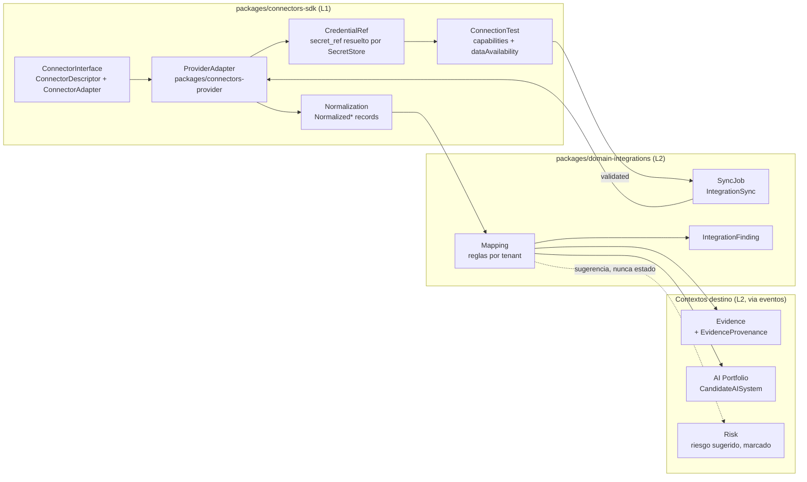

# Arquitectura de integraciones y SDK de conectores

Compañero de nivel 3 del *Architecture Spine* para el contexto Integrations y el SDK de conectores. Desarrolla AD-18 (SDK fuera del dominio, estados honestos) y AD-14 (secretos solo por `SecretStore`), y se apoya en AD-4, AD-5, AD-13, AD-19 y AD-23. No introduce decisiones nuevas: toda inferencia lleva `[ASSUMPTION]` y queda **pendiente de aprobación humana** (§12). Regla de CLAUDE.md que gobierna todo el documento: **nunca se inventan capacidades de API de proveedores**; ningún dato se declara disponible sin un `ConnectionTest` real contra el proveedor, y ningún conector aparece como `validated` sin credenciales reales y aprobación humana previa.

## 1. Objetivo y decisiones que desarrolla

| Decisión | Qué fija | Qué desarrolla este documento |
| --- | --- | --- |
| AD-18 | Pipeline fijo `ConnectorInterface → ProviderAdapter → CredentialRef (SecretStore) → ConnectionTest → SyncJob → Normalization → Mapping → Evidence, CandidateAISystem, IntegrationFinding`; adaptadores en `packages/connectors-<provider>`; el dominio solo conoce `IntegrationSync` y registros normalizados; estados `mock, configured, validated`; disponibilidad por dato; errores P2 §62; mock etiquetado. | Cada etapa del pipeline, interfaces TypeScript del SDK, registros normalizados, mapeo a entidades, contrato del mock, máquina de estados, tabla de errores y prueba de arquitectura. |
| AD-14 | La BD guarda solo `secret_ref`; adaptador `env` cifrado en MVP, KMS/Vault en F2; eventos `CREDENTIAL_*`; DTOs y server components nunca contienen el valor. | `CredentialRef`, ciclo de vida de `IntegrationCredential`, acceso desde el job de sincronización, pruebas de exposición. |
| AD-4 / AD-5 | Mutación por command con outbox; consumidores idempotentes. | `CONNECTOR_SYNC_COMPLETED` y `CONNECTOR_SYNC_FAILED` como eventos de outbox; consumo por AI Portfolio, Evidence e Incidents. |
| AD-13 | Objetos solo por `ObjectStorage`, `sha256` en servidor, antivirus. | Evidencia automatizada: el conector entrega bytes o referencia; Evidence ingiere, hashea y escanea. |
| AD-23 | Pruebas por cambio; prueba de arquitectura "nuevo conector sin tocar dominio". | §10. |

Cambios OpenSpec: 21 `connector-sdk-mock` (MVP: SDK, credenciales vía `SecretStore`, mock etiquetado, pruebas de contrato, `EvidenceProvenance` en el modelo); F2-5 `connector-azure-ai-foundry`, F2-6 `connector-openai`, F2-7 `connector-anthropic` (orden por defecto pendiente de Q9), F2-8 `ai-discovery-candidates`, F2-9 `evidence-automated-provenance`; F3-7 `future-connectors`.

## 2. Pipeline del SDK (AD-18)



Responsabilidades por etapa:

1. **Connector Interface.** `packages/connectors-sdk` define `ConnectorDescriptor` y `ConnectorAdapter` (§3). Es L1: solo conoce registros normalizados y tipos del kernel.
2. **Provider Adapter.** Un paquete `packages/connectors-<provider>` por proveedor implementa `ConnectorAdapter`; es el único lugar con SDKs de terceros. El `mock` vive en `packages/connectors-sdk/src/mock`.
3. **Credential abstraction.** El adaptador recibe un `CredentialRef` y lo resuelve por `SecretStore.resolve(ref)` solo en el worker, en memoria, durante la llamada; cada resolución emite `CREDENTIAL_ACCESSED` (AD-14). El valor nunca se serializa, loguea ni devuelve.
4. **Connection Test.** `testConnection(ref, scope)` autentica, enumera capacidades y devuelve la disponibilidad real por dato. Solo su éxito lleva la `Integration` a `validated` (§5).
5. **Sync Job.** `jobs.connector-sync` (EVENT_ARCHITECTURE §10) crea una `IntegrationSync`, invoca `sync(scope, cursor)` y persiste el resultado, incluidos errores y `Partial Sync`.
6. **Normalization.** El adaptador convierte respuestas en registros normalizados neutrales (§4); solo `providerNative` (JSON crudo sin secretos) cruza la frontera.
7. **Mapping.** `domain-integrations` aplica `IntegrationMapping` por tenant y produce `CandidateAISystem` (nunca `AISystem`: FR-039), evidencia con `EvidenceProvenance` (FR-076), `IntegrationFinding` y sugerencias de riesgo `suggested_by = connector` que un `Risk Manager` acepta o descarta.
8. **Evidence.** Evidence ingiere por su command `ingestAutomatedEvidence` al consumir `CONNECTOR_SYNC_COMPLETED`: `sha256` en servidor, clave `tenants/<tenant_id>/evidence/<object_id>/<version>`, `antivirus-scan` (AD-13). Sin procedencia completa no pasa a `Accepted` (FR-076).

El dominio nunca llama al proveedor: `domain-integrations` depende de `connectors-sdk` (L2 → L1) y los `connectors-<provider>` se registran desde `apps/worker` en el `ConnectorRegistry`. Un `packages/domain-*` que importe `connectors-<provider>` rompe la prueba de arquitectura (§10).

## 3. Interfaces TypeScript del SDK (`packages/connectors-sdk`)

```ts
// packages/connectors-sdk/src/types.ts
import type { TenantContext } from '@iso42001/kernel';

export type ConnectorStatus = 'mock' | 'configured' | 'validated';

export type DataAvailability =
  | 'Available'
  | 'Not Available'
  | 'Permission Required'
  | 'Not Supported by Provider API'
  | 'Not Configured';

export type ConnectorCapability =
  | 'ai_resources' | 'projects' | 'models' | 'model_versions' | 'deployments'
  | 'endpoints' | 'configurations' | 'monitoring_metadata' | 'evaluations'
  | 'safety_configuration' | 'responsible_ai_artifacts' | 'usage'
  | 'logs_telemetry' | 'owners_tags' | 'resource_relationships'
  | 'organization' | 'account' | 'api_keys_metadata' | 'findings'; // [ASSUMPTION: lista derivada de P2 §16]

export interface ConnectorDescriptor {
  id: string;                 // 'mock', 'azure-ai-foundry', 'openai', 'anthropic'
  provider: string;           // nombre comercial del proveedor
  version: string;            // semver del adaptador; se guarda en EvidenceProvenance.collector_version
  capabilities: ConnectorCapability[];           // lo que el adaptador SABE pedir
  dataAvailability: Record<ConnectorCapability, DataAvailability>; // estado por defecto ANTES de testConnection: 'Not Configured'
  credentialSchema: import('zod').ZodTypeAny;    // forma de la credencial, nunca su valor
  scopeSchema: import('zod').ZodTypeAny;         // forma del scope (tenant de proveedor, proyecto, region...)
  isMock: boolean;                               // true solo para el adaptador mock (PR-DR-020/021)
  documentationUrl?: string;
}

export interface CredentialRef {
  secretRef: string;          // opaco; lo resuelve SecretStore en el worker
  tenantId: string;
  credentialId: string;       // IntegrationCredential.id
}

export interface ConnectionTestResult {
  ok: boolean;
  testedAt: string;                                  // ISO 8601 UTC
  dataAvailability: Record<ConnectorCapability, DataAvailability>;
  grantedScopes?: string[];                          // si el proveedor los expone
  error?: ConnectorError;
}

export type SyncStatus = 'Completed' | 'Partial Sync' | 'Failed';

export interface SyncResult {
  status: SyncStatus;
  records: NormalizedRecord[];
  cursor?: string;                                   // paginacion/incremental, opaco
  errors: ConnectorError[];                          // no vacio si Partial Sync o Failed
  dataAvailability: Record<ConnectorCapability, DataAvailability>; // observada en esta sync
  startedAt: string;
  finishedAt: string;
  requestMetadata: { endpointsCalled: string[]; requestCount: number }; // para EvidenceProvenance
}

export interface ConnectorAdapter {
  readonly descriptor: ConnectorDescriptor;
  testConnection(ref: CredentialRef, scope: unknown, ctx: AdapterContext): Promise<ConnectionTestResult>;
  listCapabilities(): ConnectorCapability[];
  sync(ref: CredentialRef, scope: unknown, cursor: string | undefined, ctx: AdapterContext): Promise<SyncResult>;
}

export interface AdapterContext {
  tenant: TenantContext;
  correlationId: string;
  logger: Logger;            // redacta secretos; nunca loguea cuerpos
  secretStore: SecretStoreReadPort;  // resolve(ref) -> valor en memoria; emite CREDENTIAL_ACCESSED
  clock: () => Date;
  abortSignal: AbortSignal;  // timeout del job
}
```

Reglas del contrato:

- `descriptor.dataAvailability` es un valor por defecto honesto (`Not Configured` para todo hasta la primera prueba); el estado mostrado en UI procede siempre del último `ConnectionTestResult` o `SyncResult` persistido, no del descriptor.
- `capabilities` declara lo que el adaptador sabe pedir, no lo que el proveedor devuelve. Declarar una capacidad no equivale a disponibilidad.
- Todo método recibe `AbortSignal`; el job impone `timeout` y clasifica su vencimiento como `Timeout` (§7).
- El adaptador no lanza excepciones de negocio: devuelve `ConnectorError` tipados (§7). Una excepción no clasificada se envuelve como `Unknown Error`.

## 4. Registros normalizados y mapeo

Nombres `[ASSUMPTION]`, derivados de los datos que P2 §16 pide recuperar; se fijan en el cambio 21.

```ts
// packages/connectors-sdk/src/normalized.ts
export type NormalizedRecord =
  | NormalizedAIResource | NormalizedModel | NormalizedDeployment
  | NormalizedUsage | NormalizedEvaluation | NormalizedFinding;

interface NormalizedBase {
  kind: 'ai_resource' | 'model' | 'deployment' | 'usage' | 'evaluation' | 'finding';
  sourceId: string;            // id nativo del proveedor
  sourceType: string;          // tipo nativo ('Microsoft.CognitiveServices/accounts', 'model', ...)
  sourceUri?: string;
  observedAt: string;
  owners?: string[];
  tags?: Record<string, string>;
  relationships?: Array<{ kind: string; targetSourceId: string }>;
  isMock: boolean;             // propagado desde descriptor.isMock
  providerNative: unknown;     // JSON crudo sin secretos, para auditoria
}
export interface NormalizedAIResource extends NormalizedBase { kind: 'ai_resource'; name: string; region?: string; project?: string; configuration?: unknown; safetyConfiguration?: unknown; responsibleAiArtifacts?: unknown[]; monitoringMetadata?: unknown }
export interface NormalizedModel extends NormalizedBase { kind: 'model'; name: string; version?: string; provider: string; family?: string; lifecycleState?: string }
export interface NormalizedDeployment extends NormalizedBase { kind: 'deployment'; modelSourceId: string; endpoint?: string; configuration?: unknown }
export interface NormalizedUsage extends NormalizedBase { kind: 'usage'; periodStart: string; periodEnd: string; metrics: Record<string, number> }
export interface NormalizedEvaluation extends NormalizedBase { kind: 'evaluation'; targetSourceId: string; metrics: Record<string, number | string>; artifacts?: unknown[] }
export interface NormalizedFinding extends NormalizedBase { kind: 'finding'; severity: 'info' | 'low' | 'medium' | 'high'; code: string; message: string; targetSourceId?: string }
```

Mapeo en `domain-integrations` (command `applySyncMapping`, ejecutado dentro del job, con outbox):

| Registro normalizado | Destino | Cómo |
| --- | --- | --- |
| `NormalizedAIResource`, `NormalizedModel`, `NormalizedDeployment` sin correspondencia en inventario | `CandidateAISystem` (AI Portfolio) vía evento `CONNECTOR_SYNC_COMPLETED` → AI Portfolio publica `CANDIDATE_AI_SYSTEM_DISCOVERED` | El candidato nunca pasa a `AISystem` sin validación humana (FR-039). |
| `NormalizedModel` con versión distinta a la inventariada para un `AISystem` vinculado | `IntegrationFinding` (`code = MODEL_VERSION_DRIFT`) | AI Portfolio decide si registra `MODEL_VERSION_CHANGED` mediante command humano o regla de mapeo aprobada por tenant `[ASSUMPTION]`. |
| `NormalizedEvaluation`, `NormalizedUsage`, configuración de `safety`, artefactos de IA responsable | Evidencia automatizada (`Evidence` con `EvidenceProvenance`) | Regla `IntegrationMapping.evidence_rules[]`: tipo de evidencia, control(es) destino, periodicidad. Solo para controles activos (`SoAReadPort.isControlActive`, AD-9). |
| `NormalizedFinding` | `IntegrationFinding` | Visible en el espacio del conector; convertible en `Finding` de CAPA por command humano. |
| Cualquiera, con regla `risk_rules[]` | Sugerencia de riesgo (`RiskSuggestion`, marcada `suggested_by = connector`) | Solo sugiere; un `Risk Manager` crea el `Risk` (CLAUDE.md: la IA y las integraciones sugieren, una persona aprueba). |

`EvidenceProvenance` (en Evidence, FR-076): `integration_id, connector_id, connector_version, endpoint, collected_at, request_metadata, source_object_id, transformation, sha256, is_mock`. Se rellena desde `SyncResult.requestMetadata`, `descriptor.version` y `NormalizedBase.sourceId`.

## 5. Estados del conector y quién transiciona

Máquina de estados de `Integration.status` (`packages/domain-integrations/src/state/integration.ts`):

| Desde | Hacia | Command | Permiso | Condición |
| --- | --- | --- | --- | --- |
| — | `mock` | `createIntegration` con `descriptor.isMock = true` | `integrations.manage` | Solo el adaptador mock; no se puede transicionar a otro estado. |
| — | `configured` | `createIntegration` + `attachCredential` | `integrations.manage` | Credencial guardada como `secret_ref`; `ConnectionTest` no ejecutado o fallido. |
| `configured` | `validated` | `runConnectionTest` con `ok = true` | `integrations.manage` | **Solo** tras `testConnection` contra la API real del proveedor con credenciales reales; en el MVP exige además aprobación humana previa registrada (`Approval` de AD-10 con `subject_type = Integration`) `[ASSUMPTION: usar Approval para la aprobación humana de FR-115]`. |
| `validated` | `configured` | `runConnectionTest` con `ok = false`, `revokeCredential`, cambio de `scope` | `integrations.manage` o sistema | Cualquier fallo de autenticación/autorización degrada el estado; nunca se conserva `validated` con credenciales revocadas. |
| cualquiera | `disabled` `[ASSUMPTION]` | `disableIntegration` | `integrations.manage` | Detiene `IntegrationSync.schedule`; conserva historial. |

`mock` es terminal y visible: la UI muestra la etiqueta `mock` junto al nombre, en las fichas de cada activo descubierto y de cada evidencia (`is_mock = true`), y los datos mock nunca cuentan en `ScoreSnapshot` (PR-DR-020, PR-DR-021): Objectives & KPIs los excluye y los declara en `exclusions[]`. Un `validated` obtenido en pruebas automatizadas contra un servidor simulado no es válido: el estado se guarda con `validated_against = provider_api | none` y solo `provider_api` habilita el estado `[ASSUMPTION]`.

## 6. Disponibilidad por dato (FR-120, P2 §16)

Cada capacidad del descriptor tiene un valor de `DataAvailability` procedente de la última prueba o sincronización:

| Valor | Significado | Cuándo lo fija el adaptador |
| --- | --- | --- |
| `Available` | El proveedor devolvió datos de este tipo con la credencial actual. | Respuesta 2xx con contenido. |
| `Not Available` | La llamada funciona pero el proveedor no tiene datos (por ejemplo, sin evaluaciones registradas). | 2xx vacío. |
| `Permission Required` | La credencial carece de scope o rol. | 403 o error de scope del proveedor. |
| `Not Supported by Provider API` | El proveedor no expone ese dato por API (o el adaptador no lo implementa en esta versión). | Conocimiento documentado del adaptador o 404 estable en el endpoint. |
| `Not Configured` | No hay credencial o scope, o nunca se probó. | Estado inicial. |

Presentación en UI (`apps/web`, espacio del conector): una tabla dato × estado con el instante de la última prueba y la guía de remediación del error asociado. Regla: **nunca un vacío silencioso**. Una lista vacía de modelos se muestra como `Not Available` con la hora de comprobación, no como tabla vacía; un dato no soportado se muestra con su motivo. Las cifras de los dashboards que dependen de conectores (informes #19-#22, F3-6) enseñan el conjunto de datos `Available` que las alimenta.

## 7. Taxonomía de errores (P2 §62, FR-121)

`ConnectorError = { type, providerCode?, message, remediation, retryable, occurredAt, endpoint? }`. Los 10 tipos, con su causa típica y guía, viven en `packages/connectors-sdk/src/errors.ts` y se traducen por `i18n` (`connector.error.<type>`).

| Error | Causa típica | Guía de remediación | Reintentable |
| --- | --- | --- | --- |
| `Authentication Failed` | Credencial inválida, expirada o revocada en el proveedor. | Rotar la credencial (F2) o crear una nueva y repetir la prueba de conexión. | No |
| `Authorization Failed` | Credencial válida sin scope/rol para el recurso. | Conceder el scope mínimo indicado por la capacidad afectada; volver a probar. Los datos afectados pasan a `Permission Required`. | No |
| `Rate Limited` | Cuota del proveedor superada. | Esperar el `Retry-After`; reducir frecuencia de `IntegrationSync.schedule`. | Sí (con `Retry-After`) |
| `Provider Unavailable` | 5xx, caída o mantenimiento del proveedor. | Reintentar más tarde; consultar estado del proveedor. | Sí |
| `Invalid Configuration` | Scope, región, proyecto o parámetro mal formado (falla Zod `scopeSchema`). | Corregir la configuración de la integración; el error indica el campo. | No |
| `Unsupported Endpoint` | El adaptador pidió un endpoint que el proveedor no expone o retiró. | El dato pasa a `Not Supported by Provider API`; revisar versión del adaptador. | No |
| `Partial Sync` | Algunas capacidades sincronizaron y otras fallaron. | Revisar los errores individuales listados; los datos correctos ya están disponibles. | Sí (solo capacidades fallidas) |
| `Data Mapping Error` | Un registro normalizado no cumple el esquema Zod o la regla de mapeo del tenant. | Revisar la regla de mapeo; el registro se conserva en `IntegrationSync.rejected_records` con motivo. | No |
| `Timeout` | Vencimiento del `AbortSignal` del job. | Reducir el scope o aumentar el timeout configurado; reintentar. | Sí |
| `Unknown Error` | Excepción no clasificada. | Consultar `correlation_id` en el panel de administración; abrir incidencia interna. | Sí (limitado) |

Interacción con la política de reintentos de EVENT_ARCHITECTURE §7.1: los errores `retryable = false` llevan el job `connector-sync` a `dead_letter` en el primer intento y emiten `CONNECTOR_SYNC_FAILED`; los reintentables siguen la política exponencial (máximo 5). `Partial Sync` no es fallo del job: la `IntegrationSync` se persiste como `Partial Sync`, se emite `CONNECTOR_SYNC_COMPLETED` con `payload.status = 'Partial Sync'` y la UI muestra el detalle.

## 8. Entidades del contexto Integrations y eventos

Todas las tablas llevan `tenant_id`, RLS y los campos comunes de AD-11. Propietario único: `domain-integrations` (AD-3).

| Entidad | Campos principales | Notas |
| --- | --- | --- |
| `Integration` | `connector_id, provider, connector_version, status (mock, configured, validated, disabled), scope jsonb, data_availability jsonb, last_connection_test_at, last_connection_test_result jsonb, validated_against, owner_id` | Una por proveedor y scope. |
| `IntegrationCredential` | `integration_id, secret_ref, kind (api_key, oauth_client, managed_identity…), scopes_requested[], created_at, rotated_at, revoked_at, last_accessed_at, status (active, revoked)` | Nunca el valor (AD-14). `secret_ref` es opaco al dominio. |
| `IntegrationSync` | `integration_id, trigger (schedule, manual), schedule (cron), status (Queued, Running, Completed, Partial Sync, Failed), started_at, finished_at, cursor, records_count, errors jsonb, data_availability jsonb, rejected_records jsonb, correlation_id` | Historial completo; alimenta el panel de salud del conector (P2 §45). |
| `IntegrationMapping` `[ASSUMPTION]` | `integration_id, evidence_rules jsonb, candidate_rules jsonb, risk_rules jsonb, version` | Reglas de mapeo por tenant; versionadas. |
| `IntegrationFinding` | `integration_id, sync_id, code, severity, message, target_source_id, target_entity_type/id, status (Open, Converted, Dismissed), dismissed_reason` | Convertible en `Finding` de CAPA por command humano. |
| `EvidenceProvenance` (en Evidence) | ver §4 | Propiedad de Evidence; Integrations solo la rellena vía evento y command de Evidence. |

Eventos (DOMAIN_MAP §5, P2 §17, PRD FR-114/FR-116; catálogo completo en EVENT_ARCHITECTURE §3):

| Evento | Cuándo | Payload mínimo | Consumidores |
| --- | --- | --- | --- |
| `CONNECTOR_SYNC_COMPLETED` | `IntegrationSync` termina `Completed` o `Partial Sync` | `integration_id, sync_id, status, records_summary por kind, data_availability, is_mock` | AI Portfolio (candidatos), Evidence (evidencia automatizada), Incidents (F2, hallazgos con severidad alta) |
| `CONNECTOR_SYNC_FAILED` | `IntegrationSync` termina `Failed` | `integration_id, sync_id, error` | Notifications |
| `CREDENTIAL_CREATED` / `CREDENTIAL_UPDATED` / `CREDENTIAL_REVOKED` | commands de `IntegrationCredential` | `credential_id, integration_id, kind, scopes_requested` (nunca el valor) | Administration (auditoría) |
| `CREDENTIAL_ROTATED` | F2, rotación | `credential_id, previous_secret_ref_hash, new_secret_ref_hash` | Administration |
| `CREDENTIAL_ACCESSED` | cada `SecretStore.resolve` | `credential_id, accessed_by (system:connector-sync), purpose (test, sync)` | Administration |

`CREDENTIAL_ACCESSED` se escribe desde el adaptador de `SecretStore` mediante el command `recordCredentialAccess` de Integrations en la misma transacción del job cuando existe, o en transacción propia cuando la resolución ocurre fuera de un command `[ASSUMPTION]`; en ningún caso se omite (P2 §17 *access logging*).

## 9. Seguridad de conectores (P2 §17, AD-14, AD-2)

- **Scopes mínimos.** El descriptor documenta por capacidad el scope o rol mínimo; la UI lo muestra al crear la credencial y `ConnectionTest` compara `grantedScopes` (si el proveedor los expone) con los mínimos y advierte del exceso `[ASSUMPTION]`.
- **Almacenamiento.** Solo `secret_ref` en BD; valor en `SecretStore` (`env` cifrado en dev/CI; KMS/Vault en producción, F2, diferido en el spine). Cifrado en reposo.
- **Rotación (F2-5).** `rotateCredential` crea el secreto nuevo, prueba la conexión, cambia `secret_ref`, revoca el anterior y emite `CREDENTIAL_ROTATED`; si la prueba falla, no rota.
- **Revocación.** `revokeCredential` marca `revoked_at`, elimina el valor del `SecretStore`, degrada la `Integration` a `configured`, detiene el `schedule` y emite `CREDENTIAL_REVOKED`.
- **Access logging.** Toda resolución emite `CREDENTIAL_ACCESSED` y llega a `audit_entries` con el `correlation_id` del job.
- **Aislamiento por tenant.** RLS en `IntegrationCredential`; `secret_ref` con prefijo `tenants/<tenant_id>/integrations/<credential_id>` `[ASSUMPTION]`, y el `SecretStore` rechaza prefijos que no coinciden con `TenantContext.tenantId` (`TENANT_MISMATCH`).
- **Nunca en frontend.** Los DTOs no tienen campo de valor; el secreto viaja una vez por `POST` al command sin persistirse en logs ni respuesta; la prueba de exposición de `tests/security` recorre `/api/v1/integrations` y los server components.
- **Red.** Destinos salientes permitidos por conector y `timeout` obligatorio `[ASSUMPTION]`; ningún adaptador acepta URLs base arbitrarias sin validar dominio.
- **Cuentas reales** solo con aprobación humana previa (CLAUDE.md), registrada como `Approval` (§5).

## 10. Adaptador mock y pruebas de contrato (FR-115, PR-DR-020/021)

El adaptador `mock` (`packages/connectors-sdk/src/mock/`) ejercita el pipeline completo con activos ficticios (2 `NormalizedAIResource`, 3 `NormalizedModel` con versiones, 2 `NormalizedDeployment`, `NormalizedUsage` mensual, 1 `NormalizedEvaluation`, 1 `NormalizedFinding` `[ASSUMPTION cantidades]`), todos con `isMock = true`. `testConnection` devuelve `Available` para lo que simula y `Not Supported by Provider API` para el resto; `scope.simulateError` fuerza cada uno de los 10 errores y `Partial Sync`; en sincronizaciones sucesivas cambia la versión de un modelo para ejercitar `MODEL_VERSION_DRIFT`.

Pruebas de contrato (`packages/connectors-sdk/src/testing/contract.ts`), que **todo** adaptador debe pasar antes de registrarse:

1. El descriptor cumple el esquema (`id` kebab-case, semver, capacidades declaradas válidas, `isMock` coherente).
2. `listCapabilities()` coincide con `descriptor.capabilities`.
3. `testConnection` con credencial inválida devuelve `Authentication Failed` con `remediation` no vacía y no lanza.
4. Cada valor de `dataAvailability` devuelto es uno de los cinco canónicos; ninguna capacidad queda sin valor.
5. `sync` devuelve registros que validan el esquema Zod de `NormalizedRecord`; `isMock` coincide con el descriptor.
6. `sync` con fallo parcial devuelve `Partial Sync` con `errors` no vacío y registros correctos.
7. `abortSignal` disparado produce `Timeout`.
8. Ningún registro, error ni log contiene el valor de la credencial (se inyecta un valor centinela y se busca en toda la salida).
9. `providerNative` no contiene el centinela.

Prueba de arquitectura "nuevo conector sin tocar dominio" (`tests/architecture/new-connector.test.ts`): el test crea un paquete efímero `connectors-fixture` que implementa el contrato, lo registra en el `ConnectorRegistry`, ejecuta una sincronización contra el tenant de prueba y comprueba que se crearon `IntegrationSync`, `CandidateAISystem` y `Evidence` con procedencia sin que exista ningún cambio en `packages/domain-*` (se verifica que el `git diff` del paso es vacío fuera del fixture y que `dependency-cruiser` no detecta importaciones de `connectors-fixture` desde el dominio).

## 11. Conectores reales de Fase 2 y futuros

Cada conector es un paquete L1 independiente que implementa `ConnectorAdapter`. El dominio no cambia al añadirlos (FR-114, FR-122). Para los tres conectores de F2, la lista de datos es la que P2 §16 pide recuperar. Para **cada dato**: **capacidad de API por verificar contra el proveedor real; nunca se afirma disponible sin `ConnectionTest`**. Este documento no afirma que ninguna de estas API exponga ninguno de estos datos; el adaptador se construye contra la documentación vigente del proveedor en el momento del cambio F2 y la disponibilidad se demuestra por prueba.

### 11.1 `packages/connectors-azure-ai-foundry` (F2-5, FR-117)

Datos a intentar recuperar (P2 §16): proyectos de IA; modelos; despliegues de modelos; versiones de modelos; endpoints; recursos de IA; configuraciones; metadatos de monitorización; evaluaciones; configuración de *safety*; artefactos de IA responsable; uso; logs/telemetría donde sea accesible; propietarios/etiquetas; relaciones entre recursos. Cada uno se mapea a una `ConnectorCapability` y se reporta con `DataAvailability`. Credencial prevista: identidad de aplicación con scopes mínimos por capacidad `[ASSUMPTION tipo de credencial; por verificar]`. P2 §16 lo dice de forma explícita: no se asume que toda la información esté disponible en toda API de Foundry/Azure.

### 11.2 `packages/connectors-openai` (F2-6, FR-118)

Datos a intentar recuperar (P2 §16): información de proveedor, cuenta, modelos, despliegues, uso y configuración expuesta por la API autorizada. Capacidad de API por verificar contra el proveedor real; nunca se afirma disponible sin `ConnectionTest`.

### 11.3 `packages/connectors-anthropic` (F2-7, FR-119)

Datos a intentar recuperar (P2 §16): información de organización, API y modelos donde el proveedor la exponga. Capacidad de API por verificar contra el proveedor real; nunca se afirma disponible sin `ConnectionTest`. El adaptador de conector es distinto del adaptador `LLMProvider` de `packages/ai-core` (AD-17): uno inventaría, el otro invoca modelos; no comparten credenciales por defecto `[ASSUMPTION]`.

### 11.4 Orden, aprobación y criterio de salida

El orden Azure → OpenAI → Anthropic es solo el valor por defecto del ROADMAP y depende del piloto (Q9). Criterio de salida común (ROADMAP F2-5..F2-7): estado `validated` solo tras prueba con credenciales reales, con aprobación humana previa, y disponibilidad por dato visible en UI. Ningún conector se declara "funcional" antes (CLAUDE.md, *Prohibido*).

### 11.5 Conectores futuros (F3-7, FR-122, P2 §16)

AWS AI services, Google Vertex AI, GitHub, Azure DevOps, Jira, ServiceNow, Datadog, Splunk, Microsoft Purview, Microsoft Entra ID, SharePoint, almacenamiento en nube, SIEM, ticketing, registros de modelos y plataformas ML. Mismo patrón: paquete `packages/connectors-<provider>`, contrato de §10, sin cambio de dominio. Los no orientados a IA producirán sobre todo `NormalizedFinding` y evidencia; si un dato no encaja en los seis registros, se añade un `kind` al SDK con nueva `version` del contrato, nunca una entidad de dominio desde el conector.

## 12. Decisiones pendientes de aprobación humana y supuestos

| Ref. | Supuesto `[ASSUMPTION]` | Sección | Impacto si se rechaza |
| --- | --- | --- | --- |
| I-1 | Nombres de los registros normalizados (`NormalizedAIResource`, `NormalizedModel`, `NormalizedDeployment`, `NormalizedUsage`, `NormalizedEvaluation`, `NormalizedFinding`) y la lista de `ConnectorCapability`. | §3, §4 | Renombrar en el cambio 21; sin impacto de dominio. |
| I-2 | Entidad `IntegrationMapping` versionada por tenant con `evidence_rules`, `candidate_rules`, `risk_rules`. | §4, §8 | Reglas fijas en código; menor flexibilidad. |
| I-3 | `MODEL_VERSION_DRIFT` produce `IntegrationFinding`; registrar `MODEL_VERSION_CHANGED` exige command humano o regla aprobada. | §4 | Automatizar la emisión (interpretación de gobernanza: requiere aprobación humana). |
| I-4 | Aprobación humana previa a `validated` registrada como `Approval` (AD-10) con `subject_type = Integration`; campo `validated_against`. | §5 | Registro externo de la aprobación. |
| I-5 | Estado adicional `disabled` en `Integration`. | §5 | Usar `deleted_at` o `configured` con `schedule = null`. |
| I-6 | Prefijo `tenants/<tenant_id>/integrations/<credential_id>` en `secret_ref` y rechazo por prefijo en `SecretStore`. | §9 | Otra forma de aislamiento; toca seguridad, aprobación humana. |
| I-7 | Lista de destinos salientes permitidos por conector y `timeout` obligatorio; comparación de `grantedScopes` con mínimos. | §9 | Solo endurecimiento operativo. |
| I-8 | Emisión de `CREDENTIAL_ACCESSED` en transacción propia cuando la resolución ocurre fuera de un command. | §8 | Exigir siempre command envolvente. |
| I-9 | Tipo de credencial de Azure AI Foundry y separación de credenciales entre conector Anthropic y `LLMProvider`. | §11 | Por verificar contra el proveedor real en F2. |
| I-10 | Cantidades del dataset del mock. | §10 | Solo fixtures. |

I-3, I-4 e I-6 tocan gobernanza o seguridad y requieren aprobación humana explícita antes del cambio 21 `connector-sdk-mock`; I-9 se resuelve solo con verificación contra los proveedores reales en F2 y aprobación humana para usar credenciales reales.
