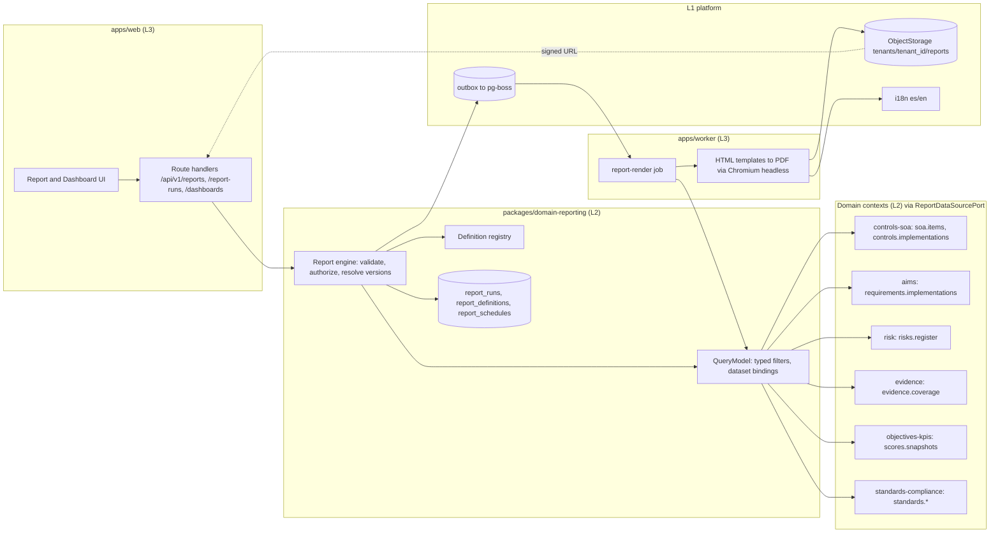
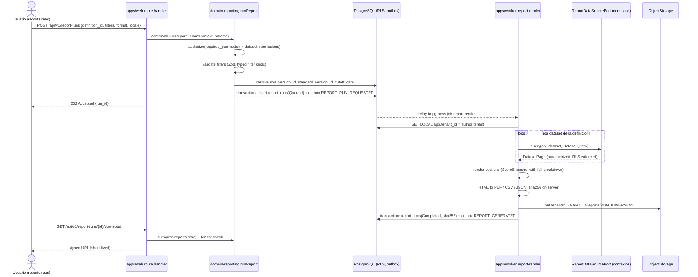

# Arquitectura de informes, puntuaciones y dashboards

Documento de nivel 3 que desarrolla las decisiones AD-16 (puntuaciones transparentes e informes declarativos sin SQL libre), AD-3 (lectura entre contextos solo por puertos), AD-8 (autorización en el servicio), AD-13 (almacenamiento de objetos) y AD-9 (la SoA gobierna qué se cuenta) del *Architecture Spine*. No introduce decisiones nuevas: cuando propone un valor concreto que el spine deja abierto lo marca `[ASSUMPTION]` y lo recoge en la tabla final como pendiente de aprobación humana. Documento en español; identificadores, entidades, eventos y código en inglés.

## 1. Objetivo y reglas que gobiernan el diseño

**Desarrolla AD-16 y AD-3.** El contexto Reporting (`packages/domain-reporting`) y el contexto Objectives & KPIs (`packages/domain-objectives-kpis`) resuelven tres preguntas del producto: qué puntuaciones muestra la plataforma y cómo se explican (FR-100, PR-DR-010), cómo se generan los informes sin que cada uno sea un *code path* (FR-105, FR-106) y qué significa "estar preparado" sin declarar nunca un veredicto de certificación (FR-113, PR-DR-009).

Tres reglas no negociables (CLAUDE.md) atraviesan todo el documento:

1. Toda puntuación expone fórmula, numerador, denominador, exclusiones y registros fuente. En arquitectura esto es la entidad `ScoreSnapshot` (AD-16) y la regla de UI "ningún valor sin desplegable de explicación".
2. La plataforma nunca declara un estado de certificación ISO. Las cadenas `certified`, `certificado` y `compliance score` están prohibidas en recursos i18n, API, plantillas y exportaciones (AD-12, PR-DR-009); una prueba de cadenas lo comprueba y este documento las menciona solo para prohibirlas.
3. La SoA gobierna qué se cuenta: un control `Not Applicable` no entra como pendiente en ninguna métrica ni dashboard, pero permanece visible y auditable (AD-9, PR-DR-001).

Posición en el monorepo (spine, *Structural Seed*): `packages/domain-reporting` contiene `ReportDefinition`, `ReportRun`, `ReportSchedule`, `Dashboard`, `DashboardWidget`, `ReadinessChecklist` y `ExportPackage`; `packages/domain-objectives-kpis` contiene `ScoreSnapshot`, `KPI` y `Metric`; `apps/worker` ejecuta el job `report-render`; `apps/web` compone la UI de dashboards e informes sin lógica de dominio (AD-1). Reporting no escribe ninguna tabla de otro contexto y lee exclusivamente por puertos `*ReadPort` o vistas SQL de solo lectura declaradas por el propietario (AD-3).

## 2. Motor genérico: `ReportDefinition`

**Desarrolla AD-16.** Un informe es un dato, no un programa. La definición es un objeto TypeScript validado con Zod que se serializa a JSON, se versiona y se carga en el registro de definiciones al arrancar (`packages/domain-reporting/src/definitions/*.report.ts`). Las definiciones de sistema viven en el repositorio; las definiciones guardadas por usuarios (report builder, F3) se persisten en la tabla `report_definitions` del tenant con el mismo esquema.

```ts
// packages/domain-reporting/src/model/report-definition.ts
export const ReportDefinitionSchema = z.object({
  id: z.string().regex(/^[a-z0-9-]+$/),          // p. ej. "statement-of-applicability"
  version: z.number().int().positive(),
  kind: z.enum(['report', 'dashboard', 'pack']),
  title_i18n_key: z.string(),                    // "reports.soa.title"
  description_i18n_key: z.string().optional(),
  required_permission: z.string(),               // del catálogo kernel/permissions.ts
  required_context_versions: z.object({
    soa_version: z.boolean(),                    // el run fija la versión de SoA aprobada vigente
    standard_version: z.boolean(),               // el run fija la StandardVersion del tenant
    cutoff_date: z.boolean(),                    // el run fija la fecha de corte
  }),
  datasets: z.array(DatasetBindingSchema),       // ver §3
  filters: z.array(FilterDefinitionSchema),      // ver §3
  sections: z.array(SectionSchema),              // table | summary | score | chart | narrative
  exports: z.array(z.enum(['pdf', 'csv', 'json', 'xlsx', 'html'])),
  phase: z.enum(['MVP', 'F2', 'F3']),
});
```

`sections[]` admite cinco tipos y ninguno más en el MVP:

| Tipo | Qué renderiza | Fuente de datos | Notas |
| --- | --- | --- | --- |
| `table` | tabla paginada con columnas declaradas (`dataset`, `columns[]`, `sort`, `group_by`) | un dataset del QueryModel | columnas por clave i18n; exportable a CSV/XLSX fila a fila |
| `summary` | contadores y agrupaciones (`count`, `count_by`) | un dataset | nunca calcula porcentajes propios: si necesita un porcentaje referencia un `score` |
| `score` | un `ScoreSnapshot` con su desglose obligatorio | `scores.snapshots` (Objectives & KPIs) | el render incluye siempre fórmula, numerador, denominador, exclusiones y enlaces a registros fuente |
| `chart` | gráfico declarativo (`bar`, `line`, `status_distribution`, `risk_matrix`, `heatmap`) | un dataset o una serie de `ScoreSnapshot` | la especificación visual es datos; el componente de `packages/ui` la interpreta |
| `narrative` | texto fijo por clave i18n o, en F2, resumen generado por IA (FR-110) | clave i18n o `AIGeneratedArtifact` | el bloque generado lleva el marcado visible de `AI_ARCHITECTURE.md` §7 |

`required_context_versions` no es decorativo: cuando `soa_version` es verdadero el run queda ligado a la `StatementOfApplicability` aprobada vigente en la fecha de corte y el informe imprime esa versión en cabecera; lo mismo con `standard_version` respecto a la `StandardVersion` que el tenant tiene activa (AD-7). Un informe que no puede resolver una versión requerida falla con `INVARIANT_VIOLATION` y `detail` explícito, nunca se genera con "la SoA actual" implícita.

## 3. `QueryModel`: datasets nombrados, filtros tipados, sin SQL libre

**Desarrolla AD-16 y AD-3.** El motor solo conoce datasets nombrados. Cada contexto de dominio que quiera ser consultado implementa en su `index.ts` público un `ReportDataSourcePort`:

```ts
// packages/kernel/src/reporting/report-data-source-port.ts
export interface ReportDataSourcePort {
  readonly datasets: ReadonlyArray<DatasetDescriptor>;
  query(ctx: TenantContext, dataset: string, q: DatasetQuery): Promise<DatasetPage>;
}

export interface DatasetDescriptor {
  name: string;                       // "soa.items"
  owner_context: string;              // "controls-soa"
  columns: ColumnDescriptor[];        // { key, type, i18n_key, filterable, sortable, ref?: { entity, id_column } }
  supported_filters: FilterKind[];    // subconjunto de los filtros tipados de §3.2
  required_permission: string;        // permiso de lectura del contexto propietario
}
```

El descriptor está en `packages/kernel` para que Reporting y los 20 contextos restantes compartan el tipo sin que Reporting importe internals de nadie (AD-3). La implementación vive en cada `packages/domain-<context>/src/reporting/` y solo ella toca sus tablas.

### 3.1 Datasets del MVP

| Dataset | Contexto propietario | Contenido (columnas principales) |
| --- | --- | --- |
| `standards.requirements` | Standards & Compliance | catálogo global: `requirement_id`, `clause_ref`, `record_type`, `standard_version_id` (sin texto literal de la norma, AD-7) |
| `standards.controls` | Standards & Compliance | 38 controles del Anexo A con `control_domain`, `catalog_id` |
| `requirements.implementations` | AIMS | `RequirementImplementation`: `status`, `owner_id`, `business_unit_id`, evidencias vinculadas, brechas |
| `soa.items` | Controls & SoA | `SoAItem`: `applicability`, `justification`, `soa_version`, `approved_at` |
| `controls.implementations` | Controls & SoA | `ControlImplementation`: `status`, `owner_id`, `evidence_expectations`, riesgos y requisitos mapeados |
| `risks.register` | Risk | `Risk`: inherente, residual (`ScoreSnapshot`), `treatment`, `owner_id`, `due_date`, `acceptance_expires_at`, `ai_system_id` |
| `evidence.coverage` | Evidence | por objeto vinculado: evidencias `Accepted`, `Expired`, `Missing`; `sha256`; fecha de expiración |
| `audit.readiness_checklist` | Reporting (proyección sobre AIMS, Controls & SoA, Evidence, Audit, CAPA, Management Review) | 13 casillas y 21 elementos documentales con `satisfied_by_ref` o `missing_action_ref` |
| `audits.findings` | Audit / CAPA | hallazgos, clasificación, `source_type`, CAPA asociadas, antigüedad |
| `scores.snapshots` | Objectives & KPIs | `ScoreSnapshot` por `score_type` y fecha |

Los datasets de F2 y F3 (inventario, ciclo de vida, incidentes, conectores, formación, regulación) se añaden con el mismo contrato; la tabla de §8 los enumera.

### 3.2 Filtros tipados

Los filtros exigidos por P2 §27 y FR-105 se modelan como enumeración cerrada en `packages/kernel/enums/report-filter-kind.ts`:

`date_range | business_unit | department | ai_system | provider | risk | control_domain | owner | lifecycle_stage | status | custom`

Cada `FilterDefinition` declara `kind`, la columna del dataset sobre la que aplica y, para `custom`, un `column` y un `operator` de la lista cerrada `eq | neq | in | gte | lte | contains`. El valor lo aporta el usuario en el `ReportRun`; el motor lo valida con Zod contra el tipo de la columna antes de llamar al puerto. **No existe ningún camino por el que una cadena del usuario llegue a un `WHERE` sin pasar por el tipo del filtro**: el `ReportDataSourcePort` recibe una estructura `DatasetQuery { filters: TypedFilter[], sort, cursor, limit }`, y el adaptador Prisma del contexto propietario la traduce a consultas parametrizadas. La regla "sin SQL libre" es, por tanto, estructural: el motor no tiene dependencia con `packages/db` y una prueba de arquitectura (`tests/architecture/reporting-no-db.test.ts`) falla si `domain-reporting` importa Prisma o ejecuta `$queryRaw`.

### 3.3 RLS y permisos: el motor ejecuta como el autor

**Desarrolla AD-2 y AD-8.** Un `ReportRun` se ejecuta bajo el `TenantContext` del usuario que lo solicitó, no bajo un principal de sistema. Consecuencias:

- El job `report-render` abre cada transacción de lectura con `SET LOCAL app.tenant_id = <tenant del autor>`; la RLS de PostgreSQL hace imposible que un dataset devuelva filas de otro tenant aunque un puerto tuviera un defecto.
- Antes de encolar, el servicio `runReport` ejecuta `authorize(definition.required_permission)` y, además, `authorize(dataset.required_permission)` por cada dataset de la definición. Un informe cuyo autor puede leer `soa.items` pero no `risks.register` se rechaza con `PERMISSION_DENIED` en lugar de generarse "a medias".
- El alcance del permiso (`tenant | business_unit | owned_object`, AD-8) se traduce en filtros implícitos que el motor añade al `DatasetQuery` y que el puerto no puede omitir: un `Business Unit Owner` con alcance de unidad recibe un informe restringido a su unidad y la cabecera lo indica.
- El `TenantContext` del autor se serializa en el job junto a `correlation_id` (AD-19); si el usuario ha sido desactivado antes de ejecutarse el job, el run termina en `Failed` con código `AUTHOR_INACTIVE` `[ASSUMPTION código]`.

## 4. Generación asíncrona: `ReportRun` y el job `report-render`

**Desarrolla AD-16, AD-5 y AD-13.** Generar un informe es un command (`runReport`) con la secuencia fija de AD-4: `authorize → validate(Zod) → transaction { insert report_runs; append outbox REPORT_RUN_REQUESTED }`. El relay del outbox lo convierte en el job `report-render` de pg-boss a través del puerto `JobScheduler` (AD-5); nunca se renderiza dentro de la petición HTTP (FR-012).

```ts
export interface ReportRun {
  id: string; tenant_id: string;
  definition_id: string; definition_version: number;
  parameters: Record<string, TypedFilterValue>;   // filtros ya validados
  requested_by: string; requested_at: Date;
  status: 'Queued' | 'Running' | 'Completed' | 'Failed' | 'Expired';
  locale: 'es' | 'en';
  soa_version_id: string | null;                  // resuelto al encolar si required_context_versions.soa_version
  standard_version_id: string | null;
  cutoff_date: string;                            // date UTC
  export_format: 'pdf' | 'csv' | 'json' | 'xlsx' | 'html';
  result_object_key: string | null;               // tenants/<tenant_id>/reports/<run_id>/<version>
  result_sha256: string | null;
  result_size_bytes: number | null;
  row_counts: Record<string, number>;             // filas por dataset, para la cabecera y la auditoría
  error_code: string | null;
  completed_at: Date | null;
  created_at: Date; created_by: string; updated_at: Date; updated_by: string; version: number; deleted_at: Date | null;
}
```

Las versiones de SoA y de norma se resuelven **al encolar**, no al renderizar, para que dos ejecuciones del mismo run reproduzcan el mismo contexto aunque la SoA se apruebe entre medias. El resultado se escribe por el puerto `ObjectStorage` con clave `tenants/<tenant_id>/reports/<run_id>/<version>` (AD-13); el `sha256` se calcula en servidor sobre los bytes finales y se guarda en `ReportRun.result_sha256`, lo que permite que el *Audit Evidence Pack* (F2) y cualquier auditor verifiquen la integridad del archivo entregado. La descarga es siempre una URL firmada de vida corta (≤ 15 minutos `[ASSUMPTION]`, AD-13) emitida por `GET /api/v1/report-runs/{id}/download` tras verificar de nuevo `reports.read` y la pertenencia al tenant. Al completar, el consumidor emite `REPORT_GENERATED { run_id, definition_id, sha256, soa_version_id, standard_version_id }`, que Administration escribe en el registro de auditoría (AD-6) y Notifications puede convertir en aviso in-app.

Los runs expiran: el job `retention-sweeper` de Administration (AD-21) marca `Expired` los runs cuya clase de retención `report_run` haya vencido; en el MVP solo archiva, nunca purga.

## 5. Exportación

**Desarrolla AD-16 y FR-080/FR-105.** La plantilla canónica de todo informe es HTML bilingüe (`packages/domain-reporting/src/templates/<definition_id>.html.tsx`, componentes de servidor sin estado renderizados a cadena). A partir de ese HTML:

| Formato | Fase | Mecanismo | Notas |
| --- | --- | --- | --- |
| PDF | MVP | HTML → Chromium headless mediante Playwright 1.63 (`chromium.launch` en `apps/worker`) `[ASSUMPTION]` | Playwright ya está en el stack para E2E; no se añade dependencia. El worker usa un navegador por proceso con cola de concurrencia limitada. |
| CSV | MVP | directamente desde el dataset paginado, sin pasar por HTML | una sección `table` por archivo; UTF-8 con BOM; separador según `locale` |
| JSON | MVP | serialización canónica (RFC 8785, AD-22) de datasets y `ScoreSnapshot` | es el formato que consume el *Audit Evidence Pack* y las integraciones |
| XLSX | F2 | ExcelJS 4.4 (MIT) `[ASSUMPTION librería]` | una hoja por sección `table`; hoja `Scores` con el desglose completo de cada `ScoreSnapshot` |
| HTML | F2 | el HTML canónico como archivo autocontenido | mismas cabeceras y marcas que el PDF |

Toda exportación imprime en cabecera y pie: nombre del tenant, `definition_id` y versión, fecha de corte, versión de SoA y de norma cuando la definición las exige, `requested_by`, `requested_at`, `run_id` y, en el pie, el `sha256` del resultado (FR-080). La plantilla toma los textos de `packages/i18n/messages/{es,en}/reports.json`; la prueba de cadenas de AD-12 recorre también las plantillas y los archivos generados por la suite de integración, de modo que ni una plantilla ni una exportación pueden contener las cadenas prohibidas.

`ReportSchedule` (F2, FR-109) es una entidad `{ definition_id, parameters, cron_expression, recipients[], delivery: 'in_app' | 'email' | 'package', locale, next_run_at }`; el job `report-schedule-dispatcher` emite `REPORT_SCHEDULE_DUE` y encola un `ReportRun` con `requested_by = schedule.created_by`, de modo que la ejecución programada respeta exactamente los permisos de quien la programó.

## 6. Puntuaciones transparentes: `ScoreSnapshot`

**Desarrolla AD-16, FR-100 y PR-DR-010.** La entidad vive en Objectives & KPIs y es la única forma de expresar un porcentaje o índice en la plataforma:

```ts
export interface ScoreSnapshot {
  id: string; tenant_id: string;
  score_type: 'Requirement Readiness' | 'Evidence Coverage' | 'Control Implementation'
            | 'Control Effectiveness' | 'Risk Exposure' | 'Audit Readiness' | 'Residual Risk';
  scope: { kind: 'tenant' | 'business_unit' | 'ai_system' | 'risk'; id: string | null };
  formula: { expression: string; i18n_key: string; parameters: Record<string, number | string> };
  numerator: number; denominator: number;
  value: number | null;                           // null cuando denominator = 0: se muestra "sin datos", nunca 0 % ni 100 %
  exclusions: Array<{ reason: ExclusionReason; count: number; record_refs: RecordRef[] }>;
  source_record_refs: RecordRef[];                // { entity, id, version }
  soa_version_id: string | null; standard_version_id: string | null;
  computed_at: Date; computed_by: 'system' | string;
}
```

`ExclusionReason` es enumeración canónica en `packages/kernel/enums`: `control_not_applicable | control_pending_assessment | ai_system_out_of_scope | requirement_not_applicable | risk_closed | evidence_superseded | not_yet_implemented`. Cada recálculo es un command (`recalculateScores`) que emite `SCORE_RECALCULATED`; Reporting lo consume para invalidar la caché de dashboards. Los recálculos se disparan por eventos consumidos de los contextos fuente (`SOA_APPROVED`, `CONTROL_APPLICABILITY_CHANGED`, `EVIDENCE_ACCEPTED`, `EVIDENCE_EXPIRED`, `RISK_UPDATED`, `AUDIT_CLOSED`…) y por un job nocturno de consistencia `[ASSUMPTION]`.

### 6.1 Definición declarativa de las seis puntuaciones

Las fórmulas siguientes son **propuestas `[ASSUMPTION]` pendientes de aprobación humana** por el Compliance Manager y el Risk Manager piloto; el spine solo fija el contrato de exposición. Todas excluyen los controles `Not Applicable` (AD-9) y los sistemas de IA fuera del alcance aprobado (`AIMSScope`), y todas listan las exclusiones con sus registros.

| Puntuación | Fórmula propuesta | Numerador | Denominador | Exclusiones listadas | Contexto de los registros fuente |
| --- | --- | --- | --- | --- | --- |
| Requirement Readiness | `implemented_or_ready / applicable_requirements` | `RequirementImplementation` con `status ∈ {Implemented, Ready for Audit}` | requisitos `normative_requirement` de la `StandardVersion` activa con implementación en estado distinto de `Not Applicable` | `requirement_not_applicable` (restringido, D-2) | AIMS (`requirements.implementations`), catálogo (`standards.requirements`) |
| Evidence Coverage | `controls_with_accepted_evidence / active_controls` | `ControlImplementation` activos con al menos un `EvidenceLink` a evidencia `Accepted` y no `Expired` a la fecha de corte | controles activos según `SoAReadPort.isControlActive` (`Applicable` y `Applicable with Alternative Control`) | `control_not_applicable`, `control_pending_assessment` | Evidence (`evidence.coverage`), Controls & SoA (`soa.items`) |
| Control Implementation | `implemented_or_operating / active_controls` | `ControlImplementation.status ∈ {Implemented, Operating}` | controles activos | `control_not_applicable`, `control_pending_assessment`, `Retired` | Controls & SoA (`controls.implementations`) |
| Control Effectiveness | MVP: `operating_with_valid_evidence / implemented_controls`; F2: incorpora el resultado de la última `ControlTest` por control | controles `Operating` con evidencia `Accepted` vigente (F2: y último `ControlTest` superado) | controles con `status ∈ {Implemented, Operating, Needs Improvement, Ineffective}` | controles no activos y controles aún `Planned`/`Implementing` (`not_yet_implemented`) | Controls & SoA, Evidence, F2 `control-testing` |
| Risk Exposure | `Σ residual_i / (n_open × max_scale)` más distribución por banda | suma de la puntuación residual vigente de cada riesgo abierto | número de riesgos abiertos × máximo de la escala de la `RiskMethodology` aprobada | `risk_closed`, `ai_system_out_of_scope`; los riesgos `Accept/Retain` vigentes **se incluyen** y se marcan | Risk (`risks.register`), AI Portfolio (alcance) |
| Audit Readiness | `satisfied_items / 13` con sub-snapshot `documented_info_with_record / 21` | casillas de la lista de P2 §53 con `satisfied_by_ref` | 13 casillas; sub-snapshot sobre los 21 elementos de información documentada (PR-DR-027) | ninguna: la lista es fija; una casilla no aplicable no existe por diseño | Reporting (`audit.readiness_checklist`) sobre AIMS, Controls & SoA, Evidence, Audit, CAPA, Management Review |

Cuando el denominador es cero el `value` es `null` y la UI muestra "sin datos con desglose", nunca un 0 % o 100 % engañoso. `Risk Exposure` no se presenta como porcentaje de "cumplimiento" sino como índice de exposición acompañado de la distribución por banda; el vocabulario permitido por P2 §39 es *readiness, coverage, implementation, effectiveness, exposure*.

### 6.2 Regla de UI y pruebas

- Componente único `ScoreCard` en `packages/ui` que recibe un `ScoreSnapshot` completo; no acepta un número suelto. El desplegable muestra fórmula traducida, numerador, denominador, lista de exclusiones con enlaces y lista de registros fuente con enlaces de trazabilidad (FR-126). Una prueba de tipos y una prueba E2E (`tests/e2e/scores-explainability.spec.ts`) verifican en el dashboard y en cada informe del MVP que todo valor numérico procede de un `ScoreCard` desplegado.
- Prueba de cadenas (`tests/architecture/forbidden-strings.test.ts`): recorre `packages/i18n`, esquemas OpenAPI generados, plantillas HTML y los archivos producidos por la suite de integración de informes; falla ante `certified`, `certificado`, `compliance score` en cualquier idioma y en cualquier capitalización.

### 6.3 Riesgo residual (addendum D.1) como fórmula expuesta

El riesgo residual es un `ScoreSnapshot` de `score_type = 'Residual Risk'` con `scope.kind = 'risk'`, calculado por Risk y expuesto por `risks.register`. La propuesta D.1, diferida por el spine a `risk-engine-core` y **pendiente de aprobación humana**, se representa así:

`formula.expression = "residual = clamp(inherent × (1 − Σ efficacy_i × weight_i), scale_min, scale_max)"`, con `parameters = { inherent, scale_min, scale_max, controls: [{ control_id, efficacy_i, weight_i, efficacy_source }] }`, donde `efficacy_source ∈ { 'no_evidence' (0), 'declared', 'control_test' (F2) }`. Los controles `Planned`, `Implementing` o sin evidencia `Accepted` aparecen con `efficacy_i = 0` y **no** en exclusiones, porque sí forman parte del cálculo; las exclusiones listan solo controles `Not Applicable` desvinculados por la SoA. El `Risk Manager` puede cambiar `weight_i`; cada cambio es un command y produce un nuevo snapshot, de modo que el informe de registro de riesgos muestra el residual vigente a la fecha de corte y su historial.

### 6.4 Estados de preparación (addendum D.2) como checklist declarativa

`ReadinessChecklist` es una `ReportDefinition` de `kind = 'report'` con una sección `table` sobre `audit.readiness_checklist` y una sección `score` (`Audit Readiness`). Los 13 ítems y los 21 elementos documentales se declaran en `packages/domain-reporting/src/definitions/readiness-checklist.items.ts` como reglas `{ item_id, i18n_key, satisfied_when: DatasetPredicate, link_to: EntityRoute }`, donde `DatasetPredicate` es un predicado tipado sobre un dataset (p. ej. `soa.items` con `approved_at ≤ cutoff_date`), nunca SQL. Los estados globales se derivan de la misma tabla, siguiendo la propuesta D.2 **pendiente de aprobación humana**:

| Estado | Condición declarativa propuesta `[ASSUMPTION]` |
| --- | --- |
| `Ready for internal review` | 10 de las 13 casillas satisfechas: todas salvo "auditoría interna completada", "revisión por la dirección completada" y "CAPA cerradas" |
| `Audit-ready` | 13/13 casillas y 21/21 elementos documentales con registro identificable y evidencia `Accepted` donde la regla lo exige |
| `Certification preparation status` | etiqueta permanente del panel con el `ScoreSnapshot` de `Audit Readiness` desplegado; describe, no veredicta |

Ninguna combinación de casillas produce una cadena prohibida; la prueba de cadenas cubre también estas claves i18n.

## 7. Los cuatro informes del MVP

**Desarrolla FR-106 y el cambio 19 `reporting-essentials`.** Los cuatro son bilingües, exigen `soa_version`, `standard_version` y `cutoff_date`, y exportan a PDF, CSV y JSON en el MVP.

| Informe (`id`) | Datasets | Filtros | Secciones | Exportaciones MVP | Permiso |
| --- | --- | --- | --- | --- | --- |
| Statement of Applicability Report (`statement-of-applicability`) | `soa.items`, `standards.controls`, `controls.implementations` | `control_domain`, `status` (aplicabilidad), `owner`, `business_unit` | `summary` (38 controles por aplicabilidad y dominio), `table` (control, aplicabilidad, justificación, estado de implementación, propietario, controles alternativos), `narrative` (nota fija: el Anexo B no es control, PR-DR-018) | PDF, CSV, JSON | `reports.read` + `soa.read` |
| ISO/IEC 42001 Clause Compliance Report (`clause-compliance`) | `standards.requirements` (cláusulas 4-10), `requirements.implementations`, `evidence.coverage` | `date_range`, `business_unit`, `owner`, `status`, `custom` (cláusula) | `score` (Requirement Readiness), `table` por cláusula (requisito, estado, propietario, evidencias aceptadas, brechas abiertas), `summary` de brechas | PDF, CSV, JSON | `reports.read` + `requirements.read` |
| AI Risk Register Report (`ai-risk-register`) | `risks.register`, `controls.implementations` | `date_range`, `ai_system`, `business_unit`, `owner`, `risk`, `status`, `custom` (banda residual) | `score` (Risk Exposure), `chart` (`risk_matrix` inherente y residual), `table` (riesgo, fuente Anexo C, inherente, residual con desglose D.1, tratamiento, plan aprobado, propietario, vencimientos y expiración de aceptación) | PDF, CSV, JSON | `reports.read` + `risks.read` |
| Audit Readiness Report (`audit-readiness`) | `audit.readiness_checklist`, `requirements.implementations`, `controls.implementations`, `evidence.coverage`, `audits.findings` | `date_range`, `business_unit`, `owner` | `score` (Audit Readiness, Evidence Coverage, Control Implementation), `table` (13 casillas con enlace al registro o a la acción faltante), `table` (21 elementos documentales), `summary` (hallazgos y CAPA abiertos), estado global explicado | PDF, CSV, JSON | `reports.read` + `readiness.read` `[ASSUMPTION permiso]` |

Los nombres de permiso compuestos (`soa.read`, `requirements.read`, `risks.read`, `readiness.read`) se toman del catálogo de `packages/kernel/permissions.ts` (AD-8); si el catálogo final de P2 §4 y el addendum §B usan otros nombres, la definición cambia el dato, no el motor.

## 8. Extensión a los 25 informes del catálogo P2 §27

**Desarrolla FR-107, FR-108, FR-112 y el cambio F2-17.** Cada fila es una definición nueva sobre datasets existentes o nuevos; ningún informe añade código al motor.

| # | Informe | Datasets principales | Fase | Dependencia |
| --- | --- | --- | --- | --- |
| 1 | Executive AI Governance Dashboard | `scores.snapshots`, `risks.register`, `audits.findings`, `evidence.coverage` | MVP (como `kind = 'dashboard'`, FR-102) | ninguna |
| 2 | ISO/IEC 42001 Clause Compliance Report | ver §7 | MVP | ninguna |
| 3 | Statement of Applicability Report | ver §7 | MVP | ninguna |
| 4 | Control Effectiveness Report | `controls.implementations`, `controls.tests`, `evidence.coverage` | F2 | `control-testing` (F2-15) |
| 5 | AI Risk Register Report | ver §7 | MVP | ninguna |
| 6 | High-Risk AI Systems Report | `ai_portfolio.systems`, `risks.register`, `impact.assessments` | F2 | umbral de "alto riesgo" configurable en `RiskMethodology` `[ASSUMPTION]` |
| 7 | AI Inventory Report | `ai_portfolio.systems`, `ai_portfolio.models`, `ai_portfolio.suppliers` | F2 | ninguna |
| 8 | AI Lifecycle Compliance Report | `lifecycle.stages`, `lifecycle.gates` | F2 | `lifecycle-stages-gates` (F2-11) |
| 9 | AI Impact Assessment Report | `impact.assessments`, `impact.findings` | F2 | ninguna |
| 10 | AI Data Governance Report | `ai_portfolio.datasets`, `data_quality.issues` | F2 | `data-quality-engine` (F2-21) |
| 11 | AI Provider / Third-Party Risk Report | `ai_portfolio.suppliers`, `ai_portfolio.contracts`, `risks.register` | F2 | ninguna |
| 12 | AI Incident Report | `incidents.register`, `capa.actions` | F2 | `incident-management` (F2-13) |
| 13 | Audit Readiness Report | ver §7 | MVP | ninguna |
| 14 | Evidence Coverage Report | `evidence.coverage`, `controls.implementations`, `requirements.implementations` | F2 | ninguna |
| 15 | Evidence Freshness Report | `evidence.items` (expiración) | F2 | ninguna |
| 16 | Nonconformity & CAPA Report | `audits.findings`, `capa.actions` | F2 | ninguna |
| 17 | Management Review Report | `management_review.reviews`, `management_review.actions` | F2 | ninguna |
| 18 | AI Governance KPI Report | `kpis.series`, `scores.snapshots` | F2 | ninguna |
| 19 | Connector / Discovery Report | `integrations.syncs`, `integrations.findings`, `ai_portfolio.candidates` | F3 | conectores reales (F2-5..F2-8) |
| 20 | Regulatory / Requirement Impact Report | `regulatory.requirements`, `ai_portfolio.systems`, `controls.implementations` | F3 | `regulatory-requirements` (F2-24, Q7) |
| 21 | Human Oversight Report | `ai_portfolio.systems` (supervisión), `lifecycle.exceptions` | F3 | `exceptions-management` (F2-12) |
| 22 | AI Model Change Report | `ai_portfolio.model_versions`, `risks.register` (reevaluaciones) | F3 | `aims-change-management` (F2-14) |
| 23 | Risk Treatment Effectiveness Report | `risks.register`, `risks.treatment_plans`, `scores.snapshots` (Residual Risk histórico) | F2 | `control-testing` para eficacia medida |
| 24 | Certification Readiness Pack | `kind = 'pack'`: `audit.readiness_checklist` + índice de `requirements.implementations`, `controls.implementations`, `evidence.coverage` | F2 | opcional `narrative` generado por IA (FR-110, `ai-assistance-engine`) |
| 25 | Audit Evidence Pack | `kind = 'pack'`: `evidence.items` con `sha256`, `evidence.links`, trazabilidad requisito→control→evidencia | F2 | ninguna; exporta JSON canónico más índice PDF |

Un `pack` es una definición que agrupa varias definiciones hijas y produce un `ExportPackage` (ZIP con índice, archivos individuales y manifiesto con `sha256` por archivo) almacenado con la misma clave de ObjectStorage.

## 9. Dashboards como `ReportDefinition` de tipo `dashboard`

**Desarrolla FR-102, FR-103 y AD-16.** Un dashboard no es una pantalla con consultas propias: es una `ReportDefinition` con `kind = 'dashboard'` cuyas secciones son `score`, `summary` y `chart`, renderizadas en vivo en `apps/web` a partir de los mismos puertos y con la misma autorización por dataset. `DashboardWidget` es la unidad de composición y referencia una sección de la definición, un enlace de navegación de detalle (drill-down) y una política de caché (`SCORE_RECALCULATED` la invalida).

El dashboard ejecutivo del MVP (P2 §38) responde con diez widgets: AIMS Readiness (`Requirement Readiness`), Risk Exposure, Control Effectiveness, Evidence Coverage, AI Portfolio (contador sobre `ai_portfolio.systems`), Open Findings, Open CAPAs, Incidents (F2, oculto hasta que exista el dataset y etiquetado como no disponible, sin botón falso), Audit Readiness y Overdue Tasks. Cada widget es un `ScoreCard` o un contador enlazado; los controles `Not Applicable` no aparecen como pendientes en ninguno. Los dashboards por dominio (F2-18) son definiciones adicionales que filtran por `control_domain` y solo muestran controles y flujos activos según `SoAReadPort`.

## 10. Report builder dinámico

**Desarrolla FR-111.** El PRD sitúa el constructor dinámico en F3 (FR-111) y el DOMAIN_MAP en Fase 3; este documento respeta esa fase y prepara la base en F2 con `reporting-catalog-and-packs`. El constructor no añade capacidad de consulta: el usuario elige un dataset descrito por `DatasetDescriptor`, dimensiones y métricas entre las columnas `filterable`/`sortable` declaradas, filtros de la enumeración cerrada y una visualización del catálogo de `chart`; el resultado es una `ReportDefinition` persistida en `report_definitions` con `created_by` y `required_permission` heredado de los datasets elegidos. Guardar, programar, compartir y exportar reutilizan `ReportRun`, `ReportSchedule` y `ExportPackage`. La restricción "sin SQL arbitrario" (P2 §28) queda garantizada por construcción porque el constructor produce el mismo objeto que las definiciones de sistema.

## 11. Prueba de arquitectura: "nuevo informe = nueva definición, sin code path"

**Desarrolla AD-16 y AD-23.** `tests/architecture/new-report-without-code.test.ts` hace lo siguiente en CI:

1. Genera en tiempo de prueba una `ReportDefinition` sintética que combina dos datasets existentes, tres filtros y las cinco clases de sección, la registra en el registro de definiciones y ejecuta `runReport` contra la base de datos de integración.
2. Verifica que el run completa, que los tres formatos del MVP se producen y que la cabecera incluye versión de SoA y de norma.
3. Verifica mediante `dependency-cruiser` que `packages/domain-reporting/src/engine/**` no importa ningún módulo de `definitions/**`; el motor no puede conocer informes concretos.
4. Verifica que ningún archivo de `apps/web` contiene ramas por `definition_id` (búsqueda estática de literales de identificadores de informe fuera de `definitions/`).

Complementan esta prueba: la prueba de que `domain-reporting` no importa Prisma (§3.2), la prueba de explicabilidad de puntuaciones (§6.2), la prueba de cadenas prohibidas (§6.2), una prueba de seguridad cross-tenant que ejecuta un run con el `TenantContext` del tenant A y comprueba que ningún dataset devuelve filas del tenant B (`tests/security`), y una prueba BOLA que intenta descargar el resultado de un run ajeno.

## 12. Diagramas

### 12.1 Componentes del motor



### 12.2 Secuencia de una ejecución



## 13. Decisiones pendientes de aprobación humana y supuestos

| Ítem | Tipo | Dónde se resuelve |
| --- | --- | --- |
| Fórmulas de las seis puntuaciones (§6.1), incluida la definición MVP de `Control Effectiveness` y la forma de `Risk Exposure` | `[ASSUMPTION]`, interpretación de negocio; pendiente de aprobación humana | cambio 18 `scoring-kpi-dashboard`, con Compliance Manager y Risk Manager piloto |
| Fórmula de riesgo residual D.1 y valores por defecto de `efficacy_i`/`weight_i` (§6.3) | propuesta del addendum; pendiente de aprobación humana | cambio 10 `risk-engine-core` |
| Condiciones de `Ready for internal review` y `Audit-ready` D.2 (§6.4) | propuesta del addendum; pendiente de aprobación humana | cambio 20 `certification-readiness-workspace` |
| PDF mediante Playwright/Chromium headless en `apps/worker` | `[ASSUMPTION]` técnica (ya en el spine) | ADR-009 |
| ExcelJS 4.4 para XLSX en F2 | `[ASSUMPTION librería]`; licencia MIT, sin copyleft | ADR-009, F2-17 |
| Vida de la URL firmada ≤ 15 min | `[ASSUMPTION]` heredada de AD-13 | ADR-008 |
| Nombres de permisos compuestos por dataset (`soa.read`, `requirements.read`, `risks.read`, `readiness.read`) y código `AUTHOR_INACTIVE` | `[ASSUMPTION]` sobre el catálogo de `kernel/permissions.ts` y `kernel/errors.ts` | cambio 3 `identity-and-rbac` y cambio 19 |
| Job nocturno de consistencia de puntuaciones | `[ASSUMPTION]` operativa | cambio 18 |
| Umbral de "alto riesgo" para el informe #6 | `[ASSUMPTION]`; configurable en `RiskMethodology` | F2-17 |
| Report builder en F3 (FR-111) con base de QueryModel en F2 | alineación con el PRD; no es supuesto nuevo | F2-17 y F3 |
