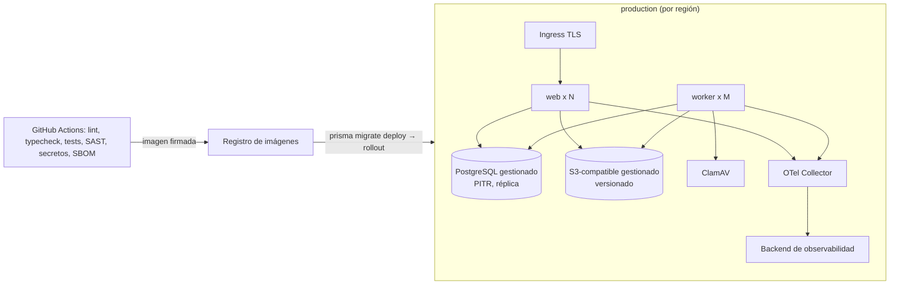

# Arquitectura del sistema

Este documento es el nivel 3 de la jerarquía de fuentes de verdad (`CLAUDE.md`): desarrolla el PRD y el mapa de dominio sin reinterpretarlos, y es la referencia que cada cambio OpenSpec debe leer antes de proponer. La versión terse y vinculante de las decisiones es la espina de arquitectura (`ARCHITECTURE-SPINE.md`, decisiones `AD-1` a `AD-23`); aquí se explican, se dibujan y se conectan. Toda inferencia no fijada por los insumos lleva `[ASSUMPTION]`; toda decisión que toque seguridad o interpretación normativa queda **pendiente de aprobación humana**.

## 1. Visión general

La plataforma permite a una organización implementar, operar, monitorear y auditar un Sistema de Gestión de IA (SGIA) conforme a ISO/IEC 42001, en modo SaaS multi-tenant, bilingüe ES/EN, con trazabilidad completa desde la norma hasta la evidencia. Sus propiedades arquitectónicas dominantes, en orden de prioridad, son:

1. **Aislamiento de tenant y auditabilidad inviolable** (NFR-001, NFR-017, FR-007): ningún dato cruza tenants; toda decisión de cumplimiento deja rastro encadenado por hash.
2. **Fidelidad normativa sin texto literal** (NFR-020, PR-DR-018, PR-DR-019): el catálogo se siembra desde `packages/standards-seed` con paráfrasis propias y cita a `resumenes/NN §sección`; nunca se inventa un identificador.
3. **Invariantes de dominio imposibles de violar** (PRD §9): la SoA gobierna los flujos; evidencia subida no es evidencia aceptada; la IA sugiere y una persona aprueba; ninguna puntuación sin desglose.
4. **Extensibilidad sin reescritura** (NFR-021): 21 bounded contexts existen desde el MVP aunque algunos no tengan UI hasta Fase 2/3; conectores, informes y tareas de IA se añaden por definición o adaptador, no por cambios en el dominio.
5. **Coste operativo bajo y "tecnología aburrida"** (A8): un despliegue, una base de datos, colas sobre PostgreSQL, sin Redis ni microservicios en el MVP.

## 2. Estilo arquitectónico

**Monolito modular con arquitectura hexagonal ligera por bounded context** (`AD-1`, ADR-003). El sistema es una única aplicación TypeScript desplegada como una imagen Docker en dos modos (`web`, `worker`). Cada uno de los 21 bounded contexts de `DOMAIN_MAP.md` es un paquete `packages/domain-<context>` con:

- **Núcleo de dominio**: entidades, máquinas de estado, invariantes (`PR-DR-nnn`) y servicios de aplicación (*commands* y *queries*).
- **Puertos**: interfaces que el dominio necesita (repositorio, `ObjectStorage`, `SecretStore`, `JobScheduler`, `LLMProvider`, `ApprovalPort`, `SoAReadPort`…) y que exporta (`*ReadPort` para otros contextos, manejadores de eventos).
- **Adaptadores**: implementaciones Prisma del repositorio dentro del propio paquete (solo sobre sus tablas), y adaptadores técnicos compartidos en `packages/*` de la capa de plataforma.

Next.js es solo el **adaptador de entrega** (UI + Route Handlers); el worker es el **adaptador de ejecución asíncrona** (relay del outbox, consumidores, jobs). Ninguno contiene lógica de negocio (`AD-1`); una prueba de arquitectura lo verifica (`AD-3`, `AD-23`).

Se descartaron: microservicios (coste operativo y transacciones distribuidas para un equipo pequeño y un MVP de 24 cambios), monolito sin módulos (imposible garantizar propiedad única de entidades entre 21 contextos) y esquema-por-tenant (A8, ADR-002).

## 3. Capas y reglas de dependencia

| Capa | Paquetes | Responsabilidad | Depende de |
| --- | --- | --- | --- |
| L0 kernel | `packages/kernel` | Tipos compartidos (`TenantContext`, `Result`, envelope `DomainEvent`), catálogo de permisos, enumeraciones canónicas, códigos de error, esquema de configuración | nada |
| L1 platform | `db`, `events`, `jobs`, `storage`, `secrets`, `i18n`, `observability`, `ai-core`, `connectors-sdk`, `standards-seed`, `ui` | Puertos y adaptadores técnicos | L0 |
| L2 domain | `domain-*` (21) | Dominio, servicios de aplicación, repositorios propios, manejadores de eventos | L0, L1, `index.ts` público de otros L2 |
| L3 composition | `apps/web`, `apps/worker` | Composición, entrega, arranque | L0-L2 |

Reglas (`AD-3`): dependencias solo hacia abajo; entre contextos únicamente `index.ts` público y eventos; cada tabla tiene un único contexto propietario; Reporting, Administration y AI Assistance leen por puertos de lectura o vistas de solo lectura declaradas por el propietario. `dependency-cruiser` `[ASSUMPTION herramienta]` falla el build ante un arco prohibido.

## 4. Estructura del monorepo

```text
/                                  # pnpm workspaces + Turborepo [ASSUMPTION]
  apps/
    web/                           # Next.js 16 App Router: UI bilingüe, app/api/v1/<domain>, auth
    worker/                        # MODE=worker: relay outbox, consumidores, jobs pg-boss, render PDF
  packages/
    kernel/                        # enums, permissions, events envelope, errors, config, TenantContext
    db/                            # Prisma 7 schema multi-archivo por contexto, migraciones, RLS, cliente tenant-scoped
    events/                        # outbox, relay, processed_events, registro de consumidores
    jobs/                          # puerto JobScheduler + adaptador pg-boss
    storage/                       # puerto ObjectStorage + adaptador S3 (SeaweedFS local, S3 gestionado prod)
    secrets/                       # puerto SecretStore + adaptadores (env cifrado; KMS/Vault F2)
    i18n/                          # mensajes es/en por namespace, prueba de claves, glosario oficial
    observability/                 # OpenTelemetry, logger estructurado, correlación
    ai-core/                       # puerto LLMProvider, presupuesto, caché, LLMUsageRecord (adaptadores F2)
    connectors-sdk/                # interfaces del SDK, pipeline, adaptador mock etiquetado, pruebas de contrato
    standards-seed/                # dataset JSON semver (42001+Amd1, UNE 2025, 19011:2026, 23894 parcial), loader, pruebas
    ui/                            # design system accesible (shadcn/ui 4 + Tailwind 4), tokens, componentes
    domain-identity-organization/  # Identity & Organization
    domain-administration/         # Administration: audit trail, retención, legal hold, calidad de datos, importación
    domain-workflow/               # Task, Workflow, Approval, Comment
    domain-notifications/
    domain-reporting/              # ReportDefinition, ReportRun, Dashboard, proyección de búsqueda [ASSUMPTION]
    domain-ai-assistance/
    domain-standards-compliance/   # catálogo global versionado
    domain-aims/                   # contexto, partes interesadas, alcance, política (ciclo), roles, objetivos (vínculo), RequirementImplementation
    domain-ai-portfolio/
    domain-risk/
    domain-impact/
    domain-lifecycle/              # F2
    domain-controls-soa/
    domain-evidence/
    domain-documents-policies/
    domain-objectives-kpis/        # AIObjective, KPI, Metric, ScoreSnapshot
    domain-incidents/              # F2
    domain-audit/
    domain-capa/
    domain-management-review/
    domain-integrations/
  tests/
    e2e/                           # Playwright: 15 pasos PRD §16.1
    security/                      # cross-tenant, escalada, BOLA, secretos, inmutabilidad del audit log
    architecture/                  # dependency-cruiser; "nuevo informe sin código"; "nuevo conector sin dominio"
  docs/                            # nivel 3: architecture/, decisions/, compliance/
  openspec/                        # nivel 4: cambios y specs
  resumenes/                       # nivel 0/1: nunca importado en runtime (A4)
  _bmad/ _bmad-output/             # método y artefactos de planificación
```

Convenciones de paquete de dominio (`AD-3`, convenciones de la espina):

```text
packages/domain-controls-soa/
  src/
    index.ts                 # ÚNICO punto público: puertos de lectura, tipos, nombres de eventos
    entities/                # StatementOfApplicability, SoAItem, ControlImplementation, Exception
    state/                   # máquinas de estado (applicability, control lifecycle)
    commands/                # decide-applicability.ts, approve-soa.ts, activate-control.ts …
    queries/                 # get-soa.ts, list-active-controls.ts …
    events/                  # publicadores y manejadores (on-risk-treatment-approved.ts …)
    ports/                   # SoARepository, SoAReadPort (exportado), ApprovalPort (requerido)
    adapters/prisma/         # implementación del repositorio sobre SUS tablas
  prisma/soa.prisma          # fragmento de esquema del contexto (compilado por packages/db)
  test/                      # unitarias por PR-DR-nnn, integración
```

## 5. Diagrama de componentes

```mermaid
flowchart TB
  subgraph Clients["Clientes"]
    BR[Navegador ES/EN]
    API[Integraciones externas<br/>API key]
  end

  subgraph Web["apps/web (MODE=web)"]
    UI[UI Next.js App Router<br/>Server Components + shadcn/ui]
    RH[Route Handlers /api/v1/*<br/>Zod + problem+json]
    AUTH[Auth adapter<br/>better-auth: sesión, TOTP, OIDC]
  end

  subgraph Worker["apps/worker (MODE=worker)"]
    RELAY[Outbox relay]
    CONS[Consumidores de eventos<br/>audit-trail-writer, evidence, workflow, kpis…]
    JOBS[Jobs pg-boss<br/>sweepers, render, scan, sync, seed]
  end

  subgraph Domain["packages/domain-* (21 bounded contexts)"]
    STD[Standards & Compliance<br/>catálogo global]
    IDO[Identity & Organization]
    ADM[Administration<br/>audit trail, retención]
    AIMS[AIMS]
    PORT[AI Portfolio]
    RISK[Risk]
    IMP[Impact]
    SOA[Controls & SoA]
    EVD[Evidence]
    DOC[Documents & Policies]
    OBJ[Objectives & KPIs]
    AUD[Audit]
    CAPA[CAPA]
    MR[Management Review]
    WF[Workflow]
    NTF[Notifications]
    RPT[Reporting]
    INT[Integrations]
    AIA[AI Assistance]
    LC[Lifecycle F2]
    INC[Incidents F2]
  end

  subgraph Platform["packages/* (plataforma)"]
    KER[kernel]
    DB[db: Prisma + RLS]
    EV[events: outbox]
    JB[jobs: JobScheduler→pg-boss]
    STO[storage: ObjectStorage]
    SEC[secrets: SecretStore]
    I18N[i18n]
    OTEL[observability]
    AIC[ai-core: LLMProvider]
    CSDK[connectors-sdk]
    SEED[standards-seed]
  end

  subgraph Infra["Infraestructura"]
    PG[(PostgreSQL 18<br/>RLS, outbox, pg-boss, audit_entries)]
    S3[(Object storage S3<br/>tenants/&lt;tenant_id&gt;/…)]
    AV[ClamAV]
    SMTP[SMTP]
    COL[OTel Collector]
    IDP[IdP OIDC del cliente]
    LLM[Proveedores LLM F2]
    PROV[Azure AI Foundry / OpenAI / Anthropic F2]
  end

  BR --> UI
  BR --> RH
  API --> RH
  UI --> AUTH
  RH --> AUTH
  AUTH --> IDP
  UI --> Domain
  RH --> Domain
  RELAY --> EV
  CONS --> Domain
  JOBS --> Domain
  Domain --> Platform
  DB --> PG
  EV --> PG
  JB --> PG
  STO --> S3
  JOBS --> AV
  NTF --> SMTP
  OTEL --> COL
  AIC -. F2 .-> LLM
  CSDK -. F2 .-> PROV
```



## 6. Flujo de una petición y de un evento

Toda mutación sigue la secuencia fija de `AD-4`: el Route Handler autentica y resuelve `TenantContext` (tenant, actor, roles, `correlation_id`), valida el cuerpo con Zod, delega al *command* del contexto propietario; el *command* autoriza por permiso declarado (`AD-8`), aplica la máquina de estado, escribe la mutación y el evento en `outbox_events` **en la misma transacción** con `SET LOCAL app.tenant_id` (`AD-2`), y devuelve el resultado. El worker relé mueve el outbox a colas pg-boss (`AD-5`); los consumidores reaccionan de forma idempotente; `audit-trail-writer` (Administration) escribe la entrada encadenada por hash (`AD-6`). El detalle está en `API_ARCHITECTURE.md` y `EVENT_ARCHITECTURE.md`.

```mermaid
sequenceDiagram
  participant U as Usuario (Compliance Manager)
  participant RH as Route Handler /api/v1/soa
  participant CMD as domain-controls-soa: decideApplicability
  participant PG as PostgreSQL (RLS)
  participant W as worker: relay + consumidores
  participant EVD as domain-evidence
  participant WF as domain-workflow
  participant ADM as domain-administration
  U->>RH: PATCH /soa/{id}/items/{itemId}/applicability {Not Applicable, justification}
  RH->>RH: sesión → TenantContext; Zod
  RH->>CMD: execute(ctx, input)
  CMD->>CMD: authorize(soa.manage); PR-DR-003 justification required
  CMD->>PG: BEGIN; SET LOCAL app.tenant_id; UPDATE soa_items; INSERT outbox_events(CONTROL_APPLICABILITY_CHANGED, CONTROL_DEACTIVATED); COMMIT
  CMD-->>RH: SoAItem v+1
  RH-->>U: 200 + ETag
  W->>PG: relay: outbox → pg-boss events.CONTROL_DEACTIVATED
  W->>EVD: handle → cancela EvidenceRequest abiertas (sin borrar)
  W->>WF: handle → cancela Task abiertas del control
  W->>ADM: audit-trail-writer → INSERT audit_entries (hash_n)
```

## 7. Despliegue y entornos

Decisión `AD-20` (envolvente operativa): una imagen Docker, dos modos, cuatro entornos.

| Entorno | Propósito | Infraestructura | Datos |
| --- | --- | --- | --- |
| `local` | desarrollo | `docker compose`: `web`, `worker`, `postgres:18`, `seaweedfs` (S3) `[ASSUMPTION]`, `clamav`, `otel-collector`, `mailpit` | semilla normativa + tenant demo etiquetado |
| `ci` | pruebas por PR | contenedores efímeros (PostgreSQL real para integración y RLS) | semilla + fixtures |
| `staging` | validación pre-producción, piloto | PostgreSQL gestionado, S3-compatible gestionado, proveedor de nube **pendiente de decisión humana** (PRD Q6) | copia anonimizada nunca; solo tenants de prueba |
| `production` | tenants reales | idem, con copias de seguridad diarias y PITR; región = `data_region` del tenant (NFR-015) | reales, RPO/RTO según PRD D-7 `[ASSUMPTION]` |

Reglas:

- **Configuración solo por variables de entorno** validadas con Zod en `packages/kernel/config.ts` al arrancar; un valor ausente detiene el proceso con mensaje claro.
- **Migraciones** (`prisma migrate deploy`) como paso obligatorio previo al despliegue; ningún cambio de esquema fuera de una migración (NFR-019); migraciones irreversibles requieren aprobación humana (`CLAUDE.md`).
- **Escalado**: `web` escala horizontalmente sin estado (sesiones en BD); `worker` escala por número de instancias, pg-boss reparte los jobs; `audit-trail-writer` se serializa por tenant (singleton key) para preservar la cadena de hashes.
- **Copias y recuperación**: copias diarias con retención 35 días `[ASSUMPTION]`, PITR habilitado, restauración probada en `mvp-hardening`; el almacenamiento de objetos con versionado y replicación del proveedor.
- **Residencia**: `data_region` se registra desde `organization-tenancy`; el despliegue multi-región (un stack por región) es un problema de despliegue, no de dominio, y queda diferido hasta que exista un segundo despliegue regional.
- **Health**: `/api/v1/health` (web) y `/health` (worker) informan de BD, colas y almacenamiento; el panel de administración expone métricas de pg-boss y del outbox.



## 8. Decisiones cruzadas

| Tema | Decisión | Dónde se desarrolla |
| --- | --- | --- |
| Multi-tenencia | PostgreSQL compartido, `tenant_id` + RLS `FORCE`, prefijo de almacenamiento (`AD-2`) | DATA_ARCHITECTURE §5, SECURITY_ARCHITECTURE, ADR-002 |
| Comunicación entre contextos | puertos públicos + eventos con outbox; nunca tablas ajenas (`AD-3`, `AD-5`) | DOMAIN_ARCHITECTURE, EVENT_ARCHITECTURE, ADR-003 |
| Trabajo en segundo plano | pg-boss tras `JobScheduler` (`AD-5`) | EVENT_ARCHITECTURE, ADR-004 |
| Auditoría | `audit_entries` append-only, hash chain por tenant, único escritor (`AD-6`) | SECURITY_ARCHITECTURE, DATA_ARCHITECTURE, ADR-005 |
| Catálogo vs. estado del tenant | separación estricta (`AD-7`, PRD D-3) | DATA_ARCHITECTURE, ADR-006 |
| Autorización | permisos declarados y verificados en el servicio; matriz por defecto addendum §B (`AD-8`) | SECURITY_ARCHITECTURE, API_ARCHITECTURE |
| Aprobaciones | `Approval` de Workflow como única vía, separación de funciones (`AD-10`) | DOMAIN_ARCHITECTURE, ADR-015 |
| Versionado y borrado | `version` optimista, `*_versions`, `object_versions`, soft delete, retención en Administration (`AD-11`, `AD-21`) | DATA_ARCHITECTURE, ADR-015 |
| i18n y enumeraciones | canónicas en `kernel`, `next-intl`, pruebas de claves y términos prohibidos (`AD-12`) | ADR-007 |
| Archivos | `ObjectStorage`, SHA-256 en servidor, escaneo, URLs firmadas (`AD-13`) | SECURITY_ARCHITECTURE, ADR-008 |
| Secretos | `SecretStore`, `secret_ref` (`AD-14`) | SECURITY_ARCHITECTURE, INTEGRATION_ARCHITECTURE, ADR-014 |
| API | `/api/v1/<domain>`, Zod, problem+json, cursor, idempotencia (`AD-15`) | API_ARCHITECTURE, ADR-013 |
| Puntuaciones e informes | `ScoreSnapshot` transparente, `ReportDefinition` declarativa (`AD-16`) | REPORTING_ARCHITECTURE, ADR-009 |
| IA asistida | `LLMProvider`, registro total, sin escritura sobre cumplimiento, plataforma inventariada (`AD-17`) | AI_ARCHITECTURE, ADR-012 |
| Conectores | SDK con pipeline fijo y estados honestos (`AD-18`) | INTEGRATION_ARCHITECTURE, ADR-016 |
| Observabilidad | OpenTelemetry + `correlation_id` extremo a extremo (`AD-19`) | EVENT_ARCHITECTURE |
| Pruebas | pirámide completa con un caso por invariante (`AD-23`) | ADR-010 |

## 9. Atributos de calidad y cómo se cumplen

| NFR | Mecanismo arquitectónico |
| --- | --- |
| NFR-001/002 seguridad por defecto, nada ajeno al cliente | RLS, `SecretStore`, DTOs explícitos en Route Handlers, Server Components sin secretos, cabeceras seguras, rate limiting |
| NFR-003 cadena de suministro | CI con escaneo de dependencias, SAST, secretos, SBOM; licencias copyleft requieren aprobación |
| NFR-004 archivos seguros | lista MIME, tamaño máximo, hash en servidor, escaneo antes de `Collected`, URLs firmadas |
| NFR-005 pruebas de seguridad por cambio | suite `tests/security` obligatoria en Definition of Done |
| NFR-006/007 escalabilidad y p95 | web sin estado, índices por `tenant_id`+`status`+`owner_id`+`due_date`, paginación por cursor, trabajo pesado en worker |
| NFR-008 disponibilidad y DR | PostgreSQL gestionado con PITR, almacenamiento versionado, restauración probada |
| NFR-009 WCAG 2.2 AA | design system `packages/ui` con auditoría automática (axe) en E2E `[ASSUMPTION herramienta]` |
| NFR-011 sin mock-only | prueba E2E "toda entrada visible tiene backend"; conector `mock` etiquetado |
| NFR-012 errores útiles | `problem+json` con `code` canónico y `PR-DR-nnn` en `detail` |
| NFR-013/014 observabilidad y correlación | OpenTelemetry, `correlation_id` en request → outbox → job → audit |
| NFR-015/016 residencia y retención | `data_region` por tenant; `RetentionPolicy`/`LegalHold` en Administration; sin borrado silencioso |
| NFR-017 atribución y exportación | `audit_entries` con actor, motivo, antes/después; exportación verificable |
| NFR-018 bilingüe | `next-intl`, enumeraciones traducidas por clave, prueba de cero claves faltantes |
| NFR-019 solo migraciones | Prisma migrate; CI falla si el esquema difiere de las migraciones |
| NFR-020 derechos de autor | semilla sin texto literal; prueba de n-gramas (addendum D.5); citas a `resumenes/` |
| NFR-021 extensibilidad | puertos, definiciones declarativas, adaptadores; pruebas de arquitectura |
| NFR-022 documentación viva | `docs/` actualizado al archivar cada cambio; matriz de trazabilidad |
| NFR-023/024 pirámide y dominio | ADR-010; pruebas de la semilla (38/26/11/7) |

## 10. Relación con la hoja de ruta

Los cinco primeros cambios (`foundation-project-bootstrap`, `organization-tenancy`, `identity-and-rbac`, `immutable-audit-trail`, `domain-events-outbox-jobs`) materializan las decisiones transversales `AD-1` a `AD-6`, `AD-8`, `AD-12`, `AD-19`, `AD-20`, `AD-22` y `AD-23`; `standards-and-requirements-engine` materializa `AD-7`. A partir de ahí cada cambio de dominio hereda el sustrato y solo añade su paquete, sus tablas, sus eventos y sus pruebas. El mapa capacidad → arquitectura de la espina indica para cada uno de los 24 cambios qué paquetes toca y qué `AD` lo gobierna; `docs/compliance/TRACEABILITY_MATRIX.md` registra la trazabilidad hasta la evidencia.

## 11. Decisiones que requieren aprobación humana

| Decisión | Motivo | Punto de aprobación |
| --- | --- | --- |
| Bloquear esta arquitectura (espina + ADR-001..ADR-016) | `CLAUDE.md`: aprobación antes de bloquear la arquitectura | Checkpoint 0 (antes del cambio 1) |
| Separación catálogo/estado del tenant (`AD-7`, PRD D-3) | afecta al modelo de datos de casi todos los contextos | antes de `standards-and-requirements-engine` |
| Matriz rol × permiso por defecto (`AD-8`, PRD D-6) | seguridad y separación de funciones | antes de `identity-and-rbac` |
| Autenticación con better-auth (ADR-011) | arquitectura de seguridad | antes de `identity-and-rbac` |
| Excepción de separación de funciones en tenants pequeños (`AD-10`, addendum D.4) | relaja PR-DR-011 de forma registrada | antes de `evidence-library` |
| Proveedor de nube, región, RPO/RTO (`AD-20`, PRD Q6, D-7) | residencia de datos y coste | antes de `staging` |
| Prefijo `/api/v1` (`AD-15`) | P2 §43 no versiona | antes de `foundation-project-bootstrap` |
| SeaweedFS como S3 local y política de licencias (ADR-008) | sustituye MinIO archivado; descarta Garage (AGPLv3) | `foundation-project-bootstrap` |
