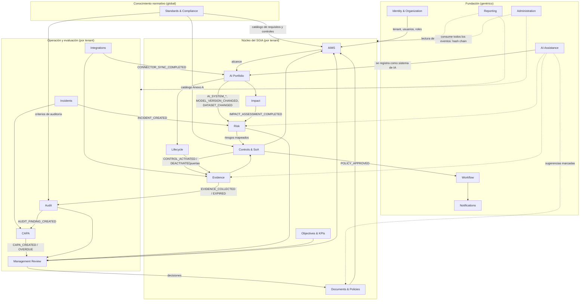

# Mapa de dominio

## 1. Principios

1. **Monolito modular** (A8, ADR-003): cada bounded context es un módulo con interfaz pública explícita (servicios de dominio y eventos). Ningún módulo escribe en tablas de otro.
2. **Una entidad, un propietario**: cada entidad de P2 §1, §4 y §5 pertenece a un único contexto. Los demás la referencian por identificador y consumen sus eventos o consultan su API interna de lectura.
3. **Catálogo frente a estado del tenant**: el conocimiento normativo (`Requirement`, `Control`) es global y de solo lectura para los tenants; el estado de cumplimiento (`RequirementImplementation`, `SoAItem`, `ControlImplementation`) es del tenant. Esta separación [ASSUMPTION] evita duplicar la norma por tenant y permite actualizar versiones.
4. **Eventos con outbox**: todo cambio de estado relevante escribe su evento en la misma transacción. Los nombres de evento son los de P2 §65 (mayúsculas con guion bajo) y los de §41/§17 se normalizan al mismo formato (`RISK_TREATMENT_APPROVED`).
5. **Registro de auditoría universal**: el contexto Administration consume todos los eventos y los encadena por hash; ningún otro contexto escribe directamente en el registro.

## 2. Diagrama de contextos



Las flechas continuas son dependencias de datos o eventos entre contextos; las discontinuas son lecturas de proyecciones o consumo universal.

## 3. Contextos

Cada ficha indica responsabilidad, entidades propias, eventos publicados y consumidos, dependencias, requisitos PR-* cubiertos y cláusulas o controles ISO relacionados. Las entidades marcadas [A] son añadidas por el analista ([ASSUMPTION]) porque P2 describe su comportamiento sin nombrarlas.

### 3.1 Identity & Organization

- **Responsabilidad**: tenants, estructura organizativa, usuarios, roles, permisos, equipos, autenticación, sesiones, invitaciones, ciclo de vida de usuario y revisiones de acceso.
- **Entidades**: `Organization`, `Tenant`, `BusinessUnit`, `Department`, `Location`, `User`, `Role`, `Permission`, `Team`, `Membership`, `Session` [A], `Invitation` [A], `AccessReview` [A].
- **Publica**: `USER_INVITED` [A], `USER_ACTIVATED` [A], `USER_DEACTIVATED` [A], `USER_PERMISSION_CHANGED` (§41), `TENANT_CREATED` [A].
- **Consume**: ninguno (contexto raíz).
- **Dependencias**: proveedor de identidad externo (PR-EXT-007).
- **Requisitos**: PR-XC-001, 002, 003, 004, 005; PR-NFR-004; PR-EXT-007, 009.
- **ISO**: 4.3 (alcance por unidades y ubicaciones), 5.3 (roles y autoridades) [01].

### 3.2 Standards & Compliance

- **Responsabilidad**: conocimiento normativo versionado, global y de solo lectura para los tenants; semilla; tipos de registro; mapeos requisito-control; relaciones entre normas; requisitos regulatorios externos (Fase 2); paquetes sectoriales (Fase 3).
- **Entidades**: `Standard`, `StandardVersion`, `Clause`, `SubClause`, `Requirement`, `Annex`, `ControlDomain`, `Control`, `ControlGuidance`, `RequirementControlMapping`, `StandardRelationship`, `RegulatoryRequirement`, `AuditQuestion` [A] (banco de preguntas por requisito), `DomainPackage` [A] (Fase 3), `SeedRecordSource` [A] (cita a `resumenes/NN §sección`, nodo A10).
- **Publica**: `STANDARD_VERSION_PUBLISHED` [A], `REGULATORY_REQUIREMENT_CHANGED` (§65).
- **Consume**: ninguno.
- **Dependencias**: `packages/standards-seed/` (A4, A6).
- **Requisitos**: PR-CAP-001, 002, 005, 006, 007, 008, 009, 010, 038, 050, 090; PR-NFR-015, 020, 021; PR-DR-018, 019, 025.
- **ISO**: estructura completa de cláusulas 4-10 [01 §3]; Anexos A y B [02 §3]; Anexo C [03]; ISO 19011 y 23894 como normas de apoyo [05] [04].

### 3.3 AIMS

- **Responsabilidad**: el sistema de gestión del tenant: contexto (4.1), partes interesadas (4.2), alcance (4.3), centro de control (4.4), roles y RACI (5.3), estado de implementación de cada requisito, competencia y formación (7.2, 7.3), planificación de cambios del SGIA (6.3).
- **Entidades**: `InterestedParty`, `ContextIssue` [A], `AIRoleDeclaration` [A] (roles de la organización respecto a la IA, 4.1 nota 1), `AIMSScope` [A], `ScopeVersion` [A], `ScopeExclusion` [A], `RequirementImplementation` [A], `RoleAssignment` [A] (RACI), `GovernanceCommittee` [A], `Competency`, `TrainingRequirement`, `TrainingRecord`, `ChangeRequest` (del SGIA, §33) .
- **Publica**: `SCOPE_CHANGED` (§65), `REQUIREMENT_STATUS_CHANGED` (§41), `CONTEXT_REVIEWED` [A], `CHANGE_REQUEST_CREATED` [A].
- **Consume**: `CONTROL_ACTIVATED`, `CONTROL_DEACTIVATED`, `EVIDENCE_COLLECTED`, `EVIDENCE_EXPIRED`, `POLICY_APPROVED`, `AUDIT_FINDING_CREATED`, `CAPA_CLOSED` (recalcular estado de requisitos); `MODEL_VERSION_CHANGED`, `AI_SYSTEM_CHANGED` (abrir solicitud de cambio, Fase 2).
- **Dependencias**: Standards (catálogo), Identity (unidades, usuarios), AI Portfolio (sistemas en alcance).
- **Requisitos**: PR-CAP-003, 004, 011, 012, 013, 014, 017, 019, 140; PR-DR-027, 029.
- **ISO**: 4.1, 4.2, 4.3, 4.4, 5.3, 6.3, 7.2, 7.3 [01 §4]; A.3.2, A.4.6 [02 §4.12].

### 3.4 AI Portfolio

- **Responsabilidad**: inventario de sistemas de IA y activos relacionados, proveedores tecnológicos, terceros contractuales (A.10), candidatos descubiertos, agentes (Fase 3), grafo de relaciones.
- **Entidades**: `AIAsset`, `AISystem`, `AIModel`, `AIModelVersion`, `AIProvider`, `AIDeployment`, `AIUseCase`, `AIProject`, `AIDataset`, `AIDataSource`, `AIIntegration`, `Supplier`, `Customer`, `Contract`, `CandidateAISystem` [A], `Agent` [A] (Fase 3), `AgentTool` [A] (Fase 3).
- **Publica**: `AI_SYSTEM_CREATED`, `AI_SYSTEM_CHANGED`, `MODEL_VERSION_CHANGED`, `DATASET_CHANGED` (§65); `AI_MODEL_CHANGED` (§41); `CANDIDATE_AI_SYSTEM_DISCOVERED` [A]; `SUPPLIER_CHANGED` [A].
- **Consume**: `CONNECTOR_SYNC_COMPLETED` (crear candidatos), `SCOPE_CHANGED` (marcar sistemas dentro/fuera de alcance), `AI_ARTIFACT_GENERATED` [A] (registrar uso de las funciones LLM de la plataforma como sistema de IA, A9).
- **Dependencias**: Identity (propietarios, unidades), AIMS (alcance), Integrations (descubrimiento).
- **Requisitos**: PR-CAP-020, 021, 022, 023, 024, 026, 027; PR-DR-007 (emite los disparadores), 012, 020, 026.
- **ISO**: A.4.2, A.4.3, A.4.4, A.4.5 (recursos), A.9.4 (uso previsto), A.10.2, A.10.3, A.10.4 (terceros y clientes) [02 §4.12]; 8.1 (procesos suministrados externamente) [01].

### 3.5 Risk

- **Responsabilidad**: metodología y criterios de riesgo del tenant, escalas, registro de riesgos, evaluación, tratamiento, aceptación, riesgo residual, tendencia, apetito, disparadores de reevaluación.
- **Entidades**: `Risk`, `RiskSource`, `Threat`, `Vulnerability`, `RiskAssessment`, `RiskTreatment`, `RiskTreatmentPlan`, `RiskAcceptance`, `ResidualRisk`, `RiskMethodology` [A] (criterios, apetito), `RiskScale` [A], `RiskReassessmentTrigger` [A].
- **Publica**: `RISK_CREATED`, `RISK_ESCALATED`, `RISK_ACCEPTED`, `RISK_ACCEPTANCE_EXPIRING` (§65); `RISK_SCORED`, `RISK_TREATMENT_APPROVED` (§41); `RISK_REASSESSMENT_REQUIRED` [A]; `RISK_ACCEPTANCE_EXPIRED` [A].
- **Consume**: `AI_SYSTEM_CHANGED`, `MODEL_VERSION_CHANGED`, `DATASET_CHANGED`, `INCIDENT_CREATED`, `IMPACT_ASSESSMENT_COMPLETED`, `REGULATORY_REQUIREMENT_CHANGED`, `CONTROL_DEACTIVATED`, `CONTROL_TEST_FAILED` [A] (recalcular residual).
- **Dependencias**: AI Portfolio (sistemas y activos), Standards (Anexo C, 23894), Controls & SoA (eficacia de controles para el residual), Impact (resultados).
- **Requisitos**: PR-CAP-030 a 039; PR-DR-005, 006, 007, 028.
- **ISO**: 6.1.1, 6.1.2, 6.1.3, 8.2, 8.3 [01 §4]; Anexo C [03]; ISO/IEC 23894 [04].

### 3.6 Impact

- **Responsabilidad**: evaluaciones del impacto del sistema de IA: plantillas, instancias, preguntas, respuestas, hallazgos de impacto, mitigaciones, aprobación, versionado.
- **Entidades**: `ImpactAssessment`, `ImpactAssessmentFinding`, `AssessmentTemplate` [A], `AssessmentQuestion` [A], `AssessmentAnswer` [A], `Mitigation` [A].
- **Publica**: `IMPACT_ASSESSMENT_COMPLETED` (§65), `IMPACT_ASSESSMENT_APPROVED` (§41), `IMPACT_REASSESSMENT_REQUIRED` [A].
- **Consume**: `AI_SYSTEM_CREATED`, `AI_SYSTEM_CHANGED`, `MODEL_VERSION_CHANGED`, `INCIDENT_CREATED`, `SCOPE_CHANGED`.
- **Dependencias**: AI Portfolio, Evidence (evidencia adjunta), CAPA (hallazgos que derivan en acciones).
- **Requisitos**: PR-CAP-040 a 044; PR-DR-028.
- **ISO**: 6.1.4, 8.4 [01 §4]; A.5.2, A.5.3, A.5.4, A.5.5 [02 §4.12]; 3.24 [13].

### 3.7 Lifecycle

- **Responsabilidad** (Fase 2): etapas y puertas configurables del ciclo de vida del sistema de IA, revisiones de etapa, bloqueo de progresión, excepciones de puerta.
- **Entidades**: `LifecycleStage`, `LifecycleGate`, `LifecycleReview`, `GateEvaluation` [A], `StageTransition` [A].
- **Publica**: `LIFECYCLE_STAGE_CHANGED` [A], `LIFECYCLE_GATE_FAILED` [A], `LIFECYCLE_GATE_PASSED` [A].
- **Consume**: `IMPACT_ASSESSMENT_COMPLETED`, `RISK_ACCEPTED`, `RISK_TREATMENT_APPROVED`, `EVIDENCE_COLLECTED`, `CONTROL_ACTIVATED`, `MODEL_VERSION_CHANGED`, `EXCEPTION_APPROVED` [A].
- **Dependencias**: AI Portfolio (el sistema), Risk, Impact, Controls & SoA, Evidence, Documents (documentación técnica), Workflow (aprobaciones).
- **Requisitos**: PR-CAP-045, 046, 047, 048; PR-DR-013.
- **ISO**: A.6.1.3, A.6.2.2 a A.6.2.8 [02 §4.12]; 6.3 [01].

### 3.8 Controls & SoA

- **Responsabilidad**: declaración de aplicabilidad del tenant, decisiones de aplicabilidad, activación por eventos, implementación operativa de controles, pruebas de controles, controles alternativos, excepciones.
- **Entidades**: `StatementOfApplicability`, `SoAItem`, `ControlImplementation` [A], `ControlTest` [A], `CustomControl` [A] (controles adicionales de la organización), `Exception`.
- **Publica**: `CONTROL_ACTIVATED`, `CONTROL_DEACTIVATED` (§65); `CONTROL_APPLICABILITY_CHANGED` (§41); `SOA_APPROVED` [A]; `CONTROL_TEST_COMPLETED` [A]; `CONTROL_TEST_FAILED` [A]; `EXCEPTION_APPROVED` [A]; `EXCEPTION_EXPIRING` [A].
- **Consume**: `RISK_CREATED`, `RISK_ESCALATED` (sugerir controles), `AUDIT_FINDING_CREATED`, `INCIDENT_CREATED`, `MODEL_VERSION_CHANGED` (revisión de control), `REGULATORY_REQUIREMENT_CHANGED`, `EVIDENCE_EXPIRED` (estado de evidencia del control).
- **Dependencias**: Standards (catálogo Anexo A), Risk (riesgos mapeados), AI Portfolio (sistemas mapeados), Identity (propietarios), Workflow (tareas y aprobaciones).
- **Requisitos**: PR-CAP-051 a 060, 135; PR-DR-001, 002, 003, 004, 014.
- **ISO**: 6.1.3 b)-g), 8.3 [01 §4]; A.1, Tabla A.1, B.1 [02 §3.1]; 3.26 [13 §4.2].

### 3.9 Evidence

- **Responsabilidad**: biblioteca de evidencia, solicitudes, revisiones, vínculos, hash, procedencia, expiración, retención aplicada.
- **Entidades**: `Evidence`, `EvidenceRequest`, `EvidenceLink`, `EvidenceReview`, `EvidenceProvenance` [A], `EvidenceFile` [A] (referencia al almacenamiento de objetos).
- **Publica**: `EVIDENCE_COLLECTED`, `EVIDENCE_EXPIRED` (§65); `EVIDENCE_APPROVED` (§41); `EVIDENCE_REJECTED` [A]; `EVIDENCE_REQUESTED` [A]; `EVIDENCE_EXPIRING` [A].
- **Consume**: `CONTROL_ACTIVATED` (crear solicitudes recurrentes), `CONTROL_DEACTIVATED` (cancelar solicitudes), `CONNECTOR_SYNC_COMPLETED` (evidencia automatizada, Fase 2), `MODEL_VERSION_CHANGED` (solicitud de evidencia), `LIFECYCLE_GATE_FAILED` (evidencia faltante), `RETENTION_POLICY_CHANGED` [A].
- **Dependencias**: almacenamiento de objetos (PR-EXT-005), Administration (retención, legal hold), Identity (revisores).
- **Requisitos**: PR-CAP-061 a 069; PR-DR-011, 015.
- **ISO**: 7.5.1, 7.5.2, 7.5.3, 9.1 [01 §4]; ISO 19011 3.9, 3.10 [05].

### 3.10 Documents & Policies

- **Responsabilidad**: información documentada viva (políticas, procedimientos, documentos), versiones, ciclo de aprobación, plantillas y generación (Fase 2), exportación.
- **Entidades**: `Policy`, `PolicyVersion`, `Procedure`, `Document`, `DocumentVersion`, `DocumentTemplate` [A].
- **Publica**: `POLICY_APPROVED` (§65/§41), `DOCUMENT_PUBLISHED` [A], `POLICY_REVIEW_DUE` [A], `POLICY_EXPIRING` [A].
- **Consume**: `SCOPE_CHANGED` (revisión de política), `MANAGEMENT_REVIEW_APPROVED` (cambios de política), `AI_ARTIFACT_GENERATED` (borrador generado, Fase 2), `REGULATORY_REQUIREMENT_CHANGED`.
- **Dependencias**: Workflow (aprobaciones), AI Assistance (generación), servicio de renderizado (PR-XC-011).
- **Requisitos**: PR-CAP-015, 016, 070, 071, 072; PR-DR-008 (marcado de borradores generados).
- **ISO**: 5.2, 7.5 [01 §4]; A.2.2, A.2.3, A.2.4, A.6.2.7 [02 §4.12].

### 3.11 Incidents

- **Responsabilidad** (Fase 2): incidentes de IA, categorías, ciclo de vida, cronología, comunicación, disparadores hacia riesgo, impacto, controles y CAPA.
- **Entidades**: `Incident`, `IncidentEvent`, `IncidentCommunication` [A].
- **Publica**: `INCIDENT_CREATED` (§65/§41), `INCIDENT_ESCALATED` [A], `INCIDENT_CLOSED` [A].
- **Consume**: `CONNECTOR_SYNC_COMPLETED` (señales de seguimiento, Fase 2), `KPI_THRESHOLD_BREACHED` [A].
- **Dependencias**: AI Portfolio (sistema afectado), Risk, Impact, Controls & SoA, CAPA, Notifications.
- **Requisitos**: PR-CAP-080, 081.
- **ISO**: A.8.4 (comunicación de incidentes), A.6.2.6, A.3.3 [02 §4.12]; 10.2 [01].

### 3.12 Audit

- **Responsabilidad**: programa de auditoría, auditorías, planes, criterios, evidencia de auditoría, hallazgos de auditoría, conclusiones, informe, seguimiento; alineado con ISO 19011.
- **Entidades**: `AuditProgramme`, `Audit`, `AuditPlan`, `AuditCriterion` [A], `AuditEvidence` (vínculo entre `Audit`, `Evidence` y `AuditCriterion`), `AuditFinding` (especialización de `Finding`), `AuditConclusion`, `AuditReport` [A], `AuditorAssignment` [A] (competencia e independencia).
- **Publica**: `AUDIT_STARTED`, `AUDIT_CONCLUDED` (§41); `AUDIT_FINDING_CREATED` (§65); `AUDIT_SCHEDULED` [A]; `AUDIT_FOLLOW_UP_DUE` [A].
- **Consume**: `RISK_ESCALATED` (programa basado en riesgos), `CONTROL_ACTIVATED` (criterios), `CAPA_CLOSED` (seguimiento), `SOA_APPROVED`.
- **Dependencias**: Standards (criterios), Controls & SoA, Evidence, AI Portfolio, Identity (auditores), CAPA.
- **Requisitos**: PR-CAP-085 a 091; PR-DR-022, 023.
- **ISO**: 9.2.1, 9.2.2 [01 §4]; ISO 19011 cl. 5, 6 y 3.5-3.12 [05].

### 3.13 CAPA

- **Responsabilidad**: hallazgos genéricos, no conformidades, corrección, causa raíz, acciones correctivas, verificación de eficacia, cierre, mejora continua.
- **Entidades**: `Finding` (genérico, `source_type`: audit, control_test, impact, incident, data_quality, ai_gap_analysis), `Nonconformity`, `CorrectiveAction`, `RootCauseAnalysis` [A], `EffectivenessVerification` [A], `ImprovementOpportunity` [A] (§56).
- **Publica**: `FINDING_CREATED` (§41), `CAPA_CREATED`, `CAPA_OVERDUE` (§65), `CAPA_CLOSED` (§41), `CAPA_EFFECTIVENESS_VERIFIED` [A], `IMPROVEMENT_RECORDED` [A].
- **Consume**: `AUDIT_FINDING_CREATED`, `INCIDENT_CREATED`, `IMPACT_ASSESSMENT_COMPLETED` (hallazgos), `CONTROL_TEST_FAILED`, `MANAGEMENT_REVIEW_APPROVED` (acciones), `DATA_QUALITY_ISSUE_DETECTED` [A].
- **Dependencias**: Audit, Incidents, Impact, Controls & SoA, Evidence (evidencia de eficacia), Workflow.
- **Requisitos**: PR-CAP-095, 096, 097, 098; PR-DR-024.
- **ISO**: 10.1, 10.2 [01 §4]; 3.16, 3.17 [13 §4.2].

### 3.14 Management Review

- **Responsabilidad**: revisiones por la dirección, entradas agregadas, decisiones, acciones, acta formal.
- **Entidades**: `ManagementReview`, `ManagementReviewInput`, `ManagementReviewDecision`, `ManagementReviewAction` [A].
- **Publica**: `MANAGEMENT_REVIEW_APPROVED` (§41), `MANAGEMENT_REVIEW_SCHEDULED` [A].
- **Consume**: `RISK_ACCEPTED`, `RISK_ESCALATED`, `AUDIT_CONCLUDED`, `AUDIT_FINDING_CREATED`, `CAPA_CREATED`, `CAPA_OVERDUE`, `INCIDENT_CREATED`, `IMPACT_ASSESSMENT_COMPLETED`, `REGULATORY_REQUIREMENT_CHANGED`, `AI_SYSTEM_CREATED`, `KPI_THRESHOLD_BREACHED`, `SUPPLIER_CHANGED` (todos como fuentes de entrada).
- **Dependencias**: lectura de proyecciones de Risk, Audit, CAPA, Incidents, Objectives & KPIs, AI Portfolio, Documents.
- **Requisitos**: PR-CAP-100, 101.
- **ISO**: 9.3.1, 9.3.2, 9.3.3 [01 §4]; A.2.4 (revisión de la política) [02].

### 3.15 Objectives & KPIs

- **Responsabilidad**: objetivos de la IA y sus métricas, KPI configurables, motor de puntuación transparente, madurez (Fase 3).
- **Entidades**: `AIObjective`, `AIObjectiveMetric`, `KPI`, `Metric`, `ScoreDefinition` [A], `ScoreSnapshot` [A] (fórmula, numerador, denominador, exclusiones, fuentes, timestamp), `MaturityAssessment` [A] (Fase 3).
- **Publica**: `KPI_THRESHOLD_BREACHED` [A], `SCORE_RECALCULATED` [A], `OBJECTIVE_UPDATED` [A].
- **Consume**: `CONTROL_ACTIVATED`, `CONTROL_DEACTIVATED` (denominadores de controles activos), `REQUIREMENT_STATUS_CHANGED`, `EVIDENCE_APPROVED`, `EVIDENCE_EXPIRED`, `RISK_SCORED`, `RISK_ACCEPTED`, `AUDIT_FINDING_CREATED`, `CAPA_CLOSED`, `INCIDENT_CREATED`, `AI_SYSTEM_CREATED`.
- **Dependencias**: lectura de proyecciones de todos los contextos del núcleo; Workflow (cálculo programado).
- **Requisitos**: PR-CAP-018, 105, 106, 107, 145; PR-DR-009, 010, 030.
- **ISO**: 6.2, 9.1 [01 §4]; A.6.1.2, A.9.3 [02].

### 3.16 Integrations

- **Responsabilidad**: SDK de conectores, definiciones de proveedor, credenciales (referencias a secretos), pruebas de conexión, sincronizaciones, mapeos, hallazgos de integración, disponibilidad de datos, errores.
- **Entidades**: `Integration`, `IntegrationCredential`, `IntegrationSync`, `IntegrationFinding`, `ConnectorDefinition` [A], `DataAvailability` [A], `SyncError` [A].
- **Publica**: `CONNECTOR_SYNC_COMPLETED` (§65), `CONNECTOR_SYNCED` (§41), `CONNECTOR_SYNC_FAILED` [A], `CREDENTIAL_CREATED`, `CREDENTIAL_UPDATED`, `CREDENTIAL_ROTATED`, `CREDENTIAL_ACCESSED`, `CREDENTIAL_REVOKED` (§17).
- **Consume**: `TENANT_CREATED` (configuración por defecto), `USER_DEACTIVATED` (revocar credenciales personales).
- **Dependencias**: gestor de secretos (PR-EXT-008), APIs de proveedores (PR-EXT-001..003), Workflow (jobs programados).
- **Requisitos**: PR-CAP-125 a 132; PR-XC-015; PR-DR-021; PR-NFR-016.
- **ISO**: A.10.3 (proveedores), A.4.2, A.6.2.6 [02 §4.12].

### 3.17 Reporting

- **Responsabilidad**: definiciones declarativas de informes, ejecuciones, programación, dashboards, exportación, paquetes de evidencia y preparación para certificación (vista agregada), constructor dinámico (Fase 3).
- **Entidades**: `ReportDefinition`, `ReportRun`, `ReportSchedule`, `Dashboard`, `DashboardWidget` [A], `ReadinessChecklist` [A] (§53), `ExportPackage` [A].
- **Publica**: `REPORT_GENERATED` [A], `REPORT_SCHEDULE_DUE` [A].
- **Consume**: lectura de proyecciones de todos los contextos; `SCORE_RECALCULATED`.
- **Dependencias**: Objectives & KPIs (puntuaciones), servicio de renderizado (PR-XC-011), Notifications (entrega).
- **Requisitos**: PR-CAP-108, 110 a 117, 120; PR-DR-009, 027.
- **ISO**: 9.1 (evidencia de seguimiento y medición), 6.1.3 f) (informe de SoA), 9.2 (preparación para auditoría) [01].

### 3.18 Workflow

- **Responsabilidad**: tareas, flujos, aprobaciones, comentarios, recurrencia, SLA, escalado, jobs en segundo plano.
- **Entidades**: `Task`, `Workflow`, `Approval`, `Comment`, `WorkflowDefinition` [A], `Job` [A] (cola pg-boss).
- **Publica**: `TASK_CREATED` [A], `TASK_OVERDUE` [A], `TASK_COMPLETED` [A], `APPROVAL_REQUESTED` [A], `APPROVAL_GRANTED` [A], `APPROVAL_REJECTED` [A].
- **Consume**: `CONTROL_ACTIVATED` (tareas de implementación), `CONTROL_DEACTIVATED` (cancelar tareas abiertas), `EVIDENCE_REQUESTED`, `AUDIT_FINDING_CREATED`, `CAPA_CREATED`, `RISK_ACCEPTANCE_EXPIRING`, `EVIDENCE_EXPIRING`, `LIFECYCLE_GATE_FAILED`, `MANAGEMENT_REVIEW_APPROVED` (acciones), `POLICY_REVIEW_DUE`, `CANDIDATE_AI_SYSTEM_DISCOVERED` (tarea de validación).
- **Dependencias**: Identity (asignación), Notifications.
- **Requisitos**: PR-CAP-075; PR-XC-008, 014, 017.
- **ISO**: 8.1 (planificación y control operacional) [01].

### 3.19 Notifications

- **Responsabilidad**: reglas de notificación configurables, canales (in-app, email, webhook), plantillas bilingües, historial de envío.
- **Entidades**: `Notification`, `NotificationRule` [A], `NotificationTemplate` [A], `NotificationDelivery` [A].
- **Publica**: `NOTIFICATION_SENT` [A], `NOTIFICATION_FAILED` [A].
- **Consume**: `TASK_OVERDUE`, `EVIDENCE_EXPIRING`, `EVIDENCE_EXPIRED`, `RISK_ESCALATED`, `RISK_ACCEPTANCE_EXPIRING`, `LIFECYCLE_GATE_FAILED`, `INCIDENT_CREATED`, `CONNECTOR_SYNC_FAILED`, `AUDIT_FINDING_CREATED`, `AUDIT_SCHEDULED`, `MANAGEMENT_REVIEW_SCHEDULED`, `POLICY_EXPIRING`, `CONTROL_TEST_COMPLETED`, `REGULATORY_REQUIREMENT_CHANGED`, `APPROVAL_REQUESTED`, `USER_INVITED`.
- **Dependencias**: servicio de correo (PR-EXT-006), Identity (destinatarios, preferencias, idioma).
- **Requisitos**: PR-XC-009, 012 (plantillas bilingües).
- **ISO**: 7.4 (comunicación) [01].

### 3.20 Administration

- **Responsabilidad**: configuración del tenant (región, idioma por defecto, escalas por defecto), registro de auditoría de la aplicación con cadena de hashes, políticas de retención y legal hold, importación/exportación, calidad de datos, feature flags, búsqueda.
- **Entidades**: `TenantSettings` [A], `AuditLogEntry` [A] (append-only, hash chain), `RetentionPolicy` [A], `LegalHold` [A], `ImportJob` [A], `ImportMapping` [A], `DataQualityCheck` [A], `DataQualityIssue` [A], `SearchDocument` [A] (proyección de búsqueda), `FeatureFlag` [A].
- **Publica**: `RETENTION_POLICY_CHANGED` [A], `RETENTION_EXPIRED` [A], `LEGAL_HOLD_APPLIED` [A], `IMPORT_COMPLETED` [A], `DATA_QUALITY_ISSUE_DETECTED` [A].
- **Consume**: **todos los eventos** (para el registro de auditoría y la indexación de búsqueda).
- **Dependencias**: ninguna funcional; infraestructura (PostgreSQL, almacenamiento).
- **Requisitos**: PR-XC-006, 010, 016, 018, 019, 020; PR-CAP-150, 155, 160, 161; PR-NFR-010, 011, 012; PR-DR-015, 016, 017.
- **ISO**: 7.5.3 (control de la información documentada), 9.2 (evidencia auditable) [01].

### 3.21 AI Assistance (contexto añadido) [ASSUMPTION]

- **Responsabilidad** (Fase 2): abstracción de proveedor LLM, tareas de asistencia (interpretación, brechas, sugerencias, generación, análisis, resúmenes), registro de artefactos generados con metadatos obligatorios, presupuesto y tokens por tenant, caché. Se añade porque P2 §19 describe un motor con estado propio y A9 exige gobernarlo como sistema de IA.
- **Entidades**: `AIAssistanceTask` [A], `AIGeneratedArtifact` [A] (modelo, hora, prompt id, fuentes, estado de revisión, revisor, aprobación), `LLMProviderConfig` [A], `LLMUsageRecord` [A], `LLMBudget` [A].
- **Publica**: `AI_ARTIFACT_GENERATED` [A], `AI_ARTIFACT_REVIEWED` [A], `LLM_BUDGET_EXCEEDED` [A].
- **Consume**: solicitudes explícitas de usuario desde otros contextos (no eventos automáticos, para evitar generación no solicitada).
- **Dependencias**: proveedor LLM (PR-EXT-004), AI Portfolio (se registra a sí mismo), Documents & Policies, Risk, Evidence, Audit, CAPA (destinatarios de sugerencias).
- **Requisitos**: PR-CAP-016, 039, 043, 059, 067, 116, 166 (parte IA), 170, 171, 172; PR-NFR-019; PR-DR-008, 026.
- **ISO**: A.6 (ciclo de vida), A.8.2 (información a usuarios), A.9.2, A.9.3 (uso responsable) aplicados a la propia plataforma [02 §3.2].

## 4. Tabla de propiedad de entidades

Todas las entidades de P2 §1, §4 y §5 con su único contexto propietario.

| Entidad | Contexto propietario | Nota |
|---|---|---|
| Standard, StandardVersion, Clause, SubClause, Requirement, Annex, ControlDomain, Control, ControlGuidance, RequirementControlMapping, StandardRelationship | Standards & Compliance | Global, solo lectura para tenants. |
| RegulatoryRequirement | Standards & Compliance | Fase 2; puede ser global o del tenant (`tenant_id` nulo = global). |
| Organization, Tenant, BusinessUnit, Department, Location, User, Role, Permission, Team, Membership | Identity & Organization | |
| InterestedParty | AIMS | 4.2 |
| Competency, TrainingRequirement, TrainingRecord | AIMS | 7.2, 7.3; candidatas a contexto propio "People & Competence" si crece (Fase 2). |
| ChangeRequest | AIMS | Cambios del SGIA (6.3, §33); los cambios de sistema de IA los origina AI Portfolio y los consume AIMS. |
| AIAsset, AISystem, AIModel, AIModelVersion, AIProvider, AIDeployment, AIUseCase, AIProject, AIDataset, AIDataSource, AIIntegration | AI Portfolio | |
| Supplier, Customer, Contract | AI Portfolio | Terceros contractuales (A.10). `AIProvider` es el proveedor tecnológico; `Supplier` el tercero contractual; pueden apuntar a la misma organización externa. |
| Risk, RiskSource, Threat, Vulnerability, RiskAssessment, RiskTreatment, RiskTreatmentPlan, RiskAcceptance, ResidualRisk | Risk | `RiskSource` del tenant referencia la fuente semilla del Anexo C en Standards. |
| ImpactAssessment, ImpactAssessmentFinding | Impact | `ImpactAssessmentFinding` es especialización de `Finding` (CAPA) con vínculo. |
| LifecycleStage, LifecycleGate, LifecycleReview | Lifecycle | Fase 2. |
| StatementOfApplicability, SoAItem, Exception | Controls & SoA | `Exception` referencia requisito o control y puede ser invocada por Lifecycle. |
| Policy, PolicyVersion, Procedure, Document, DocumentVersion | Documents & Policies | |
| Evidence, EvidenceRequest, EvidenceLink, EvidenceReview | Evidence | |
| Incident, IncidentEvent | Incidents | Fase 2. |
| Finding, Nonconformity, CorrectiveAction | CAPA | `Finding` genérico con `source_type`. |
| Audit, AuditProgramme, AuditPlan, AuditEvidence, AuditFinding, AuditConclusion | Audit | `AuditFinding` especializa `Finding`; `AuditEvidence` vincula `Evidence` con criterio. |
| ManagementReview, ManagementReviewInput, ManagementReviewDecision | Management Review | |
| AIObjective, AIObjectiveMetric, KPI, Metric | Objectives & KPIs | |
| Dashboard, ReportDefinition, ReportRun, ReportSchedule | Reporting | |
| Integration, IntegrationCredential, IntegrationSync, IntegrationFinding | Integrations | `IntegrationCredential` guarda solo referencia al secreto. |
| Task, Workflow, Approval, Comment | Workflow | |
| Notification | Notifications | |

Entidades del prompt maestro no listadas en §5 pero exigidas por su texto (`CandidateAISystem` §18, `AssessmentTemplate`/`Question`/`Answer` §10, `ControlTest` §14, `EvidenceProvenance` §15, `ImprovementOpportunity` §56, `ScoreSnapshot` §39, `NotificationRule` §30, `DataQualityCheck` §55, `ImportJob` §54, `Agent` §50) quedan asignadas en las fichas de §3 y se confirman en el modelo de datos de la arquitectura.

## 5. Matriz de eventos

Catálogo consolidado de P2 §65 (obligatorio) y §41/§17 (normalizados), más los añadidos [A]. La columna "Consumidores" lista los contextos que reaccionan; Administration consume todos y no se repite.

| Evento | Publica | Consumidores principales | Origen |
|---|---|---|---|
| AI_SYSTEM_CREATED | AI Portfolio | Impact, Objectives & KPIs, Management Review, Workflow | §65 |
| AI_SYSTEM_CHANGED | AI Portfolio | Risk, Impact, AIMS, Controls & SoA | §65, §41 |
| MODEL_VERSION_CHANGED | AI Portfolio | Risk, Impact, Controls & SoA, Evidence, Lifecycle, AIMS | §65, §41 |
| DATASET_CHANGED | AI Portfolio | Risk, Impact | §65 |
| CONTROL_ACTIVATED | Controls & SoA | Evidence, Workflow, AIMS, Objectives & KPIs, Audit, Lifecycle | §65 |
| CONTROL_DEACTIVATED | Controls & SoA | Evidence, Workflow, AIMS, Objectives & KPIs, Risk | §65 |
| CONTROL_APPLICABILITY_CHANGED | Controls & SoA | Reporting (completitud SoA) | §41 |
| RISK_CREATED | Risk | Controls & SoA, Management Review | §65, §41 |
| RISK_SCORED | Risk | Objectives & KPIs | §41 |
| RISK_ESCALATED | Risk | Notifications, Management Review, Audit, Controls & SoA | §65 |
| RISK_TREATMENT_APPROVED | Risk | Lifecycle, Controls & SoA | §41 |
| RISK_ACCEPTED | Risk | Management Review, Lifecycle, Objectives & KPIs | §65, §41 |
| RISK_ACCEPTANCE_EXPIRING | Risk | Notifications, Workflow | §65 |
| IMPACT_ASSESSMENT_COMPLETED | Impact | Risk, CAPA, Lifecycle, Management Review | §65 |
| IMPACT_ASSESSMENT_APPROVED | Impact | Lifecycle, Reporting | §41 |
| EVIDENCE_COLLECTED | Evidence | AIMS, Audit, Lifecycle, Controls & SoA | §65, §41 |
| EVIDENCE_APPROVED | Evidence | Objectives & KPIs, AIMS | §41 |
| EVIDENCE_EXPIRED | Evidence | Controls & SoA, AIMS, Objectives & KPIs, Notifications | §65 |
| INCIDENT_CREATED | Incidents | Risk, Impact, Controls & SoA, CAPA, Management Review, Notifications | §65, §41 |
| AUDIT_STARTED / AUDIT_CONCLUDED | Audit | Management Review, Reporting | §41 |
| AUDIT_FINDING_CREATED | Audit | CAPA, Controls & SoA, AIMS, Notifications, Management Review | §65, §41 |
| FINDING_CREATED | CAPA | Reporting | §41 |
| CAPA_CREATED | CAPA | Workflow, Management Review | §65 |
| CAPA_OVERDUE | CAPA | Notifications, Management Review | §65 |
| CAPA_CLOSED | CAPA | AIMS, Audit (seguimiento), Objectives & KPIs | §41 |
| POLICY_APPROVED | Documents & Policies | AIMS, Reporting | §65, §41 |
| SCOPE_CHANGED | AIMS | AI Portfolio, Impact, Documents & Policies | §65 |
| REQUIREMENT_STATUS_CHANGED | AIMS | Objectives & KPIs, Reporting | §41 |
| MANAGEMENT_REVIEW_APPROVED | Management Review | Documents & Policies, AIMS, CAPA, Workflow | §41 |
| CONNECTOR_SYNC_COMPLETED / CONNECTOR_SYNCED | Integrations | AI Portfolio, Evidence, Incidents | §65, §41 |
| CREDENTIAL_CREATED / UPDATED / ROTATED / ACCESSED / REVOKED | Integrations | Administration (solo auditoría) | §17 |
| REGULATORY_REQUIREMENT_CHANGED | Standards & Compliance | Risk, Controls & SoA, Documents & Policies, Management Review, Notifications | §65 |
| USER_PERMISSION_CHANGED | Identity & Organization | Administration (solo auditoría) | §41 |
| LIFECYCLE_GATE_FAILED / PASSED, LIFECYCLE_STAGE_CHANGED | Lifecycle | Evidence, Workflow, Notifications | [A] |
| SOA_APPROVED | Controls & SoA | Audit, Reporting | [A] |
| CONTROL_TEST_COMPLETED / FAILED | Controls & SoA | Risk, CAPA, Notifications | [A] |
| EXCEPTION_APPROVED / EXPIRING | Controls & SoA | Lifecycle, Notifications | [A] |
| EVIDENCE_REQUESTED / REJECTED / EXPIRING | Evidence | Workflow, Notifications | [A] |
| CANDIDATE_AI_SYSTEM_DISCOVERED | AI Portfolio | Workflow | [A] |
| KPI_THRESHOLD_BREACHED, SCORE_RECALCULATED | Objectives & KPIs | Incidents, Management Review, Reporting | [A] |
| TASK_OVERDUE, APPROVAL_REQUESTED / GRANTED / REJECTED | Workflow | Notifications | [A] |
| AI_ARTIFACT_GENERATED / REVIEWED, LLM_BUDGET_EXCEEDED | AI Assistance | AI Portfolio, Documents & Policies, Notifications | [A] |
| RETENTION_EXPIRED, LEGAL_HOLD_APPLIED, DATA_QUALITY_ISSUE_DETECTED, IMPORT_COMPLETED | Administration | Evidence, CAPA, Reporting | [A] |

## 6. Cadena de datos del producto (P2 §70) sobre los contextos

```text
ORGANIZATION ............ Identity & Organization
CONTEXT ................. AIMS
SCOPE ................... AIMS
AI PORTFOLIO ............ AI Portfolio
RISKS + IMPACTS ......... Risk, Impact
OBJECTIVES .............. Objectives & KPIs
REQUIREMENTS ............ Standards & Compliance (catálogo) + AIMS (estado del tenant)
SoA ..................... Controls & SoA
ACTIVE CONTROLS ......... Controls & SoA
PROCESSES ............... Workflow, Documents & Policies, Lifecycle
EVIDENCE ................ Evidence
MONITORING .............. Objectives & KPIs, Integrations, Incidents
AUDIT ................... Audit
FINDINGS ................ CAPA (Finding), Audit (AuditFinding)
CORRECTIVE ACTION ....... CAPA
MANAGEMENT REVIEW ....... Management Review
CONTINUAL IMPROVEMENT ... CAPA (ImprovementOpportunity)
```

## 7. Decisiones abiertas para la arquitectura

1. Confirmar la separación catálogo (global) frente a estado del tenant (`RequirementImplementation`, `ControlImplementation`) y su impacto en el modelo de datos. [ASSUMPTION]
2. Decidir si `Competency`/`Training*` se separan de AIMS en un contexto "People & Competence" en Fase 2.
3. Decidir si `Exception` vive en Controls & SoA (propuesta) o en Workflow como aprobación especializada.
4. Confirmar el contexto AI Assistance como módulo separado con su propio inventario en AI Portfolio (A9).
5. Confirmar que Administration es el único escritor del registro de auditoría de la aplicación y que consume el outbox completo (ADR-005).
